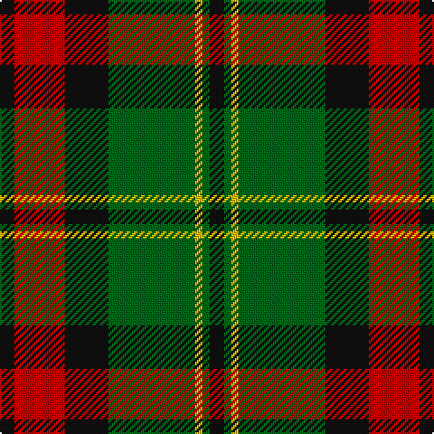

In pattern [KGYGKRK](/stripes/kgygkrk/).

This was sourced from register-of-tartans.  It is a [7 stripe tartan](/stripes/stripes7/).

Original link https://www.tartanregister.gov.uk/tartanDetails.aspx?ref=288

## Also known as

This cloth is also recorded under:

- Blackstock, hunting

## Attestations

This cloth appears in 3 source records; the oldest owns this page.

- 01/01/1983 — Blackstock Hunting (register-of-tartans, [record](https://www.tartanregister.gov.uk/tartanDetails.aspx?ref=288))
- undated — Blackstock, hunting (weddslist, [record](http://www.weddslist.com/cgi-bin/tartans/pg.pl?source=sts))
- undated — Blackstock Hunting Family Tartan Tartan Number: 1120. Earliest known date: 1982 Commissioned by Herbert Earl Blackstock in 1983, President of the Clan Blackstock Society in the USA. Blackstocks were a 'Scotch-Irish' family who emigrated to the US from Ulster. Designed by kiltmaker and historian Bob Martin of Greenville, South Carolina. www.clanblackstocksociety.com See products available Copyright © Blair Urquhart, Comrie, 2015 (house-of-tartan, [record](http://www.house-of-tartan.scotland.net/house/TartanViewjs.asp?colr=Def&tnam=1120))

## Register references

External register numbers recorded for this tartan.

- Scottish Register of Tartans: [288](https://www.tartanregister.gov.uk/tartanDetails.aspx?ref=288)
- Scottish Tartans Authority (ITI): 1120
- Scottish Tartans World Register: 1120

## Thread count
K/8 R28 K24 G48 Ya4 G4 K/8

## Palette
Each colour and the base-6 reference it is a variant of.

| Colour | Shade | Base |
|---|---|---|
| DG | <code style="background-color:#003820;">#003820</code> `oklch(30.0% 0.070 158.3)` <small>#003820</small> | G <code style="background-color:#006100;">#006100</code> |
| G | <code style="background-color:#006818;">#006818</code> `oklch(45.0% 0.142 145.0)` <small>#006818</small> | G <code style="background-color:#006100;">#006100</code> |
| K | <code style="background-color:#101010;">#101010</code> `oklch(17.3% 0.000 89.9)` <small>#101010</small> | K <code style="background-color:#000000;">#000000</code> |
| R | <code style="background-color:#C80000;">#C80000</code> `oklch(52.3% 0.215 29.2)` <small>#C80000</small> | R <code style="background-color:#CC0000;">#CC0000</code> |
| Y | <code style="background-color:#D8B000;">#D8B000</code> `oklch(77.1% 0.158 92.3)` <small>#D8B000</small> | Y <code style="background-color:#F2BF00;">#F2BF00</code> |
| Ya | <code style="background-color:#E8C000;">#E8C000</code> `oklch(81.9% 0.168 93.7)` <small>#E8C000</small> | Y <code style="background-color:#F2BF00;">#F2BF00</code> |

# Sample pattern

## Nearest tartans

The nearest existing variants by ΔTartan distance.

1. [Celtic Combat](/setts/s6/k2o20k8dg18o3w2~x2/) — ΔT 0.85
1. [MacNett](/setts/s9/k1db1g16r16k12db8g16db1k1~x2/) — ΔT 0.88
1. [Longford County Crest (Fashion)](/setts/s8/k44lo9k3lo8lo16lo15lo6k7~x2/) — ΔT 0.90
1. [Scott Hunting Clan Tartan Tartan Number: 1546. Earliest known date: 1906 Also known as Green Scott, this tartan is generally available today. The Chief of the Scotts is His Grace the 9th Duke of Buccleuch and 10th of Queensberry who lives in Selkirk in the borders region of Scotland. See products available Copyright © Blair Urquhart, Comrie, 2015](/setts/s8/r3dr14g8r2g2w2g2r1~x2/) — ΔT 0.92
1. [MacMillan - 2002 (Black - Unofficial](/setts/s6/k3lo18dg6r17k31dg3~x2/) — ΔT 0.93
1. [Dickie](/setts/s8/g8r2g12k6g3db6r24k4~x2/) — ΔT 0.95
1. [Buccleuch Weavers Tartan Tartan Number: 6009. Earliest known date: pre 2003 A Fashion tartan from Marton Mills See products available Copyright © Blair Urquhart, Comrie, 2015](/setts/s8/lo15k1lo2k1lo2k10dy14w2~x2/) — ΔT 0.96
1. [Wcwm 1062](/setts/s7/g3r20g16k22lo6k3g2~x2/) — ΔT 0.96
1. [Logan - 1797 (Dark)](/setts/s7/k9lr4k1lr4dg15r4k1~x4/) — ΔT 0.97
1. [Strummer, Joe (Commemorative)](/setts/s7/k3dy3lo6k12lo1o2dy2~x4/) — ΔT 0.99

## Neighbour map

Every grey dot is one of 14299 variants placed by the first two principal components of the ΔTartan feature space (44% of its variance). Red is this tartan; blue dots are its nearest — click one to open its page.

<svg viewBox="0 0 640 380" role="img" style="max-width:100%;height:auto;border:1px solid #e0e0e0;border-radius:4px;display:block" xmlns="http://www.w3.org/2000/svg"><image href="/nn/cloud.v1.png" width="640" height="380"/><a href="/setts/s6/k2o20k8dg18o3w2~x2/"><circle cx="237.3" cy="204.2" r="4" fill="#3465a4"><title>Celtic Combat</title></circle></a><a href="/setts/s9/k1db1g16r16k12db8g16db1k1~x2/"><circle cx="236.2" cy="177.4" r="4" fill="#3465a4"><title>MacNett</title></circle></a><a href="/setts/s8/k44lo9k3lo8lo16lo15lo6k7~x2/"><circle cx="212.7" cy="165.8" r="4" fill="#3465a4"><title>Longford County Crest (Fashion)</title></circle></a><a href="/setts/s8/r3dr14g8r2g2w2g2r1~x2/"><circle cx="246.1" cy="171.1" r="4" fill="#3465a4"><title>Scott Hunting Clan Tartan Tartan Number: 1546. Earliest known date: 1906 Also known as Green Scott, this tartan is generally available today. The Chief of the Scotts is His Grace the 9th Duke of Buccleuch and 10th of Queensberry who lives in Selkirk in the borders region of Scotland. See products available Copyright © Blair Urquhart, Comrie, 2015</title></circle></a><a href="/setts/s6/k3lo18dg6r17k31dg3~x2/"><circle cx="218.1" cy="210.6" r="4" fill="#3465a4"><title>MacMillan - 2002 (Black - Unofficial</title></circle></a><a href="/setts/s8/g8r2g12k6g3db6r24k4~x2/"><circle cx="200.7" cy="180.3" r="4" fill="#3465a4"><title>Dickie</title></circle></a><a href="/setts/s8/lo15k1lo2k1lo2k10dy14w2~x2/"><circle cx="229.9" cy="169.1" r="4" fill="#3465a4"><title>Buccleuch Weavers Tartan Tartan Number: 6009. Earliest known date: pre 2003 A Fashion tartan from Marton Mills See products available Copyright © Blair Urquhart, Comrie, 2015</title></circle></a><a href="/setts/s7/g3r20g16k22lo6k3g2~x2/"><circle cx="179.7" cy="196.8" r="4" fill="#3465a4"><title>Wcwm 1062</title></circle></a><a href="/setts/s7/k9lr4k1lr4dg15r4k1~x4/"><circle cx="215.3" cy="185.3" r="4" fill="#3465a4"><title>Logan - 1797 (Dark)</title></circle></a><a href="/setts/s7/k3dy3lo6k12lo1o2dy2~x4/"><circle cx="264.7" cy="193.5" r="4" fill="#3465a4"><title>Strummer, Joe (Commemorative)</title></circle></a><circle cx="229.5" cy="195.1" r="5" fill="#c00000"/></svg>

ID: /setts/s7/k2r7k6g12ly1g1k2~x4/
