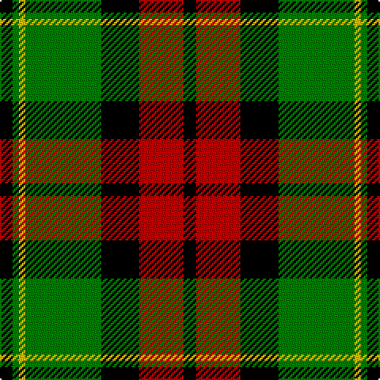

In pattern [KGYGKRK](/patterns/kgygkrk/).

This was sourced from weddslist.  It is a [7 stripes tartan](/stripes/stripes7/).

Original link http://www.weddslist.com/cgi-bin/tartans/pg.pl?source=sts

## Thread count
K/8 G4 Y4 G48 K24 R28 K/8

## Palette
Each colour and its ΔE from the base-6 reference it is a variant of.

| Colour | Shade | Base | ΔE (OKLab) |
|---|---|---|---|
| G | <code style="background-color:#008000;">#008000</code> `#008000` | G <code style="background-color:#006100;">#006100</code> | 0.10 |
| K | <code style="background-color:#000000;">#000000</code> `#000000` | K <code style="background-color:#000000;">#000000</code> | 0.00 |
| R | <code style="background-color:#C00000;">#C00000</code> `#C00000` | R <code style="background-color:#CC0000;">#CC0000</code> | 0.03 |
| Y | <code style="background-color:#F0C000;">#F0C000</code> `#F0C000` | Y <code style="background-color:#F2BF00;">#F2BF00</code> | 0.00 |

# Sample pattern

## Nearest tartans

The nearest existing variants by ΔTartan distance.

1. [Logan, Dark](/setts/s7/k9r4k1r4g15ra4k1x2~g008000-k000000-rd03030-rac00000/) — ΔT 0.68
1. [Longford County Crest (Fashion)](/setts/s8/k44y9k3y8y16y15y6k7x2~k101010-ybc8c00/) — ΔT 0.97
1. [Prince Edward Island](/setts/s7/w2k1g16k12r12k1w2x2~g008000-k000000-rc00000-we0e0e0/) — ΔT 0.97
1. [Blackstock Hunting](/setts/s7/k2r7k6g12y1g1k2x4~g006818-k101010-rc80000-ye8c000/) — ΔT 1.10
1. [MacMillan Variant (Unidentified)](/setts/s6/g3k31r17g6y18k3x2~g008000-k000000-rc00000-yf0c000/) — ΔT 1.11
1. [Lindsay](/setts/s9/g12ga1g1ga1g1k5r10k1r2x2~g008000-ga003000-k000000-rc00000/) — ΔT 1.11
1. [Wilson's, No 160](/setts/s6/g21y2g4k16b14k3x2~b800080-g008000-k000000-yf0c000/) — ΔT 1.14
1. [Cleghorn (Personal)](/setts/s7/g8r3g30k8w3k36w8x2~g007800-k000000-r8c0000-wf0f0f0/) — ΔT 1.17
1. [MacDuck](/setts/s6/k4g5k2r21ga8k2x2~g003000-ga30a010-k000000-r806050/) — ΔT 1.18
1. [Garvock (2015)](/setts/s8/g28b3g3k10r2k10r20y4x2~b2888c4-g006818-k000000-rdc0000-yffe600/) — ΔT 1.19

## Neighbour map

Every grey dot is one of 15726 variants placed by the first two principal components of the ΔTartan feature space (44% of its variance). Red is this tartan; blue dots are its nearest — click one to open its page.

<svg viewBox="0 0 640 380" role="img" style="max-width:100%;height:auto;border:1px solid #e0e0e0;border-radius:4px;display:block" xmlns="http://www.w3.org/2000/svg"><image href="/nn/cloud.v1.png" width="640" height="380"/><a href="/setts/s7/k9r4k1r4g15ra4k1x2~g008000-k000000-rd03030-rac00000/"><circle cx="187.2" cy="175.2" r="4" fill="#3465a4"><title>Logan, Dark</title></circle></a><a href="/setts/s8/k44y9k3y8y16y15y6k7x2~k101010-ybc8c00/"><circle cx="210.5" cy="167.9" r="4" fill="#3465a4"><title>Longford County Crest (Fashion)</title></circle></a><a href="/setts/s7/w2k1g16k12r12k1w2x2~g008000-k000000-rc00000-we0e0e0/"><circle cx="169.0" cy="164.5" r="4" fill="#3465a4"><title>Prince Edward Island</title></circle></a><a href="/setts/s7/k2r7k6g12y1g1k2x4~g006818-k101010-rc80000-ye8c000/"><circle cx="227.2" cy="195.1" r="4" fill="#3465a4"><title>Blackstock Hunting</title></circle></a><a href="/setts/s6/g3k31r17g6y18k3x2~g008000-k000000-rc00000-yf0c000/"><circle cx="177.8" cy="195.4" r="4" fill="#3465a4"><title>MacMillan Variant (Unidentified)</title></circle></a><a href="/setts/s9/g12ga1g1ga1g1k5r10k1r2x2~g008000-ga003000-k000000-rc00000/"><circle cx="217.0" cy="158.5" r="4" fill="#3465a4"><title>Lindsay</title></circle></a><a href="/setts/s6/g21y2g4k16b14k3x2~b800080-g008000-k000000-yf0c000/"><circle cx="181.8" cy="211.0" r="4" fill="#3465a4"><title>Wilson's, No 160</title></circle></a><a href="/setts/s7/g8r3g30k8w3k36w8x2~g007800-k000000-r8c0000-wf0f0f0/"><circle cx="219.5" cy="187.9" r="4" fill="#3465a4"><title>Cleghorn (Personal)</title></circle></a><a href="/setts/s6/k4g5k2r21ga8k2x2~g003000-ga30a010-k000000-r806050/"><circle cx="242.6" cy="196.5" r="4" fill="#3465a4"><title>MacDuck</title></circle></a><a href="/setts/s8/g28b3g3k10r2k10r20y4x2~b2888c4-g006818-k000000-rdc0000-yffe600/"><circle cx="161.6" cy="151.0" r="4" fill="#3465a4"><title>Garvock (2015)</title></circle></a><circle cx="197.2" cy="186.1" r="5" fill="#c00000"/></svg>

ID: /setts/s7/k2r7k6g12y1g1k2x4~g008000-k000000-rc00000-yf0c000/
