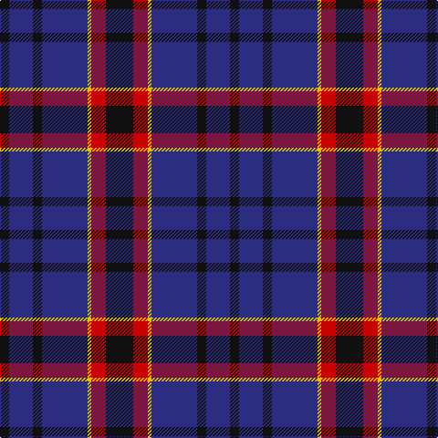

In pattern [KBKBYRK](/patterns/kbkbyrk/).

This was sourced from tartans-authority.  It is a [7 stripes tartan](/stripes/stripes7/).

Original link http://www.tartansauthority.com/tartan-ferret/display/8029/

## Thread count
K/10 DB26 K10 DB50 Y4 R16 K/30

## Palette
Each colour and its ΔE from the base-6 reference it is a variant of.

| Colour | Shade | Base | ΔE (OKLab) |
|---|---|---|---|
| DB | <code style="background-color:#2C2C80;">#2C2C80</code> `#2C2C80` | B <code style="background-color:#2A418A;">#2A418A</code> | 0.06 |
| K | <code style="background-color:#101010;">#101010</code> `#101010` | K <code style="background-color:#000000;">#000000</code> | 0.17 |
| R | <code style="background-color:#C80000;">#C80000</code> `#C80000` | R <code style="background-color:#CC0000;">#CC0000</code> | 0.01 |
| Y | <code style="background-color:#E8C000;">#E8C000</code> `#E8C000` | Y <code style="background-color:#F2BF00;">#F2BF00</code> | 0.02 |

# Sample pattern

## Nearest tartans

The nearest existing variants by ΔTartan distance.

1. [Murdoch Clebration (Personal)](/setts/s8/k42b16r8b4r4b46k8w4-b2c2c80-k101010-rc80000-we0e0e0/) — ΔT 1.03
1. [Scottish Express International](/setts/s6/b4k16w4k16ba28k4-b9058d8-ba1c0070-k101010-wa8ace8/) — ΔT 1.22
1. [Joker Fancy Tartan Tartan Number: 6769. Earliest known date: 2005 I have a photo of a fabric swatch that I am trying to match as close as possible. I have been commissioned to make a life size mannequin of Jack Nicholson as the Joker and he wore plaid/tartan pants. I could send you some photos through email and possibly you could help me. Thanks, Andy Garringer USA, January 2008. (96 threads @ 40 epi heavyweight = 2.5 inch repeat) See products available Copyright © Blair Urquhart, Comrie, 2015](/setts/s6/b22k2b6k10ba18y2-b1870a4-ba4c0470-k101010-yd87c00/) — ΔT 1.22
1. [Ibrox](/setts/s11/b16r8b8r16k28b40w8k52b72k8b8-b2c2c80-k101010-rc80000-we0e0e0/) — ΔT 1.24
1. [Britannia](/setts/s5/k28r8k50b60w8-b202060-k101010-rc80000-we0e0e0/) — ΔT 1.25
1. [Heritage of Wales (Fashion)](/setts/s7/r20b8r12b60k20b10w4-b2c2c80-k101010-rc80000-we0e0e0/) — ΔT 1.28
1. [Dege, of Saville Row](/setts/s6/r44b4r12ba4b36ra4-b000050-ba304080-r806050-rac00000/) — ΔT 1.30
1. [Stone of Destiny](/setts/s9/b8y4b34k4r8k4b6k22b6-b304080-k000030-rc00000-yf0c000/) — ΔT 1.32
1. [South African Air Force](/setts/s8/b60k56ba4y8ba4k56b60k8-b3c5470-ba5c8ca8-k101010-ye8c000/) — ΔT 1.34
1. [Granger (Personal)](/setts/s6/b80k8b24k42g54w8-b2c2c80-g006818-k101010-we0e0e0/) — ΔT 1.35

## Neighbour map

Every grey dot is one of 15726 variants placed by the first two principal components of the ΔTartan feature space (44% of its variance). Red is this tartan; blue dots are its nearest — click one to open its page.

<svg viewBox="0 0 640 380" role="img" style="max-width:100%;height:auto;border:1px solid #e0e0e0;border-radius:4px;display:block" xmlns="http://www.w3.org/2000/svg"><image href="/nn/cloud.v1.png" width="640" height="380"/><a href="/setts/s8/k42b16r8b4r4b46k8w4-b2c2c80-k101010-rc80000-we0e0e0/"><circle cx="305.5" cy="194.8" r="4" fill="#3465a4"><title>Murdoch Clebration (Personal)</title></circle></a><a href="/setts/s6/b4k16w4k16ba28k4-b9058d8-ba1c0070-k101010-wa8ace8/"><circle cx="282.8" cy="252.5" r="4" fill="#3465a4"><title>Scottish Express International</title></circle></a><a href="/setts/s6/b22k2b6k10ba18y2-b1870a4-ba4c0470-k101010-yd87c00/"><circle cx="260.5" cy="224.4" r="4" fill="#3465a4"><title>Joker Fancy Tartan Tartan Number: 6769. Earliest known date: 2005 I have a photo of a fabric swatch that I am trying to match as close as possible. I have been commissioned to make a life size mannequin of Jack Nicholson as the Joker and he wore plaid/tartan pants. I could send you some photos through email and possibly you could help me. Thanks, Andy Garringer USA, January 2008. (96 threads @ 40 epi heavyweight = 2.5 inch repeat) See products available Copyright © Blair Urquhart, Comrie, 2015</title></circle></a><a href="/setts/s11/b16r8b8r16k28b40w8k52b72k8b8-b2c2c80-k101010-rc80000-we0e0e0/"><circle cx="302.2" cy="200.1" r="4" fill="#3465a4"><title>Ibrox</title></circle></a><a href="/setts/s5/k28r8k50b60w8-b202060-k101010-rc80000-we0e0e0/"><circle cx="283.6" cy="259.1" r="4" fill="#3465a4"><title>Britannia</title></circle></a><a href="/setts/s7/r20b8r12b60k20b10w4-b2c2c80-k101010-rc80000-we0e0e0/"><circle cx="338.1" cy="185.5" r="4" fill="#3465a4"><title>Heritage of Wales (Fashion)</title></circle></a><a href="/setts/s6/r44b4r12ba4b36ra4-b000050-ba304080-r806050-rac00000/"><circle cx="327.1" cy="206.2" r="4" fill="#3465a4"><title>Dege, of Saville Row</title></circle></a><a href="/setts/s9/b8y4b34k4r8k4b6k22b6-b304080-k000030-rc00000-yf0c000/"><circle cx="305.0" cy="203.9" r="4" fill="#3465a4"><title>Stone of Destiny</title></circle></a><a href="/setts/s8/b60k56ba4y8ba4k56b60k8-b3c5470-ba5c8ca8-k101010-ye8c000/"><circle cx="308.0" cy="204.4" r="4" fill="#3465a4"><title>South African Air Force</title></circle></a><a href="/setts/s6/b80k8b24k42g54w8-b2c2c80-g006818-k101010-we0e0e0/"><circle cx="250.7" cy="234.7" r="4" fill="#3465a4"><title>Granger (Personal)</title></circle></a><circle cx="297.3" cy="221.6" r="5" fill="#c00000"/></svg>

ID: /setts/s7/k30r16y4b50k10b26k10-b2c2c80-k101010-rc80000-ye8c000/
