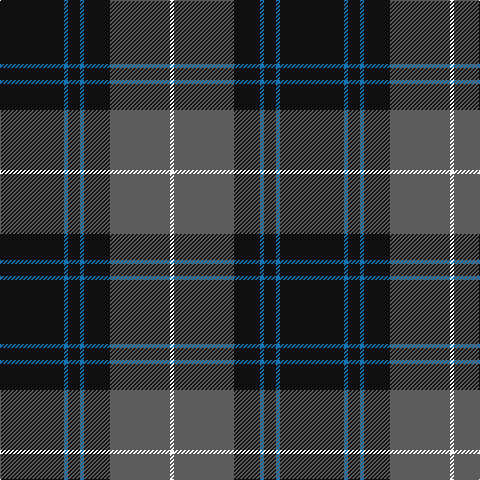

In pattern [KBKBKBW](/patterns/kbkbkbw/).

This was sourced from tartans-authority.  It is a [7 stripes tartan](/stripes/stripes7/).

Original link http://www.tartansauthority.com/tartan-ferret/display/6311/

## Thread count
K/64 B4 K12 B4 K26 N60 W/4

## Palette
Each colour and its ΔE from the base-6 reference it is a variant of.

| Colour | Shade | Base | ΔE (OKLab) |
|---|---|---|---|
| B | <code style="background-color:#1474B4;">#1474B4</code> `#1474B4` | B <code style="background-color:#2A418A;">#2A418A</code> | 0.15 |
| K | <code style="background-color:#101010;">#101010</code> `#101010` | K <code style="background-color:#000000;">#000000</code> | 0.17 |
| N | <code style="background-color:#5C5C5C;">#5C5C5C</code> `#5C5C5C` | B <code style="background-color:#2A418A;">#2A418A</code> | 0.15 |
| W | <code style="background-color:#FCFCFC;">#FCFCFC</code> `#FCFCFC` | W <code style="background-color:#F7F7F7;">#F7F7F7</code> | 0.01 |

# Sample pattern

## Nearest tartans

The nearest existing variants by ΔTartan distance.

1. [Mountain Rescue Association Honor Guard](/setts/s7/k32b2k6b2k13ba30w2x2~b0000ff-ba2f4f4f-k101010-wffffff/) — ΔT 0.61
1. [Connecticut State Police Pipe Band](/setts/s6/k42b2k2b17ba8y4x2~b5c5c5c-ba00008c-k141414-yc88c00/) — ΔT 0.95
1. [Kelley Oliphint](/setts/s5/b3k31ba27w2k3x2~b871f78-ba555555-k101010-wffffff/) — ΔT 0.96
1. [Kelley Oliphint (Commemorative)](/setts/s5/k3w2b27k31y3x2~b5c5c5c-k101010-we0e0e0-ydc94c4/) — ΔT 1.02
1. [Wild Highlanders (Corporate)](/setts/s7/k36w3k10w3g28r6k18x2~g00643c-k101010-r901c38-wfcfcfc/) — ΔT 1.09
1. [MacHardy Clan Tartan Tartan Number: 514. Earliest known date: 1906 The following is from an 1860 manuscript written by a Charles Andrew McHardy who was the Chief Constable of Dumbarton and an historian. The McHardy Tartan, for Kilting and Plaiding, according to coloured thread scale is as follows:-Warp, 6 red; 58 green; 58 blue; 4 white; 58 blue; 6 red; 6 green; 6 red; 58 blue; 4 white; 58 blue; 58 green; 6 red; 6 blue; 6 red; 58 green; 58 blue; 4 white; 58 blue; 6 red; 6 green; 6 red; 58 blue; 4 white; 58 blue; 58 green; 6 red; 6 blue; 6 red &c. The ordinary width of a web of tartan is about two feet two inches, and if made of double width the sets, as above, are to be repeated until the full width be obtained. The threads in the Woof must correspond with those in the Warp, and if this be attended to the sets and checks will be correct. The slightly smaller sett illustrated comes from Johnston book of 1906. See products available Copyright © Blair Urquhart, Comrie, 2015](/setts/s8/b3r3g18b16w2b26r3g3x2~b2c2c66-g006818-rc80000-we0e0e0/) — ΔT 1.12
1. [Brotherhood of the Kilt](/setts/s5/k10g4k1b2r1x10~b7884a8-g505420-k101010-rc80000/) — ΔT 1.15
1. [Calgary Firefighters](/setts/s5/g4k48g16r12b3x2~b4876ff-g696969-k101010-rdb2929/) — ΔT 1.17
1. [Frederiction Police Force](/setts/s8/r6k55b8g6b10g6b6g4x2~b2c2c80-g289c18-k101010-rc80000/) — ΔT 1.21
1. [Corrie](/setts/s8/b14r1b1r1b6ra14w1ra1x4~b1c1c1c-r98481c-ra888888-we0e0e0/) — ΔT 1.21

## Neighbour map

Every grey dot is one of 15726 variants placed by the first two principal components of the ΔTartan feature space (44% of its variance). Red is this tartan; blue dots are its nearest — click one to open its page.

<svg viewBox="0 0 640 380" role="img" style="max-width:100%;height:auto;border:1px solid #e0e0e0;border-radius:4px;display:block" xmlns="http://www.w3.org/2000/svg"><image href="/nn/cloud.v1.png" width="640" height="380"/><a href="/setts/s7/k32b2k6b2k13ba30w2x2~b0000ff-ba2f4f4f-k101010-wffffff/"><circle cx="374.6" cy="200.7" r="4" fill="#3465a4"><title>Mountain Rescue Association Honor Guard</title></circle></a><a href="/setts/s6/k42b2k2b17ba8y4x2~b5c5c5c-ba00008c-k141414-yc88c00/"><circle cx="386.0" cy="185.0" r="4" fill="#3465a4"><title>Connecticut State Police Pipe Band</title></circle></a><a href="/setts/s5/b3k31ba27w2k3x2~b871f78-ba555555-k101010-wffffff/"><circle cx="338.8" cy="206.5" r="4" fill="#3465a4"><title>Kelley Oliphint</title></circle></a><a href="/setts/s5/k3w2b27k31y3x2~b5c5c5c-k101010-we0e0e0-ydc94c4/"><circle cx="326.4" cy="200.7" r="4" fill="#3465a4"><title>Kelley Oliphint (Commemorative)</title></circle></a><a href="/setts/s7/k36w3k10w3g28r6k18x2~g00643c-k101010-r901c38-wfcfcfc/"><circle cx="326.6" cy="210.9" r="4" fill="#3465a4"><title>Wild Highlanders (Corporate)</title></circle></a><a href="/setts/s8/b3r3g18b16w2b26r3g3x2~b2c2c66-g006818-rc80000-we0e0e0/"><circle cx="366.5" cy="200.0" r="4" fill="#3465a4"><title>MacHardy Clan Tartan Tartan Number: 514. Earliest known date: 1906 The following is from an 1860 manuscript written by a Charles Andrew McHardy who was the Chief Constable of Dumbarton and an historian. The McHardy Tartan, for Kilting and Plaiding, according to coloured thread scale is as follows:-Warp, 6 red; 58 green; 58 blue; 4 white; 58 blue; 6 red; 6 green; 6 red; 58 blue; 4 white; 58 blue; 58 green; 6 red; 6 blue; 6 red; 58 green; 58 blue; 4 white; 58 blue; 6 red; 6 green; 6 red; 58 blue; 4 white; 58 blue; 58 green; 6 red; 6 blue; 6 red &amp;c. The ordinary width of a web of tartan is about two feet two inches, and if made of double width the sets, as above, are to be repeated until the full width be obtained. The threads in the Woof must correspond with those in the Warp, and if this be attended to the sets and checks will be correct. The slightly smaller sett illustrated comes from Johnston book of 1906. See products available Copyright © Blair Urquhart, Comrie, 2015</title></circle></a><a href="/setts/s5/k10g4k1b2r1x10~b7884a8-g505420-k101010-rc80000/"><circle cx="355.1" cy="227.6" r="4" fill="#3465a4"><title>Brotherhood of the Kilt</title></circle></a><a href="/setts/s5/g4k48g16r12b3x2~b4876ff-g696969-k101010-rdb2929/"><circle cx="340.6" cy="195.1" r="4" fill="#3465a4"><title>Calgary Firefighters</title></circle></a><a href="/setts/s8/r6k55b8g6b10g6b6g4x2~b2c2c80-g289c18-k101010-rc80000/"><circle cx="318.8" cy="168.1" r="4" fill="#3465a4"><title>Frederiction Police Force</title></circle></a><a href="/setts/s8/b14r1b1r1b6ra14w1ra1x4~b1c1c1c-r98481c-ra888888-we0e0e0/"><circle cx="323.4" cy="167.9" r="4" fill="#3465a4"><title>Corrie</title></circle></a><circle cx="364.2" cy="192.6" r="5" fill="#c00000"/></svg>

ID: /setts/s7/k32b2k6b2k13ba30w2x2~b1474b4-ba5c5c5c-k101010-wfcfcfc/
