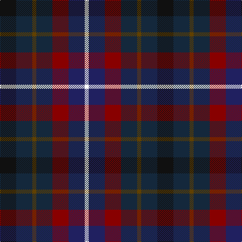

In pattern [KBGBRBW](/patterns/kbgbrbw/).

This was sourced from register-of-tartans.  It is a [7 stripes tartan](/stripes/stripes7/).

Original link https://www.tartanregister.gov.uk/tartanDetails.aspx?ref=5299

## Thread count
K/32 DN32 T8 DN32 DR32 DB32 W/8

## Palette
Each colour and its ΔE from the base-6 reference it is a variant of.

| Colour | Shade | Base | ΔE (OKLab) |
|---|---|---|---|
| DB | <code style="background-color:#202060;">#202060</code> `#202060` | B <code style="background-color:#2A418A;">#2A418A</code> | 0.11 |
| DN | <code style="background-color:#14283C;">#14283C</code> `#14283C` | B <code style="background-color:#2A418A;">#2A418A</code> | 0.15 |
| DR | <code style="background-color:#880000;">#880000</code> `#880000` | R <code style="background-color:#CC0000;">#CC0000</code> | 0.15 |
| K | <code style="background-color:#101010;">#101010</code> `#101010` | K <code style="background-color:#000000;">#000000</code> | 0.17 |
| T | <code style="background-color:#604000;">#604000</code> `#604000` | G <code style="background-color:#006100;">#006100</code> | 0.14 |
| W | <code style="background-color:#FFFFFF;">#FFFFFF</code> `#FFFFFF` | W <code style="background-color:#F7F7F7;">#F7F7F7</code> | 0.02 |

# Sample pattern

## Nearest tartans

The nearest existing variants by ΔTartan distance.

1. [Blackdown Hills (Corporate)](/setts/s7/k32b32g8b32r32ba32y8-b14283c-ba202060-g604000-k101010-r880000-yb8b8b8/) — ΔT 0.97
1. [Blackdown Hills Corporate Tartan Tartan Number: 6711. Earliest known date: 1991 The Blackdown Hills on the Devon/Somerset border were designated as an Area of Outstanding Natural Beauty (AONB) in 1991 and this tartan was designed to celebrate that occasion. Designed at Coldharbour Mill at Cullompton in Devon. See products available Copyright © Blair Urquhart, Comrie, 2015](/setts/s7/k32b32y8b32r32ba32w8-b34506c-ba202060-k101010-rc85858-wf8f8f8-yd87c00/) — ΔT 1.47
1. [Game Fair](/setts/s7/r6b24k24g24ba4g24w6-b202060-ba1870a4-g003820-k101010-rc8002c-we0e0e0/) — ΔT 1.53
1. [Dalmeny #1](/setts/s5/r8g30k30b30w8-b202060-g003820-k101010-rc80000-wc0c0c0/) — ΔT 1.53
1. [New York City](/setts/s7/b16ba24k8ba24r24g32ra8-b1474b4-ba2c2c80-g006818-k101010-r888888-raa00000/) — ΔT 1.59
1. [Crinnion (Personal)](/setts/s5/b12k4ba12bb16g12-b1c0070-ba5c5c5c-bb440044-g006818-k101010/) — ΔT 1.59
1. [Hawkes, Norman (Personal)](/setts/s6/g14w8k42b32ba32r10-b5c5c5c-ba2c2c80-g006818-k101010-rc80000-we0e0e0/) — ΔT 1.62
1. [Scots Heritage](/setts/s5/r8b28k30g28y8-b141e46-g003c14-k101010-r960000-ye8c000/) — ΔT 1.63
1. [Devon Companion District Tartan Tartan Number: 1283. Earliest known date: 1984 The Devon Original and Devon Companion owe their origin to the success of the Cornish St Piran sett, which was woven by Coldharbour Mill in the early 1980's. The accreditation certificate was presented to the Mayor of Barnstaple in 1991. In a poem describing the tartan, Miss M. Miles says, "So, in the mind, Devon's beauty is retrieved By contemplating Devon's tartan's weave." See products available Copyright © Blair Urquhart, Comrie, 2015](/setts/s7/r20b16y4b16k16ba16w4-b202060-ba480800-k101010-r888888-we0e0e0-ye8c000/) — ΔT 1.64
1. [Parliament Trade Tartan Tartan Number: 2477. Earliest known date: 1998 Created to celebrate the referendum result for the re-establishment of a Scottish Parliament as well as to provide a Parliamentary livery tartan. See products available Copyright © Blair Urquhart, Comrie, 2015](/setts/s7/b16g22k6g22r24ba20y4-b2c2c80-ba003c64-g006818-k101010-r880000-ye8c000/) — ΔT 1.67

## Neighbour map

Every grey dot is one of 15726 variants placed by the first two principal components of the ΔTartan feature space (44% of its variance). Red is this tartan; blue dots are its nearest — click one to open its page.

<svg viewBox="0 0 640 380" role="img" style="max-width:100%;height:auto;border:1px solid #e0e0e0;border-radius:4px;display:block" xmlns="http://www.w3.org/2000/svg"><image href="/nn/cloud.v1.png" width="640" height="380"/><a href="/setts/s7/k32b32g8b32r32ba32y8-b14283c-ba202060-g604000-k101010-r880000-yb8b8b8/"><circle cx="115.4" cy="275.8" r="4" fill="#3465a4"><title>Blackdown Hills (Corporate)</title></circle></a><a href="/setts/s7/k32b32y8b32r32ba32w8-b34506c-ba202060-k101010-rc85858-wf8f8f8-yd87c00/"><circle cx="56.6" cy="243.3" r="4" fill="#3465a4"><title>Blackdown Hills Corporate Tartan Tartan Number: 6711. Earliest known date: 1991 The Blackdown Hills on the Devon/Somerset border were designated as an Area of Outstanding Natural Beauty (AONB) in 1991 and this tartan was designed to celebrate that occasion. Designed at Coldharbour Mill at Cullompton in Devon. See products available Copyright © Blair Urquhart, Comrie, 2015</title></circle></a><a href="/setts/s7/r6b24k24g24ba4g24w6-b202060-ba1870a4-g003820-k101010-rc8002c-we0e0e0/"><circle cx="146.0" cy="231.6" r="4" fill="#3465a4"><title>Game Fair</title></circle></a><a href="/setts/s5/r8g30k30b30w8-b202060-g003820-k101010-rc80000-wc0c0c0/"><circle cx="86.7" cy="282.2" r="4" fill="#3465a4"><title>Dalmeny #1</title></circle></a><a href="/setts/s7/b16ba24k8ba24r24g32ra8-b1474b4-ba2c2c80-g006818-k101010-r888888-raa00000/"><circle cx="72.9" cy="259.1" r="4" fill="#3465a4"><title>New York City</title></circle></a><a href="/setts/s5/b12k4ba12bb16g12-b1c0070-ba5c5c5c-bb440044-g006818-k101010/"><circle cx="84.0" cy="309.9" r="4" fill="#3465a4"><title>Crinnion (Personal)</title></circle></a><a href="/setts/s6/g14w8k42b32ba32r10-b5c5c5c-ba2c2c80-g006818-k101010-rc80000-we0e0e0/"><circle cx="61.1" cy="227.8" r="4" fill="#3465a4"><title>Hawkes, Norman (Personal)</title></circle></a><a href="/setts/s5/r8b28k30g28y8-b141e46-g003c14-k101010-r960000-ye8c000/"><circle cx="90.5" cy="286.0" r="4" fill="#3465a4"><title>Scots Heritage</title></circle></a><a href="/setts/s7/r20b16y4b16k16ba16w4-b202060-ba480800-k101010-r888888-we0e0e0-ye8c000/"><circle cx="52.3" cy="230.6" r="4" fill="#3465a4"><title>Devon Companion District Tartan Tartan Number: 1283. Earliest known date: 1984 The Devon Original and Devon Companion owe their origin to the success of the Cornish St Piran sett, which was woven by Coldharbour Mill in the early 1980's. The accreditation certificate was presented to the Mayor of Barnstaple in 1991. In a poem describing the tartan, Miss M. Miles says, &quot;So, in the mind, Devon's beauty is retrieved By contemplating Devon's tartan's weave.&quot; See products available Copyright © Blair Urquhart, Comrie, 2015</title></circle></a><a href="/setts/s7/b16g22k6g22r24ba20y4-b2c2c80-ba003c64-g006818-k101010-r880000-ye8c000/"><circle cx="112.3" cy="242.7" r="4" fill="#3465a4"><title>Parliament Trade Tartan Tartan Number: 2477. Earliest known date: 1998 Created to celebrate the referendum result for the re-establishment of a Scottish Parliament as well as to provide a Parliamentary livery tartan. See products available Copyright © Blair Urquhart, Comrie, 2015</title></circle></a><circle cx="87.0" cy="262.8" r="5" fill="#c00000"/></svg>

ID: /setts/s7/k32b32g8b32r32ba32w8-b14283c-ba202060-g604000-k101010-r880000-wffffff/
