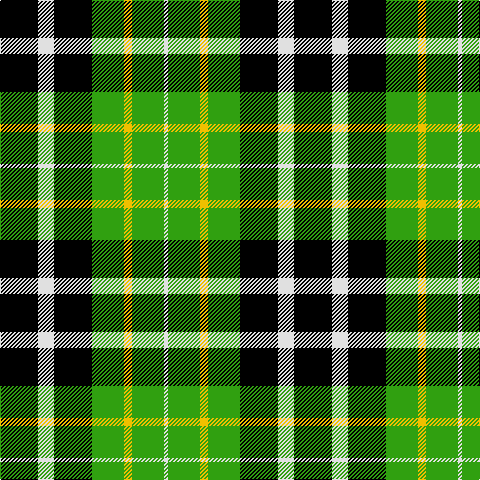

In pattern [KWKGYGW](/patterns/kwkgygw/).

This was sourced from weddslist.  It is a [7 stripes tartan](/stripes/stripes7/).

Original link http://www.weddslist.com/cgi-bin/tartans/pg.pl?source=sts

## Thread count
K/38 LN16 K38 G32 Y8 G32 LN/4

## Palette
Each colour and its ΔE from the base-6 reference it is a variant of.

| Colour | Shade | Base | ΔE (OKLab) |
|---|---|---|---|
| G | <code style="background-color:#30A010;">#30A010</code> `#30A010` | G <code style="background-color:#006100;">#006100</code> | 0.20 |
| K | <code style="background-color:#000000;">#000000</code> `#000000` | K <code style="background-color:#000000;">#000000</code> | 0.00 |
| LN | <code style="background-color:#E0E0E0;">#E0E0E0</code> `#E0E0E0` | W <code style="background-color:#F7F7F7;">#F7F7F7</code> | 0.07 |
| Y | <code style="background-color:#F0C000;">#F0C000</code> `#F0C000` | Y <code style="background-color:#F2BF00;">#F2BF00</code> | 0.00 |

# Sample pattern

## Nearest tartans

The nearest existing variants by ΔTartan distance.

1. [Menteith](/setts/s6/g18w2g12k14b14k2-b304080-g008000-k000000-we0e0e0/) — ΔT 1.02
1. [Unnamed 3](/setts/s6/g4b8k12ba2g18k4-b8080d0-ba5480b0-g008000-k000000/) — ΔT 1.02
1. [Unnamed, No 31](/setts/s7/k16g16k2g16k16b16w4-b8080d0-g008000-k000000-we0e0e0/) — ΔT 1.12
1. [Walker, James](/setts/s6/g8r16k24b4g28k8-b5480b0-g008000-k000000-rc00000/) — ΔT 1.19
1. [Fitzpatrick](/setts/s9/g20y4g12y8g32k32b4k32g4-b304080-g008000-k000000-yf0c000/) — ΔT 1.20
1. [MacCallum](/setts/s7/g16k4b2g8k12ba12k2-b5480b0-ba304080-g008000-k000000/) — ΔT 1.26
1. [Arrol](/setts/s9/r10b30k30g30w4g30k30g30w4-b304080-g008000-k000000-rc00000-we0e0e0/) — ΔT 1.30
1. [Lawson, William 2002](/setts/s7/k8w38k22g30k6g32y6-g003c14-k101010-we0e0e0-ye8c000/) — ΔT 1.30
1. [Sinclair, hunting](/setts/s7/g12r4g26k12w4k32r6-g008000-k000000-r900030-we0e0e0/) — ΔT 1.31
1. [Unidentified, Pinafore](/setts/s7/g48k8g48k48b14r48b14-b5480b0-g008000-k000000-r900030/) — ΔT 1.38

## Neighbour map

Every grey dot is one of 15726 variants placed by the first two principal components of the ΔTartan feature space (44% of its variance). Red is this tartan; blue dots are its nearest — click one to open its page.

<svg viewBox="0 0 640 380" role="img" style="max-width:100%;height:auto;border:1px solid #e0e0e0;border-radius:4px;display:block" xmlns="http://www.w3.org/2000/svg"><image href="/nn/cloud.v1.png" width="640" height="380"/><a href="/setts/s6/g18w2g12k14b14k2-b304080-g008000-k000000-we0e0e0/"><circle cx="192.2" cy="235.5" r="4" fill="#3465a4"><title>Menteith</title></circle></a><a href="/setts/s6/g4b8k12ba2g18k4-b8080d0-ba5480b0-g008000-k000000/"><circle cx="187.2" cy="221.9" r="4" fill="#3465a4"><title>Unnamed 3</title></circle></a><a href="/setts/s7/k16g16k2g16k16b16w4-b8080d0-g008000-k000000-we0e0e0/"><circle cx="126.1" cy="240.2" r="4" fill="#3465a4"><title>Unnamed, No 31</title></circle></a><a href="/setts/s6/g8r16k24b4g28k8-b5480b0-g008000-k000000-rc00000/"><circle cx="156.2" cy="237.3" r="4" fill="#3465a4"><title>Walker, James</title></circle></a><a href="/setts/s9/g20y4g12y8g32k32b4k32g4-b304080-g008000-k000000-yf0c000/"><circle cx="198.1" cy="208.5" r="4" fill="#3465a4"><title>Fitzpatrick</title></circle></a><a href="/setts/s7/g16k4b2g8k12ba12k2-b5480b0-ba304080-g008000-k000000/"><circle cx="168.2" cy="230.0" r="4" fill="#3465a4"><title>MacCallum</title></circle></a><a href="/setts/s9/r10b30k30g30w4g30k30g30w4-b304080-g008000-k000000-rc00000-we0e0e0/"><circle cx="129.4" cy="214.3" r="4" fill="#3465a4"><title>Arrol</title></circle></a><a href="/setts/s7/k8w38k22g30k6g32y6-g003c14-k101010-we0e0e0-ye8c000/"><circle cx="146.7" cy="225.4" r="4" fill="#3465a4"><title>Lawson, William 2002</title></circle></a><a href="/setts/s7/g12r4g26k12w4k32r6-g008000-k000000-r900030-we0e0e0/"><circle cx="200.8" cy="216.0" r="4" fill="#3465a4"><title>Sinclair, hunting</title></circle></a><a href="/setts/s7/g48k8g48k48b14r48b14-b5480b0-g008000-k000000-r900030/"><circle cx="135.3" cy="241.9" r="4" fill="#3465a4"><title>Unidentified, Pinafore</title></circle></a><circle cx="164.7" cy="222.0" r="5" fill="#c00000"/></svg>

ID: /setts/s7/k38w16k38g32y8g32w4-g30a010-k000000-we0e0e0-yf0c000/
