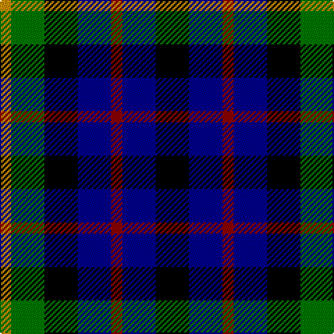

In pattern [KBRBKGY](/patterns/kbrbkgy/).

This was sourced from register-of-tartans.  It is a [7 stripes tartan](/stripes/stripes7/).

Original link https://www.tartanregister.gov.uk/tartanDetails.aspx?ref=2913

## Attestations

This cloth appears in 2 source records; the oldest owns this page.

- 01/01/2002 — Melrose of Alabama (register-of-tartans, [record](https://www.tartanregister.gov.uk/tartanDetails.aspx?ref=2913))
- pre 2002 — Melrose of Alabama (Corporate) (tartans-authority, [record](http://www.tartansauthority.com/tartan-ferret/display/4151/))

## Thread count
DY/8 G24 K24 DB24 DR8 DB24 K/24

## Palette
Each colour and its ΔE from the base-6 reference it is a variant of.

| Colour | Shade | Base | ΔE (OKLab) |
|---|---|---|---|
| DB | <code style="background-color:#00008C;">#00008C</code> `#00008C` | B <code style="background-color:#2A418A;">#2A418A</code> | 0.13 |
| DR | <code style="background-color:#8C0000;">#8C0000</code> `#8C0000` | R <code style="background-color:#CC0000;">#CC0000</code> | 0.14 |
| DY | <code style="background-color:#C88C00;">#C88C00</code> `#C88C00` | Y <code style="background-color:#F2BF00;">#F2BF00</code> | 0.15 |
| G | <code style="background-color:#007800;">#007800</code> `#007800` | G <code style="background-color:#006100;">#006100</code> | 0.07 |
| K | <code style="background-color:#000000;">#000000</code> `#000000` | K <code style="background-color:#000000;">#000000</code> | 0.00 |

# Sample pattern

## Nearest tartans

The nearest existing variants by ΔTartan distance.

1. [Montrose of Alabama](/setts/s7/k3ka3r1ka3k3g3y1~g30a010-k000000-ka000030-rc00000-yf0c000~x8/) — ΔT 0.96
1. [Denholm](/setts/s8/g8k7b8r2b8k7g8k2~b2c2c80-g006818-k000000-rc80000~x2/) — ΔT 1.25
1. [Davidson Double](/setts/s8/b3r2b8k8g8k3w2g3~b000064-g004c00-k000000-rc80000-wd0d0d0/) — ΔT 1.35
1. [Davidson Double](/setts/s8/b3r2b8k8g8k3y2k3~b000052-g11450d-k000000-raa0000-yaaaaaa~x2/) — ΔT 1.46
1. [Davidson Double](/setts/s8/b3r2b8k8g8k3y2k3~b000052-g11450d-k000000-raa0000-yaaaaaa/) — ΔT 1.46
1. [Davidson, Double..](/setts/s8/b3r2b8k8g8k3w2k3~b304080-g008000-k000000-rc00000-we0e0e0~x2/) — ΔT 1.49
1. [MacKean dress](/setts/s9/r1k2g4k1g1k2b3k1w1~b304080-g004010-k000000-rc00000-we0e0e0~x6/) — ΔT 1.57
1. [Denholm (Fashion)](/setts/s5/k5g20k18b20r5~b2c2c80-g006818-k000000-rc80000~x2/) — ΔT 1.59
1. [Graham of Montrose](/setts/s7/k4g4w1g4k4b4k1~b00004c-g004c00-k000000-wd0d0d0/) — ΔT 1.62
1. [Davidson, Double](/setts/s8/b3r2b8k8g8k3w2k3~b2c2c80-g006818-k101010-rc80000-wfcfcfc~x2/) — ΔT 1.62

## Neighbour map

Every grey dot is one of 15726 variants placed by the first two principal components of the ΔTartan feature space (44% of its variance). Red is this tartan; blue dots are its nearest — click one to open its page.

<svg viewBox="0 0 640 380" role="img" style="max-width:100%;height:auto;border:1px solid #e0e0e0;border-radius:4px;display:block" xmlns="http://www.w3.org/2000/svg"><image href="/nn/cloud.v1.png" width="640" height="380"/><a href="/setts/s7/k3ka3r1ka3k3g3y1~g30a010-k000000-ka000030-rc00000-yf0c000~x8/"><circle cx="40.1" cy="279.6" r="4" fill="#3465a4"><title>Montrose of Alabama</title></circle></a><a href="/setts/s8/g8k7b8r2b8k7g8k2~b2c2c80-g006818-k000000-rc80000~x2/"><circle cx="83.2" cy="282.7" r="4" fill="#3465a4"><title>Denholm</title></circle></a><a href="/setts/s8/b3r2b8k8g8k3w2g3~b000064-g004c00-k000000-rc80000-wd0d0d0/"><circle cx="61.9" cy="242.5" r="4" fill="#3465a4"><title>Davidson Double</title></circle></a><a href="/setts/s8/b3r2b8k8g8k3y2k3~b000052-g11450d-k000000-raa0000-yaaaaaa~x2/"><circle cx="107.5" cy="250.0" r="4" fill="#3465a4"><title>Davidson Double</title></circle></a><a href="/setts/s8/b3r2b8k8g8k3y2k3~b000052-g11450d-k000000-raa0000-yaaaaaa/"><circle cx="107.5" cy="250.0" r="4" fill="#3465a4"><title>Davidson Double</title></circle></a><a href="/setts/s8/b3r2b8k8g8k3w2k3~b304080-g008000-k000000-rc00000-we0e0e0~x2/"><circle cx="78.5" cy="234.2" r="4" fill="#3465a4"><title>Davidson, Double..</title></circle></a><a href="/setts/s9/r1k2g4k1g1k2b3k1w1~b304080-g004010-k000000-rc00000-we0e0e0~x6/"><circle cx="85.5" cy="233.0" r="4" fill="#3465a4"><title>MacKean dress</title></circle></a><a href="/setts/s5/k5g20k18b20r5~b2c2c80-g006818-k000000-rc80000~x2/"><circle cx="106.7" cy="284.1" r="4" fill="#3465a4"><title>Denholm (Fashion)</title></circle></a><a href="/setts/s7/k4g4w1g4k4b4k1~b00004c-g004c00-k000000-wd0d0d0/"><circle cx="130.5" cy="290.9" r="4" fill="#3465a4"><title>Graham of Montrose</title></circle></a><a href="/setts/s8/b3r2b8k8g8k3w2k3~b2c2c80-g006818-k101010-rc80000-wfcfcfc~x2/"><circle cx="100.9" cy="240.4" r="4" fill="#3465a4"><title>Davidson, Double</title></circle></a><circle cx="46.8" cy="283.2" r="5" fill="#c00000"/></svg>

ID: /setts/s7/k3b3r1b3k3g3y1~b00008c-g007800-k000000-r8c0000-yc88c00~x8/
