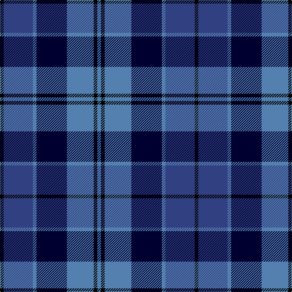

This page is one **sett** — a single exact thread-count. It belongs to the [tartan](/tartans/k3db24t3ki25t22k3t3/)
(the same proportion at any scale), whose colour order is pattern [BKBKBBK](/stripes/bkbkbbk/).

Sourced from weddslist.  It is a [7 stripe tartan](/stripes/stripes7/).

Original link http://www.weddslist.com/cgi-bin/tartans/pg.pl?source=sts

## Thread count
K/6 B48 Ba6 DB50 Ba44 K6 Ba/6

## Palette

Palette: <strong>Ingles Buchan</strong> <small style="color:#888">(1 of 4 colours)</small>
<table><thead><tr><th>Colour</th><th>Threads</th><th>Shade</th><th>Base</th><th>OKLCh</th></tr></thead><tbody><tr><td>K/</td><td style="text-align:right;font-variant-numeric:tabular-nums">6</td><td><code style="background-color:#000000;">#000000</code> <small style="color:#888">#000000</small></td><td>K <code style="background-color:#000000;">#000000</code></td><td><small style="color:#888">oklch(0.0% 0.000 0.0)</small></td></tr><tr><td>B</td><td style="text-align:right;font-variant-numeric:tabular-nums">48</td><td><code style="background-color:#304080;">#304080</code> <small style="color:#888">#304080</small></td><td>B <code style="background-color:#2A418A;">#2A418A</code></td><td><small style="color:#888">oklch(39.4% 0.109 270.2)</small></td></tr><tr><td>Ba</td><td style="text-align:right;font-variant-numeric:tabular-nums">6</td><td><code style="background-color:#5480B0;">#5480B0</code> <small style="color:#888">#5480B0</small></td><td>B <code style="background-color:#2A418A;">#2A418A</code></td><td><small style="color:#888">oklch(58.8% 0.089 251.5)</small></td></tr><tr><td>DB</td><td style="text-align:right;font-variant-numeric:tabular-nums">50</td><td><code style="background-color:#000030;">#000030</code> <small style="color:#888">#000030</small></td><td>K <code style="background-color:#000000;">#000000</code></td><td><small style="color:#888">oklch(14.0% 0.097 264.1)</small></td></tr><tr><td>Ba</td><td style="text-align:right;font-variant-numeric:tabular-nums">44</td><td><code style="background-color:#5480B0;">#5480B0</code> <small style="color:#888">#5480B0</small></td><td>B <code style="background-color:#2A418A;">#2A418A</code></td><td><small style="color:#888">oklch(58.8% 0.089 251.5)</small></td></tr><tr><td>K</td><td style="text-align:right;font-variant-numeric:tabular-nums">6</td><td><code style="background-color:#000000;">#000000</code> <small style="color:#888">#000000</small></td><td>K <code style="background-color:#000000;">#000000</code></td><td><small style="color:#888">oklch(0.0% 0.000 0.0)</small></td></tr><tr><td>Ba/</td><td style="text-align:right;font-variant-numeric:tabular-nums">6</td><td><code style="background-color:#5480B0;">#5480B0</code> <small style="color:#888">#5480B0</small></td><td>B <code style="background-color:#2A418A;">#2A418A</code></td><td><small style="color:#888">oklch(58.8% 0.089 251.5)</small></td></tr></tbody></table>

# Sample pattern

## Nearest tartans

The nearest existing variants by ΔTartan distance, with this tartan at the top so the swatches line up against it.

ΔTartan

Tartan

Sett

—

<a href="/ttd/edit/#slug=k3db24t3ki25t22k3t3~x2">Strathclyde blue</a> <a class="nn-out" href="/setts/s7/k3db24t3ki25t22k3t3~x2/" title="open its dictionary page">↗</a>

0.35

<a href="/setts/s7/ki3db24t3k25t22ki3t3~x2/">Strathclyde blue</a>

0.90

<a href="/ttd/edit/#slug=db25k3db7k15b25k2b2w4~x2">Sabema</a> <a class="nn-out" href="/setts/s8/db25k3db7k15b25k2b2w4~x2/" title="open its dictionary page">↗</a>

1.02

<a href="/ttd/edit/#slug=r8b32k24db24k3b3~x2">MacCorquodale #2</a> <a class="nn-out" href="/setts/s6/r8b32k24db24k3b3~x2/" title="open its dictionary page">↗</a>

1.28

<a href="/ttd/edit/#slug=r7k4db28k24t24k4db4~x2">MacCorquodale</a> <a class="nn-out" href="/setts/s7/r7k4db28k24t24k4db4~x2/" title="open its dictionary page">↗</a>

1.29

<a href="/ttd/edit/#slug=n12k2n2k2n2k12db12b3w1~x2">de Franck, Matt (Personal)</a> <a class="nn-out" href="/setts/s9/n12k2n2k2n2k12db12b3w1~x2/" title="open its dictionary page">↗</a>

1.31

<a href="/ttd/edit/#slug=k16db8k6db8k6db20k6db6k14b41r4">Merchiston Castle School</a> <a class="nn-out" href="/setts/s11/k16db8k6db8k6db20k6db6k14b41r4/" title="open its dictionary page">↗</a>

1.34

<a href="/ttd/edit/#slug=dp3k1dp8k6dg8k1w2~x2">Baillie (Highland Society)</a> <a class="nn-out" href="/setts/s7/dp3k1dp8k6dg8k1w2~x2/" title="open its dictionary page">↗</a>

1.35

<a href="/ttd/edit/#slug=dbi26w2dbi3db15t26db2t3ly4~x2">Banff, and Buchan</a> <a class="nn-out" href="/setts/s8/dbi26w2dbi3db15t26db2t3ly4~x2/" title="open its dictionary page">↗</a>

1.36

<a href="/setts/s7/k1db6b1ki6b6k1w1~x6/">Mary Washington</a>

1.37

<a href="/ttd/edit/#slug=r7k4t28k24ti24k4t4~x2">MacCorquodale</a> <a class="nn-out" href="/setts/s7/r7k4t28k24ti24k4t4~x2/" title="open its dictionary page">↗</a>

## Neighbour map

Every grey dot is one of 14359 variants placed by the first two principal components of the ΔTartan feature space (44% of its variance). Red is this tartan; blue dots are its nearest — click one to open its page.

<svg viewBox="0 0 640 380" role="img" style="max-width:100%;height:auto;border:1px solid #e0e0e0;border-radius:4px;display:block" xmlns="http://www.w3.org/2000/svg"><image href="/nn/cloud.v1.png" width="640" height="380"/><a href="/setts/s7/ki3db24t3k25t22ki3t3~x2/"><circle cx="182.1" cy="222.8" r="4" fill="#3465a4"><title>Strathclyde blue</title></circle></a><a href="/setts/s8/db25k3db7k15b25k2b2w4~x2/"><circle cx="215.5" cy="195.5" r="4" fill="#3465a4"><title>Sabema</title></circle></a><a href="/setts/s6/r8b32k24db24k3b3~x2/"><circle cx="200.8" cy="229.9" r="4" fill="#3465a4"><title>MacCorquodale #2</title></circle></a><a href="/setts/s7/r7k4db28k24t24k4db4~x2/"><circle cx="144.1" cy="220.6" r="4" fill="#3465a4"><title>MacCorquodale</title></circle></a><a href="/setts/s9/n12k2n2k2n2k12db12b3w1~x2/"><circle cx="179.5" cy="184.1" r="4" fill="#3465a4"><title>de Franck, Matt (Personal)</title></circle></a><a href="/setts/s11/k16db8k6db8k6db20k6db6k14b41r4/"><circle cx="209.6" cy="205.2" r="4" fill="#3465a4"><title>Merchiston Castle School</title></circle></a><a href="/setts/s7/dp3k1dp8k6dg8k1w2~x2/"><circle cx="177.0" cy="227.1" r="4" fill="#3465a4"><title>Baillie (Highland Society)</title></circle></a><a href="/setts/s8/dbi26w2dbi3db15t26db2t3ly4~x2/"><circle cx="182.0" cy="165.4" r="4" fill="#3465a4"><title>Banff, and Buchan</title></circle></a><a href="/setts/s7/k1db6b1ki6b6k1w1~x6/"><circle cx="101.4" cy="204.9" r="4" fill="#3465a4"><title>Mary Washington</title></circle></a><a href="/setts/s7/r7k4t28k24ti24k4t4~x2/"><circle cx="150.0" cy="222.0" r="4" fill="#3465a4"><title>MacCorquodale</title></circle></a><circle cx="174.8" cy="217.7" r="5" fill="#c00000"/></svg>

ID: /setts/s7/k3db24t3ki25t22k3t3~x2/
