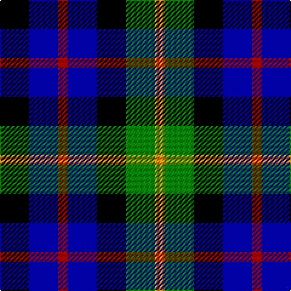

This page is one **sett** — a single exact thread-count. It belongs to the [tartan](/tartans/k3db3r1db3k3g3lo1/)
(the same proportion at any scale), whose colour order is pattern [KBRBKGY](/stripes/kbrbkgy/).

Sourced from register-of-tartans.  It is a [7 stripe tartan](/stripes/stripes7/).

Original link https://www.tartanregister.gov.uk/tartanDetails.aspx?ref=2913

2 attestations — the source records this cloth was collapsed from (oldest owns this page)

<ul>
<li>01/01/2002 — Melrose of Alabama (register-of-tartans, <a href="https://www.tartanregister.gov.uk/tartanDetails.aspx?ref=2913">record</a>)</li>
<li>pre 2002 — Melrose of Alabama (Corporate) (tartans-authority, <a href="http://www.tartansauthority.com/tartan-ferret/display/4151/">record</a>)</li>
</ul>

## Register references

External register numbers recorded for this tartan.

- Scottish Register of Tartans: [2913](https://www.tartanregister.gov.uk/tartanDetails.aspx?ref=2913)
- Scottish Tartans Authority (ITI): 4151

## Thread count
K/24 DB24 DR8 DB24 K24 G24 DY/8

## Palette

Palette: <strong>Tartan Register</strong> <small style="color:#888">(4 of 5 colours)</small>
<table><thead><tr><th>Colour</th><th>Threads</th><th>Shade</th><th>Base</th><th>OKLCh</th></tr></thead><tbody><tr><td>K/</td><td style="text-align:right;font-variant-numeric:tabular-nums">24</td><td><code style="background-color:#000000;">#000000</code> <small style="color:#888">#000000</small></td><td>K <code style="background-color:#000000;">#000000</code></td><td><small style="color:#888">oklch(0.0% 0.000 0.0)</small></td></tr><tr><td>DB</td><td style="text-align:right;font-variant-numeric:tabular-nums">24</td><td><code style="background-color:#00008C;">#00008C</code> <small style="color:#888">#00008C</small></td><td>B <code style="background-color:#2A418A;">#2A418A</code></td><td><small style="color:#888">oklch(28.9% 0.200 264.1)</small></td></tr><tr><td>DR</td><td style="text-align:right;font-variant-numeric:tabular-nums">8</td><td><code style="background-color:#8C0000;">#8C0000</code> <small style="color:#888">#8C0000</small></td><td>R <code style="background-color:#CC0000;">#CC0000</code></td><td><small style="color:#888">oklch(40.2% 0.165 29.2)</small></td></tr><tr><td>DB</td><td style="text-align:right;font-variant-numeric:tabular-nums">24</td><td><code style="background-color:#00008C;">#00008C</code> <small style="color:#888">#00008C</small></td><td>B <code style="background-color:#2A418A;">#2A418A</code></td><td><small style="color:#888">oklch(28.9% 0.200 264.1)</small></td></tr><tr><td>K</td><td style="text-align:right;font-variant-numeric:tabular-nums">24</td><td><code style="background-color:#000000;">#000000</code> <small style="color:#888">#000000</small></td><td>K <code style="background-color:#000000;">#000000</code></td><td><small style="color:#888">oklch(0.0% 0.000 0.0)</small></td></tr><tr><td>G</td><td style="text-align:right;font-variant-numeric:tabular-nums">24</td><td><code style="background-color:#007800;">#007800</code> <small style="color:#888">#007800</small></td><td>G <code style="background-color:#006100;">#006100</code></td><td><small style="color:#888">oklch(49.6% 0.169 142.5)</small></td></tr><tr><td>DY/</td><td style="text-align:right;font-variant-numeric:tabular-nums">8</td><td><code style="background-color:#C88C00;">#C88C00</code> <small style="color:#888">#C88C00</small></td><td>Y <code style="background-color:#F2BF00;">#F2BF00</code></td><td><small style="color:#888">oklch(68.2% 0.142 78.2)</small></td></tr></tbody></table>

# Sample pattern

## Nearest tartans

The nearest existing variants by ΔTartan distance, with this tartan at the top so the swatches line up against it.

ΔTartan

Tartan

Sett

—

<a href="/ttd/edit/#slug=k3db3r1db3k3g3lo1~x8">Melrose of Alabama</a> <a class="nn-out" href="/setts/s7/k3db3r1db3k3g3lo1~x8/" title="open its dictionary page">↗</a>

0.95

<a href="/setts/s7/k3ki3r1ki3k3g3ly1~x8/">Montrose of Alabama</a>

1.25

<a href="/ttd/edit/#slug=g8k7db8r2db8k7g8k2~x2">Denholm</a> <a class="nn-out" href="/setts/s8/g8k7db8r2db8k7g8k2~x2/" title="open its dictionary page">↗</a>

1.35

<a href="/ttd/edit/#slug=dg3lb2k3dg8k8db8r2db3">Davidson Double</a> <a class="nn-out" href="/setts/s8/dg3lb2k3dg8k8db8r2db3/" title="open its dictionary page">↗</a>

1.46

<a href="/ttd/edit/#slug=k3lr2k3dg8k8db8r2db3~x2">Davidson Double</a> <a class="nn-out" href="/setts/s8/k3lr2k3dg8k8db8r2db3~x2/" title="open its dictionary page">↗</a>

1.46

<a href="/ttd/edit/#slug=k3lr2k3dg8k8db8r2db3">Davidson Double</a> <a class="nn-out" href="/setts/s8/k3lr2k3dg8k8db8r2db3/" title="open its dictionary page">↗</a>

1.57

<a href="/ttd/edit/#slug=r1k2dg4k1dg1k2db3k1w1~x6">MacKean dress</a> <a class="nn-out" href="/setts/s9/r1k2dg4k1dg1k2db3k1w1~x6/" title="open its dictionary page">↗</a>

1.59

<a href="/ttd/edit/#slug=k5g20k18db20r5~x2">Denholm (Fashion)</a> <a class="nn-out" href="/setts/s5/k5g20k18db20r5~x2/" title="open its dictionary page">↗</a>

1.62

<a href="/ttd/edit/#slug=k4dg4lb1dg4k4db4k1~x2">Graham of Montrose</a> <a class="nn-out" href="/setts/s7/k4dg4lb1dg4k4db4k1~x2/" title="open its dictionary page">↗</a>

1.62

<a href="/ttd/edit/#slug=k3w2k3g8k8db8r2db3~x2">Davidson, Double</a> <a class="nn-out" href="/setts/s8/k3w2k3g8k8db8r2db3~x2/" title="open its dictionary page">↗</a>

1.63

<a href="/ttd/edit/#slug=k4g8k7db8r4~x2">Durham</a> <a class="nn-out" href="/setts/s5/k4g8k7db8r4~x2/" title="open its dictionary page">↗</a>

## Neighbour map

Every grey dot is one of 14359 variants placed by the first two principal components of the ΔTartan feature space (44% of its variance). Red is this tartan; blue dots are its nearest — click one to open its page.

<svg viewBox="0 0 640 380" role="img" style="max-width:100%;height:auto;border:1px solid #e0e0e0;border-radius:4px;display:block" xmlns="http://www.w3.org/2000/svg"><image href="/nn/cloud.v1.png" width="640" height="380"/><a href="/setts/s7/k3ki3r1ki3k3g3ly1~x8/"><circle cx="44.2" cy="281.5" r="4" fill="#3465a4"><title>Montrose of Alabama</title></circle></a><a href="/setts/s8/g8k7db8r2db8k7g8k2~x2/"><circle cx="87.3" cy="286.1" r="4" fill="#3465a4"><title>Denholm</title></circle></a><a href="/setts/s8/dg3lb2k3dg8k8db8r2db3/"><circle cx="66.4" cy="246.6" r="4" fill="#3465a4"><title>Davidson Double</title></circle></a><a href="/setts/s8/k3lr2k3dg8k8db8r2db3~x2/"><circle cx="111.7" cy="254.7" r="4" fill="#3465a4"><title>Davidson Double</title></circle></a><a href="/setts/s8/k3lr2k3dg8k8db8r2db3/"><circle cx="111.7" cy="254.7" r="4" fill="#3465a4"><title>Davidson Double</title></circle></a><a href="/setts/s9/r1k2dg4k1dg1k2db3k1w1~x6/"><circle cx="89.3" cy="235.5" r="4" fill="#3465a4"><title>MacKean dress</title></circle></a><a href="/setts/s5/k5g20k18db20r5~x2/"><circle cx="110.6" cy="286.3" r="4" fill="#3465a4"><title>Denholm (Fashion)</title></circle></a><a href="/setts/s7/k4dg4lb1dg4k4db4k1~x2/"><circle cx="134.6" cy="293.8" r="4" fill="#3465a4"><title>Graham of Montrose</title></circle></a><a href="/setts/s8/k3w2k3g8k8db8r2db3~x2/"><circle cx="104.3" cy="244.1" r="4" fill="#3465a4"><title>Davidson, Double</title></circle></a><a href="/setts/s5/k4g8k7db8r4~x2/"><circle cx="51.0" cy="338.3" r="4" fill="#3465a4"><title>Durham</title></circle></a><circle cx="51.3" cy="286.3" r="5" fill="#c00000"/></svg>

ID: /setts/s7/k3db3r1db3k3g3lo1~x8/
