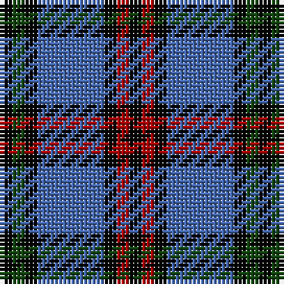

In pattern [KGKBKRK](/stripes/kgkbkrk/).

This was sourced from weddslist.  It is a [7 stripe tartan](/stripes/stripes7/).

Original link http://www.weddslist.com/cgi-bin/tartans/pg.pl?source=x

## Thread count
K/3 DR3 K3 B16 K3 DG3 K/3

## Palette
Each colour and the base-6 reference it is a variant of.

| Colour | Shade | Base |
|---|---|---|
| B | <code style="background-color:#4367AE;">#4367AE</code> `oklch(52.2% 0.120 262.7)` <small>#4367AE</small> | B <code style="background-color:#2A418A;">#2A418A</code> |
| DG | <code style="background-color:#11450D;">#11450D</code> `oklch(34.4% 0.101 142.1)` <small>#11450D</small> | G <code style="background-color:#006100;">#006100</code> |
| DR | <code style="background-color:#AA0000;">#AA0000</code> `oklch(46.3% 0.190 29.2)` <small>#AA0000</small> | R <code style="background-color:#CC0000;">#CC0000</code> |
| K | <code style="background-color:#000000;">#000000</code> `oklch(0.0% 0.000 0.0)` <small>#000000</small> | K <code style="background-color:#000000;">#000000</code> |

# Sample pattern

## Nearest tartans

The nearest existing variants by ΔTartan distance, with this tartan at the top so the swatches line up against it.

ΔTartan

Tartan

Sett

—

<a href="/ttd/edit/#slug=k3dg3k3b16k3r3k3">Eglinton</a> <a class="nn-out" href="/setts/s7/k3dg3k3b16k3r3k3/" title="open its dictionary page">↗</a>

0.00

<a href="/ttd/edit/#slug=k3dg3k3b16k3r3k3~x2">Eglinton</a> <a class="nn-out" href="/setts/s7/k3dg3k3b16k3r3k3~x2/" title="open its dictionary page">↗</a>

0.71

<a href="/ttd/edit/#slug=k3r3k3t16k3g3k3~x2">Eglinton</a> <a class="nn-out" href="/setts/s7/k3r3k3t16k3g3k3~x2/" title="open its dictionary page">↗</a>

0.81

<a href="/ttd/edit/#slug=k4r5k4db28k4g5k4~x2">Montgomerie of Eglinton</a> <a class="nn-out" href="/setts/s7/k4r5k4db28k4g5k4~x2/" title="open its dictionary page">↗</a>

1.03

<a href="/ttd/edit/#slug=db2ly1db7w1k7w2~x6">Hawick Rugby Club (Corporate)</a> <a class="nn-out" href="/setts/s6/db2ly1db7w1k7w2~x6/" title="open its dictionary page">↗</a>

1.13

<a href="/setts/s10/db2ly1db7w1k7w2~x6/">Hawick Rugby Club</a>

1.14

<a href="/ttd/edit/#slug=n6db3n6db20k20db8w4~x2">Allianz Deutschland 2012</a> <a class="nn-out" href="/setts/s7/n6db3n6db20k20db8w4~x2/" title="open its dictionary page">↗</a>

1.16

<a href="/ttd/edit/#slug=r5db35k25db8ly10r5~x2">University of Notre Dame</a> <a class="nn-out" href="/setts/s6/r5db35k25db8ly10r5~x2/" title="open its dictionary page">↗</a>

1.31

<a href="/ttd/edit/#slug=k4dg5k4dp28k4r5k4">Montgomery</a> <a class="nn-out" href="/setts/s7/k4dg5k4dp28k4r5k4/" title="open its dictionary page">↗</a>

1.35

<a href="/ttd/edit/#slug=db28k3db6k3db6k20o28k3w6~x2">Forbes</a> <a class="nn-out" href="/setts/s9/db28k3db6k3db6k20o28k3w6~x2/" title="open its dictionary page">↗</a>

1.37

<a href="/ttd/edit/#slug=r5db25w5db3dg25db3~x2">Thayer USA</a> <a class="nn-out" href="/setts/s6/r5db25w5db3dg25db3~x2/" title="open its dictionary page">↗</a>

## Neighbour map

Every grey dot is one of 14299 variants placed by the first two principal components of the ΔTartan feature space (44% of its variance). Red is this tartan; blue dots are its nearest — click one to open its page.

<svg viewBox="0 0 640 380" role="img" style="max-width:100%;height:auto;border:1px solid #e0e0e0;border-radius:4px;display:block" xmlns="http://www.w3.org/2000/svg"><image href="/nn/cloud.v1.png" width="640" height="380"/><a href="/setts/s7/k3dg3k3b16k3r3k3~x2/"><circle cx="212.3" cy="215.0" r="4" fill="#3465a4"><title>Eglinton</title></circle></a><a href="/setts/s7/k3r3k3t16k3g3k3~x2/"><circle cx="201.0" cy="208.1" r="4" fill="#3465a4"><title>Eglinton</title></circle></a><a href="/setts/s7/k4r5k4db28k4g5k4~x2/"><circle cx="263.8" cy="202.0" r="4" fill="#3465a4"><title>Montgomerie of Eglinton</title></circle></a><a href="/setts/s6/db2ly1db7w1k7w2~x6/"><circle cx="197.2" cy="217.3" r="4" fill="#3465a4"><title>Hawick Rugby Club (Corporate)</title></circle></a><a href="/setts/s10/db2ly1db7w1k7w2~x6/"><circle cx="195.3" cy="201.4" r="4" fill="#3465a4"><title>Hawick Rugby Club</title></circle></a><a href="/setts/s7/n6db3n6db20k20db8w4~x2/"><circle cx="199.7" cy="236.2" r="4" fill="#3465a4"><title>Allianz Deutschland 2012</title></circle></a><a href="/setts/s6/r5db35k25db8ly10r5~x2/"><circle cx="220.8" cy="221.1" r="4" fill="#3465a4"><title>University of Notre Dame</title></circle></a><a href="/setts/s7/k4dg5k4dp28k4r5k4/"><circle cx="268.6" cy="197.1" r="4" fill="#3465a4"><title>Montgomery</title></circle></a><a href="/setts/s9/db28k3db6k3db6k20o28k3w6~x2/"><circle cx="179.8" cy="185.3" r="4" fill="#3465a4"><title>Forbes</title></circle></a><a href="/setts/s6/r5db25w5db3dg25db3~x2/"><circle cx="250.4" cy="215.6" r="4" fill="#3465a4"><title>Thayer USA</title></circle></a><circle cx="212.3" cy="215.0" r="5" fill="#c00000"/></svg>

ID: /setts/s7/k3dg3k3b16k3r3k3/
