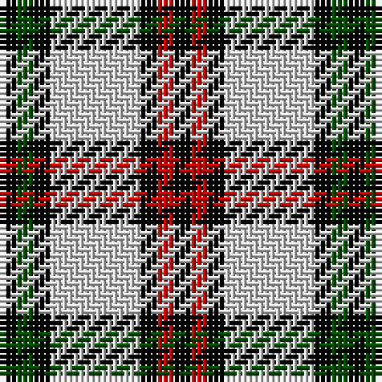

This page is one **sett** — a single exact thread-count. It belongs to the [tartan](/tartans/k3r3k3n16k3g3k3/)
(the same proportion at any scale), whose colour order is pattern [KGKWKRK](/stripes/kgkwkrk/).

Sourced from weddslist.  It is a [7 stripe tartan](/stripes/stripes7/).

Original link http://www.weddslist.com/cgi-bin/tartans/pg.pl?source=rb

## Thread count
K/3 R3 K3 N16 K3 G3 K/3

## Palette
Each colour and the base-6 reference it is a variant of.

| Colour | Shade | Base |
|---|---|---|
| G | <code style="background-color:#004C00;">#004C00</code> `oklch(36.1% 0.123 142.5)` <small>#004C00</small> | G <code style="background-color:#006100;">#006100</code> |
| K | <code style="background-color:#000000;">#000000</code> `oklch(0.0% 0.000 0.0)` <small>#000000</small> | K <code style="background-color:#000000;">#000000</code> |
| N | <code style="background-color:#D0D0D0;">#D0D0D0</code> `oklch(85.8% 0.000 89.9)` <small>#D0D0D0</small> | W <code style="background-color:#F7F7F7;">#F7F7F7</code> |
| R | <code style="background-color:#C80000;">#C80000</code> `oklch(52.3% 0.215 29.2)` <small>#C80000</small> | R <code style="background-color:#CC0000;">#CC0000</code> |

# Sample pattern

## Nearest tartans

The nearest existing variants by ΔTartan distance, with this tartan at the top so the swatches line up against it.

ΔTartan

Tartan

Sett

—

<a href="/ttd/edit/#slug=k3dg3k3lb16k3r3k3">Eglinton</a> <a class="nn-out" href="/setts/s7/k3dg3k3lb16k3r3k3/" title="open its dictionary page">↗</a>

0.98

<a href="/ttd/edit/#slug=w5r3w26k21w3k8ly3~x2">MacPherson Dress, Blue (Dance)</a> <a class="nn-out" href="/setts/s7/w5r3w26k21w3k8ly3~x2/" title="open its dictionary page">↗</a>

1.14

<a href="/ttd/edit/#slug=g6db11w8k4w8k4w8k27w4~x2">Breton District Tartan Tartan Number: 3902. Earliest known date: 2001 Commissioned by Richard Duclos of Le Coudray-Montceaux, France and produced by House of Tartan. See products available Copyright © Blair Urquhart, Comrie, 2015</a> <a class="nn-out" href="/setts/s9/g6db11w8k4w8k4w8k27w4~x2/" title="open its dictionary page">↗</a>

1.16

<a href="/ttd/edit/#slug=w23t6w6r5k35r10~x2">Merrilees</a> <a class="nn-out" href="/setts/s6/w23t6w6r5k35r10~x2/" title="open its dictionary page">↗</a>

1.16

<a href="/ttd/edit/#slug=w23db6w6r5k35r10~x2">Meg, Merrilees</a> <a class="nn-out" href="/setts/s6/w23db6w6r5k35r10~x2/" title="open its dictionary page">↗</a>

1.22

<a href="/ttd/edit/#slug=k6m2k12y3k6lb16y3lb16k2~x2">MacMillan</a> <a class="nn-out" href="/setts/s9/k6m2k12y3k6lb16y3lb16k2~x2/" title="open its dictionary page">↗</a>

1.28

<a href="/ttd/edit/#slug=r4o30k6w13k13w3~x2">Thom(p)son camel</a> <a class="nn-out" href="/setts/s6/r4o30k6w13k13w3~x2/" title="open its dictionary page">↗</a>

1.29

<a href="/ttd/edit/#slug=k3w1k1w6g1w1g1w1o3~x4">Puffin</a> <a class="nn-out" href="/setts/s9/k3w1k1w6g1w1g1w1o3~x4/" title="open its dictionary page">↗</a>

1.31

<a href="/ttd/edit/#slug=lo9k32g6lb20lo3lb9k5~x2">Black &amp; White Golf (Corporate)</a> <a class="nn-out" href="/setts/s7/lo9k32g6lb20lo3lb9k5~x2/" title="open its dictionary page">↗</a>

1.33

<a href="/ttd/edit/#slug=g6db11lr8k4lr8k4lr8k27lr4~x2">Brittany National (District)</a> <a class="nn-out" href="/setts/s9/g6db11lr8k4lr8k4lr8k27lr4~x2/" title="open its dictionary page">↗</a>

1.37

<a href="/ttd/edit/#slug=k3r3k3t16k3g3k3~x2">Eglinton</a> <a class="nn-out" href="/setts/s7/k3r3k3t16k3g3k3~x2/" title="open its dictionary page">↗</a>

## Neighbour map

Every grey dot is one of 14299 variants placed by the first two principal components of the ΔTartan feature space (44% of its variance). Red is this tartan; blue dots are its nearest — click one to open its page.

<svg viewBox="0 0 640 380" role="img" style="max-width:100%;height:auto;border:1px solid #e0e0e0;border-radius:4px;display:block" xmlns="http://www.w3.org/2000/svg"><image href="/nn/cloud.v1.png" width="640" height="380"/><a href="/setts/s7/w5r3w26k21w3k8ly3~x2/"><circle cx="228.5" cy="177.6" r="4" fill="#3465a4"><title>MacPherson Dress, Blue (Dance)</title></circle></a><a href="/setts/s9/g6db11w8k4w8k4w8k27w4~x2/"><circle cx="159.0" cy="191.1" r="4" fill="#3465a4"><title>Breton District Tartan Tartan Number: 3902. Earliest known date: 2001 Commissioned by Richard Duclos of Le Coudray-Montceaux, France and produced by House of Tartan. See products available Copyright © Blair Urquhart, Comrie, 2015</title></circle></a><a href="/setts/s6/w23t6w6r5k35r10~x2/"><circle cx="157.3" cy="193.5" r="4" fill="#3465a4"><title>Merrilees</title></circle></a><a href="/setts/s6/w23db6w6r5k35r10~x2/"><circle cx="158.8" cy="199.2" r="4" fill="#3465a4"><title>Meg, Merrilees</title></circle></a><a href="/setts/s9/k6m2k12y3k6lb16y3lb16k2~x2/"><circle cx="208.5" cy="186.8" r="4" fill="#3465a4"><title>MacMillan</title></circle></a><a href="/setts/s6/r4o30k6w13k13w3~x2/"><circle cx="185.0" cy="187.3" r="4" fill="#3465a4"><title>Thom(p)son camel</title></circle></a><a href="/setts/s9/k3w1k1w6g1w1g1w1o3~x4/"><circle cx="172.2" cy="181.1" r="4" fill="#3465a4"><title>Puffin</title></circle></a><a href="/setts/s7/lo9k32g6lb20lo3lb9k5~x2/"><circle cx="190.2" cy="179.7" r="4" fill="#3465a4"><title>Black &amp; White Golf (Corporate)</title></circle></a><a href="/setts/s9/g6db11lr8k4lr8k4lr8k27lr4~x2/"><circle cx="172.4" cy="199.7" r="4" fill="#3465a4"><title>Brittany National (District)</title></circle></a><a href="/setts/s7/k3r3k3t16k3g3k3~x2/"><circle cx="201.0" cy="208.1" r="4" fill="#3465a4"><title>Eglinton</title></circle></a><circle cx="186.3" cy="191.1" r="5" fill="#c00000"/></svg>

ID: /setts/s7/k3dg3k3lb16k3r3k3/
