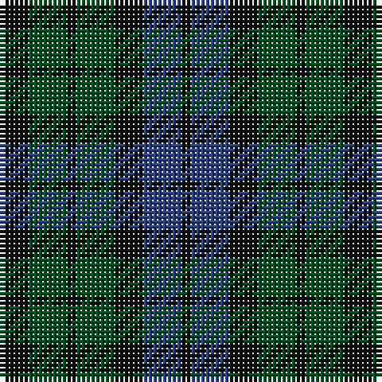

This page is one **sett** — a single exact thread-count. It belongs to the [tartan](/tartans/k3g4k1g4k3b4k1/)
(the same proportion at any scale), whose colour order is pattern [KBKGKGK](/stripes/kbkgkgk/).

Sourced from register-of-tartans.  It is a [7 stripe tartan](/stripes/stripes7/).

Original link https://www.tartanregister.gov.uk/tartanDetails.aspx?ref=4331

## Also known as

This cloth is also recorded under:

- Unnamed, No 63

## Register references

External register numbers recorded for this tartan.

- Scottish Register of Tartans: [4331](https://www.tartanregister.gov.uk/tartanDetails.aspx?ref=4331)
- Scottish Tartans World Register: 1040

## Thread count
K/6 G8 K2 G8 K6 B8 K/2

## Palette
Each colour and the base-6 reference it is a variant of.

| Colour | Shade | Base |
|---|---|---|
| B | <code style="background-color:#2C4084;">#2C4084</code> `oklch(39.4% 0.117 268.3)` <small>#2C4084</small> | B <code style="background-color:#2A418A;">#2A418A</code> |
| G | <code style="background-color:#005020;">#005020</code> `oklch(37.7% 0.105 149.6)` <small>#005020</small> | G <code style="background-color:#006100;">#006100</code> |
| K | <code style="background-color:#101010;">#101010</code> `oklch(17.3% 0.000 89.9)` <small>#101010</small> | K <code style="background-color:#000000;">#000000</code> |

# Sample pattern

## Nearest tartans

The nearest existing variants by ΔTartan distance, with this tartan at the top so the swatches line up against it.

ΔTartan

Tartan

Sett

—

<a href="/ttd/edit/#slug=k3dg4k1dg4k3db4k1~x2">Unidentified No 63</a> <a class="nn-out" href="/setts/s7/k3dg4k1dg4k3db4k1~x2/" title="open its dictionary page">↗</a>

0.88

<a href="/ttd/edit/#slug=k1dg3k3db3k1db1~x4">Sutherland 42nd</a> <a class="nn-out" href="/setts/s6/k1dg3k3db3k1db1~x4/" title="open its dictionary page">↗</a>

1.07

<a href="/ttd/edit/#slug=k5dg14k16db12dg4~x2">Unidentified #29</a> <a class="nn-out" href="/setts/s5/k5dg14k16db12dg4~x2/" title="open its dictionary page">↗</a>

1.18

<a href="/ttd/edit/#slug=k12dg12k2dg12k12db12t3~x2">MacIntyre</a> <a class="nn-out" href="/setts/s7/k12dg12k2dg12k12db12t3~x2/" title="open its dictionary page">↗</a>

1.26

<a href="/ttd/edit/#slug=k6dg6r1dg6k6db6k1~x2">MacCallum #2</a> <a class="nn-out" href="/setts/s7/k6dg6r1dg6k6db6k1~x2/" title="open its dictionary page">↗</a>

1.56

<a href="/ttd/edit/#slug=db4k4db4g9k2~x2">Austin Clan</a> <a class="nn-out" href="/setts/s5/db4k4db4g9k2~x2/" title="open its dictionary page">↗</a>

1.67

<a href="/ttd/edit/#slug=k3dg20k20g20k3~x2">MacCormick Hunting (Name)</a> <a class="nn-out" href="/setts/s5/k3dg20k20g20k3~x2/" title="open its dictionary page">↗</a>

1.69

<a href="/ttd/edit/#slug=dg21k14dg9dt21k3dt12p3~x2">Scotsman</a> <a class="nn-out" href="/setts/s7/dg21k14dg9dt21k3dt12p3~x2/" title="open its dictionary page">↗</a>

1.70

<a href="/ttd/edit/#slug=k3g14k14g2dt14g3~x2">MacKay Clan Tartan Tartan Number: 703. Earliest known date: 1816 Wilson's of Bannockburn (1819) record the same sett with blue changed to purple. Logan calls the colour 'corbeau' which is in fact a dark shade of green. The pattern shows a marked similarity to the Gunn tartan in all but colour, suggesting a territorial origin for both. Recently historians of Scottish dress have tended to stress the geographical sources, rather than the clan associations of the earliest Highland tartans. A sample was signed and sealed by the Chief for Highland Society of London in 1816. See products available Copyright © Blair Urquhart, Comrie, 2015</a> <a class="nn-out" href="/setts/s6/k3g14k14g2dt14g3~x2/" title="open its dictionary page">↗</a>

1.71

<a href="/ttd/edit/#slug=dt12g8t4g8dt12t5">Sheffield High School</a> <a class="nn-out" href="/setts/s6/dt12g8t4g8dt12t5/" title="open its dictionary page">↗</a>

1.72

<a href="/ttd/edit/#slug=k4dg4ly1dg4k4db4k1~x2">MacKay Coat</a> <a class="nn-out" href="/setts/s7/k4dg4ly1dg4k4db4k1~x2/" title="open its dictionary page">↗</a>

## Neighbour map

Every grey dot is one of 14299 variants placed by the first two principal components of the ΔTartan feature space (44% of its variance). Red is this tartan; blue dots are its nearest — click one to open its page.

<svg viewBox="0 0 640 380" role="img" style="max-width:100%;height:auto;border:1px solid #e0e0e0;border-radius:4px;display:block" xmlns="http://www.w3.org/2000/svg"><image href="/nn/cloud.v1.png" width="640" height="380"/><a href="/setts/s6/k1dg3k3db3k1db1~x4/"><circle cx="233.7" cy="348.8" r="4" fill="#3465a4"><title>Sutherland 42nd</title></circle></a><a href="/setts/s5/k5dg14k16db12dg4~x2/"><circle cx="264.5" cy="364.3" r="4" fill="#3465a4"><title>Unidentified #29</title></circle></a><a href="/setts/s7/k12dg12k2dg12k12db12t3~x2/"><circle cx="212.5" cy="302.5" r="4" fill="#3465a4"><title>MacIntyre</title></circle></a><a href="/setts/s7/k6dg6r1dg6k6db6k1~x2/"><circle cx="220.8" cy="296.4" r="4" fill="#3465a4"><title>MacCallum #2</title></circle></a><a href="/setts/s5/db4k4db4g9k2~x2/"><circle cx="209.1" cy="323.4" r="4" fill="#3465a4"><title>Austin Clan</title></circle></a><a href="/setts/s5/k3dg20k20g20k3~x2/"><circle cx="276.4" cy="320.3" r="4" fill="#3465a4"><title>MacCormick Hunting (Name)</title></circle></a><a href="/setts/s7/dg21k14dg9dt21k3dt12p3~x2/"><circle cx="231.5" cy="284.1" r="4" fill="#3465a4"><title>Scotsman</title></circle></a><a href="/setts/s6/k3g14k14g2dt14g3~x2/"><circle cx="250.6" cy="291.6" r="4" fill="#3465a4"><title>MacKay Clan Tartan Tartan Number: 703. Earliest known date: 1816 Wilson's of Bannockburn (1819) record the same sett with blue changed to purple. Logan calls the colour 'corbeau' which is in fact a dark shade of green. The pattern shows a marked similarity to the Gunn tartan in all but colour, suggesting a territorial origin for both. Recently historians of Scottish dress have tended to stress the geographical sources, rather than the clan associations of the earliest Highland tartans. A sample was signed and sealed by the Chief for Highland Society of London in 1816. See products available Copyright © Blair Urquhart, Comrie, 2015</title></circle></a><a href="/setts/s6/dt12g8t4g8dt12t5/"><circle cx="242.3" cy="364.1" r="4" fill="#3465a4"><title>Sheffield High School</title></circle></a><a href="/setts/s7/k4dg4ly1dg4k4db4k1~x2/"><circle cx="169.0" cy="305.0" r="4" fill="#3465a4"><title>MacKay Coat</title></circle></a><circle cx="235.4" cy="344.1" r="5" fill="#c00000"/></svg>

ID: /setts/s7/k3dg4k1dg4k3db4k1~x2/
