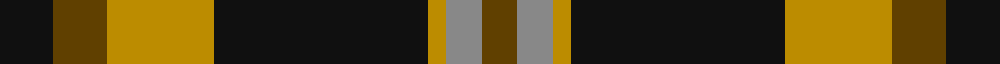
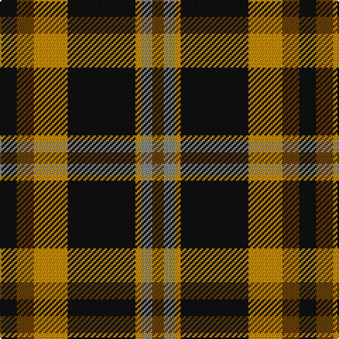

This page is one **sett** — a single exact thread-count. It belongs to the [tartan](/tartans/k3dy3lo6k12lo1o2dy2/)
(the same proportion at any scale), whose colour order is pattern [GRYKYGK](/stripes/grykygk/).

Sourced from tartans-authority.  It is a [7 stripe tartan](/stripes/stripes7/).

Original link http://www.tartansauthority.com/tartan-ferret/display/10750/

## Thread count
K/12 T12 DY24 K48 DY4 N8 T/8

## Palette

Palette: <strong>Tartan Register</strong>
<table><thead><tr><th>Colour</th><th>Threads</th><th>Shade</th><th>Base</th><th>OKLCh</th></tr></thead><tbody><tr><td>K/</td><td style="text-align:right;font-variant-numeric:tabular-nums">12</td><td><code style="background-color:#101010;">#101010</code> <small style="color:#888">#101010</small></td><td>K <code style="background-color:#000000;">#000000</code></td><td><small style="color:#888">oklch(17.3% 0.000 89.9)</small></td></tr><tr><td>T</td><td style="text-align:right;font-variant-numeric:tabular-nums">12</td><td><code style="background-color:#604000;">#604000</code> <small style="color:#888">#604000</small></td><td>G <code style="background-color:#006100;">#006100</code></td><td><small style="color:#888">oklch(39.8% 0.083 76.8)</small></td></tr><tr><td>DY</td><td style="text-align:right;font-variant-numeric:tabular-nums">24</td><td><code style="background-color:#BC8C00;">#BC8C00</code> <small style="color:#888">#BC8C00</small></td><td>Y <code style="background-color:#F2BF00;">#F2BF00</code></td><td><small style="color:#888">oklch(66.8% 0.137 84.1)</small></td></tr><tr><td>K</td><td style="text-align:right;font-variant-numeric:tabular-nums">48</td><td><code style="background-color:#101010;">#101010</code> <small style="color:#888">#101010</small></td><td>K <code style="background-color:#000000;">#000000</code></td><td><small style="color:#888">oklch(17.3% 0.000 89.9)</small></td></tr><tr><td>DY</td><td style="text-align:right;font-variant-numeric:tabular-nums">4</td><td><code style="background-color:#BC8C00;">#BC8C00</code> <small style="color:#888">#BC8C00</small></td><td>Y <code style="background-color:#F2BF00;">#F2BF00</code></td><td><small style="color:#888">oklch(66.8% 0.137 84.1)</small></td></tr><tr><td>N</td><td style="text-align:right;font-variant-numeric:tabular-nums">8</td><td><code style="background-color:#888888;">#888888</code> <small style="color:#888">#888888</small></td><td>R <code style="background-color:#CC0000;">#CC0000</code></td><td><small style="color:#888">oklch(62.7% 0.000 89.9)</small></td></tr><tr><td>T/</td><td style="text-align:right;font-variant-numeric:tabular-nums">8</td><td><code style="background-color:#604000;">#604000</code> <small style="color:#888">#604000</small></td><td>G <code style="background-color:#006100;">#006100</code></td><td><small style="color:#888">oklch(39.8% 0.083 76.8)</small></td></tr></tbody></table>

# Sample pattern

## Nearest tartans

The nearest existing variants by ΔTartan distance, with this tartan at the top so the swatches line up against it.

ΔTartan

Tartan

Sett

—

<a href="/ttd/edit/#slug=k3dy3lo6k12lo1o2dy2~x4">Strummer, Joe (Commemorative)</a> <a class="nn-out" href="/setts/s7/k3dy3lo6k12lo1o2dy2~x4/" title="open its dictionary page">↗</a>

0.79

<a href="/ttd/edit/#slug=dg28r4db25w5r22dg27r4db2~x2">New Glasgow (Canada)</a> <a class="nn-out" href="/setts/s8/dg28r4db25w5r22dg27r4db2~x2/" title="open its dictionary page">↗</a>

0.81

<a href="/ttd/edit/#slug=k21o2k8w2o16n6k2n8~x2">Ardmore (Fashion)</a> <a class="nn-out" href="/setts/s8/k21o2k8w2o16n6k2n8~x2/" title="open its dictionary page">↗</a>

0.91

<a href="/ttd/edit/#slug=k4dg5k2o21g8k2~x2">MacDuck</a> <a class="nn-out" href="/setts/s6/k4dg5k2o21g8k2~x2/" title="open its dictionary page">↗</a>

0.91

<a href="/ttd/edit/#slug=k4lo17k2lo2g7k2lo2k22db4~x2">Bro-Leon</a> <a class="nn-out" href="/setts/s9/k4lo17k2lo2g7k2lo2k22db4~x2/" title="open its dictionary page">↗</a>

0.99

<a href="/ttd/edit/#slug=k2r7k6g12ly1g1k2~x4">Blackstock Hunting</a> <a class="nn-out" href="/setts/s7/k2r7k6g12ly1g1k2~x4/" title="open its dictionary page">↗</a>

1.06

<a href="/ttd/edit/#slug=k3lo18dg6r17k31dg3~x2">MacMillan - 2002 (Black - Unofficial</a> <a class="nn-out" href="/setts/s6/k3lo18dg6r17k31dg3~x2/" title="open its dictionary page">↗</a>

1.08

<a href="/ttd/edit/#slug=w6dy36k48r4k5ly6">Drambuie Dress</a> <a class="nn-out" href="/setts/s6/w6dy36k48r4k5ly6/" title="open its dictionary page">↗</a>

1.09

<a href="/ttd/edit/#slug=do2lr2k6do3k2o14k1o1~x4">Blair Atholl (Fashion)</a> <a class="nn-out" href="/setts/s8/do2lr2k6do3k2o14k1o1~x4/" title="open its dictionary page">↗</a>

1.10

<a href="/ttd/edit/#slug=dg28r4dp25w5r22dg27r4dp2~x2">New Glasgow (Canada)</a> <a class="nn-out" href="/setts/s8/dg28r4dp25w5r22dg27r4dp2~x2/" title="open its dictionary page">↗</a>

1.15

<a href="/ttd/edit/#slug=k4lo15dg5k3dg7k3dg30r20dg3~x2">MacKillen</a> <a class="nn-out" href="/setts/s9/k4lo15dg5k3dg7k3dg30r20dg3~x2/" title="open its dictionary page">↗</a>

## Neighbour map

Every grey dot is one of 14299 variants placed by the first two principal components of the ΔTartan feature space (44% of its variance). Red is this tartan; blue dots are its nearest — click one to open its page.

<svg viewBox="0 0 640 380" role="img" style="max-width:100%;height:auto;border:1px solid #e0e0e0;border-radius:4px;display:block" xmlns="http://www.w3.org/2000/svg"><image href="/nn/cloud.v1.png" width="640" height="380"/><a href="/setts/s8/dg28r4db25w5r22dg27r4db2~x2/"><circle cx="228.4" cy="185.5" r="4" fill="#3465a4"><title>New Glasgow (Canada)</title></circle></a><a href="/setts/s8/k21o2k8w2o16n6k2n8~x2/"><circle cx="239.6" cy="197.5" r="4" fill="#3465a4"><title>Ardmore (Fashion)</title></circle></a><a href="/setts/s6/k4dg5k2o21g8k2~x2/"><circle cx="245.2" cy="194.8" r="4" fill="#3465a4"><title>MacDuck</title></circle></a><a href="/setts/s9/k4lo17k2lo2g7k2lo2k22db4~x2/"><circle cx="249.0" cy="168.6" r="4" fill="#3465a4"><title>Bro-Leon</title></circle></a><a href="/setts/s7/k2r7k6g12ly1g1k2~x4/"><circle cx="229.5" cy="195.1" r="4" fill="#3465a4"><title>Blackstock Hunting</title></circle></a><a href="/setts/s6/k3lo18dg6r17k31dg3~x2/"><circle cx="218.1" cy="210.6" r="4" fill="#3465a4"><title>MacMillan - 2002 (Black - Unofficial</title></circle></a><a href="/setts/s6/w6dy36k48r4k5ly6/"><circle cx="266.9" cy="173.8" r="4" fill="#3465a4"><title>Drambuie Dress</title></circle></a><a href="/setts/s8/do2lr2k6do3k2o14k1o1~x4/"><circle cx="268.1" cy="161.1" r="4" fill="#3465a4"><title>Blair Atholl (Fashion)</title></circle></a><a href="/setts/s8/dg28r4dp25w5r22dg27r4dp2~x2/"><circle cx="249.7" cy="188.7" r="4" fill="#3465a4"><title>New Glasgow (Canada)</title></circle></a><a href="/setts/s9/k4lo15dg5k3dg7k3dg30r20dg3~x2/"><circle cx="269.2" cy="196.4" r="4" fill="#3465a4"><title>MacKillen</title></circle></a><circle cx="264.7" cy="193.5" r="5" fill="#c00000"/></svg>

ID: /setts/s7/k3dy3lo6k12lo1o2dy2~x4/
