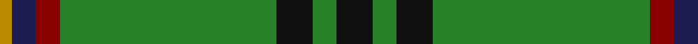
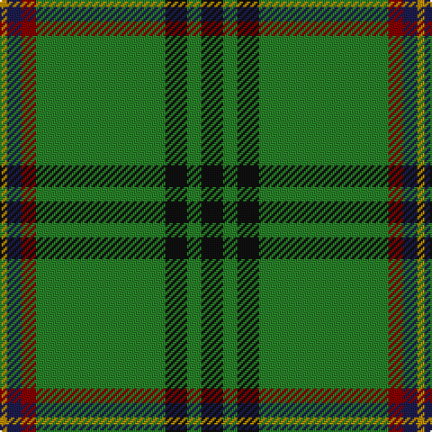

**Bands:** [KGKGRBY](/stripes/kgkgrby/) · **Stripes:** [K G K G R DB LO](/stripes/stripes7/) K G K G R DB LO

This was sourced from tartans-authority.  It is a [7 band tartan](/bands/bands7/).

Original link http://www.tartansauthority.com/tartan-ferret/display/7566/

## Attestations

This cloth appears in 3 source records; the oldest owns this page.

- March 2008 — Selvon-Bruce (Personal) (tartans-authority, [record](http://www.tartansauthority.com/tartan-ferret/display/7566/))
- undated — Selvon-Bruce (Personal) (register-of-tartans, [record](https://www.tartanregister.gov.uk/tartanDetails.aspx?ref=5592))
- undated — Sevlon Bruce Personal Tartan Tartan Number: 7566. Earliest known date: 2008 The tartan has been designed to celebrate the wedding of Nathalie Selvon and Alex Bruce, to mark the beginning of a new family. The colours blend the histories of our two families. The red and green are from the Ancient Bruce and the yellow and blue are consistent with the flag of Mauritius, the country where the Selvon family trace their roots. See products available Copyright © Blair Urquhart, Comrie, 2015 (house-of-tartan, [record](http://www.house-of-tartan.scotland.net/house/TartanViewjs.asp?colr=Def&tnam=7566))

## Register references

External register numbers recorded for this tartan.

- Scottish Register of Tartans: [5592](https://www.tartanregister.gov.uk/tartanDetails.aspx?ref=5592)
- Scottish Tartans Authority (ITI): 7566

## Thread count
K/12 G8 K12 G72 DR8 DB8 DY/4

## Palette
Each colour and its ΔE from the base-6 reference it is a variant of.

| Colour | Shade | Base | ΔE (OKLab) |
|---|---|---|---|
| DB | <code style="background-color:#1C1C50;">#1C1C50</code> `#1C1C50` | B <code style="background-color:#2A418A;">#2A418A</code> | 0.14 |
| DR | <code style="background-color:#880000;">#880000</code> `#880000` | R <code style="background-color:#CC0000;">#CC0000</code> | 0.15 |
| DY | <code style="background-color:#BC8C00;">#BC8C00</code> `#BC8C00` | Y <code style="background-color:#F2BF00;">#F2BF00</code> | 0.16 |
| G | <code style="background-color:#288028;">#288028</code> `#288028` | G <code style="background-color:#006100;">#006100</code> | 0.10 |
| K | <code style="background-color:#101010;">#101010</code> `#101010` | K <code style="background-color:#000000;">#000000</code> | 0.17 |

# Sample pattern

## Nearest tartans

The nearest existing variants by ΔTartan distance.

1. [Celtic Pride](/setts/s8/g10lo3w2k2g8k22g43lo4~x2/) — ΔT 0.63
1. [Military Medical Memorial (USA)](/setts/s6/db6w3r3g55k10r3~x4/) — ΔT 0.73
1. [Sarros (Personal) XX](/setts/s8/k2w2db8k4g33r2g16w2~x2/) — ΔT 0.99
1. [Hall (P.I.E.) (Personal)](/setts/s8/ly5g3ly3g53r7db5r13w4~x2/) — ΔT 1.04
1. [Bundanoon (District)](/setts/s9/db17r3g55db3g4db3g4ly3w5~x2/) — ΔT 1.06
1. [Mullikin (2013)](/setts/s8/r5w4db6db2g43db2db4r3~x2/) — ΔT 1.06
1. [Seattle (District)](/setts/s10/g4lb1db2r1g1r1db2lb1g14lo1~x4/) — ΔT 1.09
1. [Crieff, and Strathearn](/setts/s7/g55p7r24g12db4ly3db4~x2/) — ΔT 1.09
1. [Crieff and Strathearn District Tartan Tartan Number: 664. Earliest known date: 1988 A branch of the Stewart clan from Galloway and the South West of Scotland. See products available Copyright © Blair Urquhart, Comrie, 2015](/setts/s7/g55dp7r24g12db4ly3db4~x2/) — ΔT 1.20
1. [Isle of Raasay](/setts/s5/dg60ly16m8t2o3~x2/) — ΔT 1.20

## Neighbour map

Every grey dot is one of 14299 variants placed by the first two principal components of the ΔTartan feature space (44% of its variance). Red is this tartan; blue dots are its nearest — click one to open its page.

<svg viewBox="0 0 640 380" role="img" style="max-width:100%;height:auto;border:1px solid #e0e0e0;border-radius:4px;display:block" xmlns="http://www.w3.org/2000/svg"><image href="/nn/cloud.v1.png" width="640" height="380"/><a href="/setts/s8/g10lo3w2k2g8k22g43lo4~x2/"><circle cx="383.2" cy="151.2" r="4" fill="#3465a4"><title>Celtic Pride</title></circle></a><a href="/setts/s6/db6w3r3g55k10r3~x4/"><circle cx="411.5" cy="150.2" r="4" fill="#3465a4"><title>Military Medical Memorial (USA)</title></circle></a><a href="/setts/s8/k2w2db8k4g33r2g16w2~x2/"><circle cx="406.6" cy="156.0" r="4" fill="#3465a4"><title>Sarros (Personal) XX</title></circle></a><a href="/setts/s8/ly5g3ly3g53r7db5r13w4~x2/"><circle cx="345.3" cy="131.6" r="4" fill="#3465a4"><title>Hall (P.I.E.) (Personal)</title></circle></a><a href="/setts/s9/db17r3g55db3g4db3g4ly3w5~x2/"><circle cx="386.0" cy="127.9" r="4" fill="#3465a4"><title>Bundanoon (District)</title></circle></a><a href="/setts/s8/r5w4db6db2g43db2db4r3~x2/"><circle cx="367.4" cy="121.8" r="4" fill="#3465a4"><title>Mullikin (2013)</title></circle></a><a href="/setts/s10/g4lb1db2r1g1r1db2lb1g14lo1~x4/"><circle cx="383.1" cy="139.3" r="4" fill="#3465a4"><title>Seattle (District)</title></circle></a><a href="/setts/s7/g55p7r24g12db4ly3db4~x2/"><circle cx="358.7" cy="154.8" r="4" fill="#3465a4"><title>Crieff, and Strathearn</title></circle></a><a href="/setts/s7/g55dp7r24g12db4ly3db4~x2/"><circle cx="365.9" cy="158.0" r="4" fill="#3465a4"><title>Crieff and Strathearn District Tartan Tartan Number: 664. Earliest known date: 1988 A branch of the Stewart clan from Galloway and the South West of Scotland. See products available Copyright © Blair Urquhart, Comrie, 2015</title></circle></a><a href="/setts/s5/dg60ly16m8t2o3~x2/"><circle cx="425.1" cy="151.6" r="4" fill="#3465a4"><title>Isle of Raasay</title></circle></a><circle cx="379.4" cy="154.9" r="5" fill="#c00000"/></svg>

ID: /setts/s7/k3g2k3g18r2db2lo1~x4/
