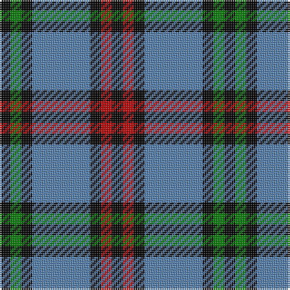

In pattern [KGKBKRK](/patterns/kgkbkrk/).

This was sourced from weddslist.  It is a [7 stripes tartan](/stripes/stripes7/).

Original link http://www.weddslist.com/cgi-bin/tartans/pg.pl?source=sts

## Thread count
K/6 G6 K6 B32 K6 R6 K/6

## Palette
Each colour and its ΔE from the base-6 reference it is a variant of.

| Colour | Shade | Base | ΔE (OKLab) |
|---|---|---|---|
| B | <code style="background-color:#5480B0;">#5480B0</code> `#5480B0` | B <code style="background-color:#2A418A;">#2A418A</code> | 0.19 |
| G | <code style="background-color:#008000;">#008000</code> `#008000` | G <code style="background-color:#006100;">#006100</code> | 0.10 |
| K | <code style="background-color:#000000;">#000000</code> `#000000` | K <code style="background-color:#000000;">#000000</code> | 0.00 |
| R | <code style="background-color:#C00000;">#C00000</code> `#C00000` | R <code style="background-color:#CC0000;">#CC0000</code> | 0.03 |

# Sample pattern

## Nearest tartans

The nearest existing variants by ΔTartan distance.

1. [Eglinton](/setts/s7/k3g3k3b16k3r3k3~b4367ae-g11450d-k000000-raa0000~x2/) — ΔT 0.71
1. [Eglinton](/setts/s7/k3g3k3b16k3r3k3~b4367ae-g11450d-k000000-raa0000/) — ΔT 0.71
1. [Eglinton District Tartan Tartan Number: 2075. Earliest known date: pre 1847 The Eglinton tartan is the Montgomerie with a narrower ground. D W Stewart in his book, Old and Rare, was of the opinion that the Montgomerie tartan was adopted by the Montgomeries of Ayrshire in 1707. He stated that in 1893 there were historic relics at Eglinton Castle which furnished evidence of the early use of the tartan. See products available Copyright © Blair Urquhart, Comrie, 2015](/setts/s7/k3g3k3b16k3r3k3~b5c8ca8-g006818-k101010-rc80000~x2/) — ΔT 1.01
1. [Brittany National (District)](/setts/s9/g6b11y8k4y8k4y8k27y4~b2c2c80-g006818-k101010-yb8b8b8~x2/) — ΔT 1.08
1. [Hawick Rugby Club (Corporate)](/setts/s6/b2y1b7w1k7w2~b2c2c80-k101010-we0e0e0-ye8c000~x6/) — ΔT 1.10
1. [Brabender](/setts/s8/g1b7k1b1k4r1g4k1~b304080-g008000-k000000-rc00000~x6/) — ΔT 1.19
1. [Montgomerie of Eglinton](/setts/s7/k4g5k4b28k4r5k4~b304080-g008000-k000000-rc00000~x2/) — ΔT 1.20
1. [Australian Police](/setts/s8/k5w5k5b11k3g17k30b3~b2888c4-g808080-k101010-we0e0e0~x2/) — ΔT 1.23
1. [Thayer USA](/setts/s6/r5b25w5b3g25b3~b202060-g255210-ra51805-wffffff~x2/) — ΔT 1.29
1. [Hawick Rugby Club](/setts/s10/b2y1b7w1k7w2k7w1b7y1~b2c2c80-k101010-we0e0e0-ye8c000~x6/) — ΔT 1.29

## Neighbour map

Every grey dot is one of 15726 variants placed by the first two principal components of the ΔTartan feature space (44% of its variance). Red is this tartan; blue dots are its nearest — click one to open its page.

<svg viewBox="0 0 640 380" role="img" style="max-width:100%;height:auto;border:1px solid #e0e0e0;border-radius:4px;display:block" xmlns="http://www.w3.org/2000/svg"><image href="/nn/cloud.v1.png" width="640" height="380"/><a href="/setts/s7/k3g3k3b16k3r3k3~b4367ae-g11450d-k000000-raa0000~x2/"><circle cx="208.7" cy="216.8" r="4" fill="#3465a4"><title>Eglinton</title></circle></a><a href="/setts/s7/k3g3k3b16k3r3k3~b4367ae-g11450d-k000000-raa0000/"><circle cx="208.7" cy="216.8" r="4" fill="#3465a4"><title>Eglinton</title></circle></a><a href="/setts/s7/k3g3k3b16k3r3k3~b5c8ca8-g006818-k101010-rc80000~x2/"><circle cx="217.6" cy="215.5" r="4" fill="#3465a4"><title>Eglinton District Tartan Tartan Number: 2075. Earliest known date: pre 1847 The Eglinton tartan is the Montgomerie with a narrower ground. D W Stewart in his book, Old and Rare, was of the opinion that the Montgomerie tartan was adopted by the Montgomeries of Ayrshire in 1707. He stated that in 1893 there were historic relics at Eglinton Castle which furnished evidence of the early use of the tartan. See products available Copyright © Blair Urquhart, Comrie, 2015</title></circle></a><a href="/setts/s9/g6b11y8k4y8k4y8k27y4~b2c2c80-g006818-k101010-yb8b8b8~x2/"><circle cx="169.2" cy="201.9" r="4" fill="#3465a4"><title>Brittany National (District)</title></circle></a><a href="/setts/s6/b2y1b7w1k7w2~b2c2c80-k101010-we0e0e0-ye8c000~x6/"><circle cx="193.8" cy="219.7" r="4" fill="#3465a4"><title>Hawick Rugby Club (Corporate)</title></circle></a><a href="/setts/s8/g1b7k1b1k4r1g4k1~b304080-g008000-k000000-rc00000~x6/"><circle cx="172.0" cy="210.3" r="4" fill="#3465a4"><title>Brabender</title></circle></a><a href="/setts/s7/k4g5k4b28k4r5k4~b304080-g008000-k000000-rc00000~x2/"><circle cx="260.5" cy="203.1" r="4" fill="#3465a4"><title>Montgomerie of Eglinton</title></circle></a><a href="/setts/s8/k5w5k5b11k3g17k30b3~b2888c4-g808080-k101010-we0e0e0~x2/"><circle cx="254.9" cy="191.0" r="4" fill="#3465a4"><title>Australian Police</title></circle></a><a href="/setts/s6/r5b25w5b3g25b3~b202060-g255210-ra51805-wffffff~x2/"><circle cx="247.4" cy="215.6" r="4" fill="#3465a4"><title>Thayer USA</title></circle></a><a href="/setts/s10/b2y1b7w1k7w2k7w1b7y1~b2c2c80-k101010-we0e0e0-ye8c000~x6/"><circle cx="191.9" cy="202.5" r="4" fill="#3465a4"><title>Hawick Rugby Club</title></circle></a><circle cx="197.5" cy="211.0" r="5" fill="#c00000"/></svg>

ID: /setts/s7/k3g3k3b16k3r3k3~b5480b0-g008000-k000000-rc00000~x2/
