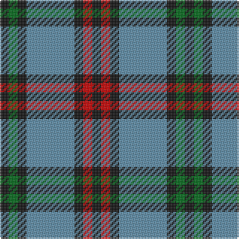

In pattern [KGKBKRK](/patterns/kgkbkrk/).

This was sourced from house-of-tartan.  It is a [7 stripes tartan](/stripes/stripes7/).

Original link http://www.house-of-tartan.scotland.net/house/TartanViewjs.asp?colr=Def&tnam=2075

## Thread count
K/6 G6 K6 B32 K6 R6 K/6

## Palette
Each colour and its ΔE from the base-6 reference it is a variant of.

| Colour | Shade | Base | ΔE (OKLab) |
|---|---|---|---|
| B | <code style="background-color:#5C8CA8;">#5C8CA8</code> `#5C8CA8` | B <code style="background-color:#2A418A;">#2A418A</code> | 0.23 |
| G | <code style="background-color:#006818;">#006818</code> `#006818` | G <code style="background-color:#006100;">#006100</code> | 0.02 |
| K | <code style="background-color:#101010;">#101010</code> `#101010` | K <code style="background-color:#000000;">#000000</code> | 0.17 |
| R | <code style="background-color:#C80000;">#C80000</code> `#C80000` | R <code style="background-color:#CC0000;">#CC0000</code> | 0.01 |

# Sample pattern

## Nearest tartans

The nearest existing variants by ΔTartan distance.

1. [Thayer USA](/setts/s6/r5b25w5b3g25b3~b202060-g255210-ra51805-wffffff~x2/) — ΔT 0.90
1. [Thayer USA (Name)](/setts/s6/r5b25w5b3g25b3~b2c2c80-g006818-rc80000-we0e0e0~x2/) — ΔT 0.95
1. [Eglinton](/setts/s7/k3g3k3b16k3r3k3~b5480b0-g008000-k000000-rc00000~x2/) — ΔT 1.01
1. [Michaluk (Personal)](/setts/s6/k3b4g20k20g3y3~b1474b4-g408060-k101010-ybc8c00~x4/) — ΔT 1.04
1. [Albuquerque, City of](/setts/s8/r2g12b2g8b18w3r2w2~b2c2c80-g006818-rc80000-wf8f8f8~x2/) — ΔT 1.06
1. [Tweedside Hunting District Tartan Tartan Number: 163. Earliest known date: 20th Century A variation of Wilson's design. There is no record of this sett in any of the old collections which points to dating it in this century. It is the most popular of Tweedside district tartans. See products available Copyright © Blair Urquhart, Comrie, 2015](/setts/s9/b21g5k5g15w3g5w3g5k3~b2c2c80-g006818-k101010-we0e0e0~x2/) — ΔT 1.13
1. [Kyle](/setts/s7/g19k2w2k2b5k2b5~b505050-g808080-k000000-we0e0e0~x4/) — ΔT 1.14
1. [Brittany National (District)](/setts/s9/g6b11y8k4y8k4y8k27y4~b2c2c80-g006818-k101010-yb8b8b8~x2/) — ΔT 1.14
1. [Irving of Bonshaw Tower (Personal)](/setts/s6/r2g3b2g14b14y2~b1c0070-g006818-r880000-yb8b8b8~x2/) — ΔT 1.15
1. [Notre Dame Marching Guard (Corp)](/setts/s6/b5ba35k24ba9g9b5~b4c0000-ba1474b4-g289c18-k101010~x2/) — ΔT 1.18

## Neighbour map

Every grey dot is one of 15726 variants placed by the first two principal components of the ΔTartan feature space (44% of its variance). Red is this tartan; blue dots are its nearest — click one to open its page.

<svg viewBox="0 0 640 380" role="img" style="max-width:100%;height:auto;border:1px solid #e0e0e0;border-radius:4px;display:block" xmlns="http://www.w3.org/2000/svg"><image href="/nn/cloud.v1.png" width="640" height="380"/><a href="/setts/s6/r5b25w5b3g25b3~b202060-g255210-ra51805-wffffff~x2/"><circle cx="247.4" cy="215.6" r="4" fill="#3465a4"><title>Thayer USA</title></circle></a><a href="/setts/s6/r5b25w5b3g25b3~b2c2c80-g006818-rc80000-we0e0e0~x2/"><circle cx="248.8" cy="215.5" r="4" fill="#3465a4"><title>Thayer USA (Name)</title></circle></a><a href="/setts/s7/k3g3k3b16k3r3k3~b5480b0-g008000-k000000-rc00000~x2/"><circle cx="197.5" cy="211.0" r="4" fill="#3465a4"><title>Eglinton</title></circle></a><a href="/setts/s6/k3b4g20k20g3y3~b1474b4-g408060-k101010-ybc8c00~x4/"><circle cx="230.8" cy="226.8" r="4" fill="#3465a4"><title>Michaluk (Personal)</title></circle></a><a href="/setts/s8/r2g12b2g8b18w3r2w2~b2c2c80-g006818-rc80000-wf8f8f8~x2/"><circle cx="203.5" cy="190.5" r="4" fill="#3465a4"><title>Albuquerque, City of</title></circle></a><a href="/setts/s9/b21g5k5g15w3g5w3g5k3~b2c2c80-g006818-k101010-we0e0e0~x2/"><circle cx="204.9" cy="209.7" r="4" fill="#3465a4"><title>Tweedside Hunting District Tartan Tartan Number: 163. Earliest known date: 20th Century A variation of Wilson's design. There is no record of this sett in any of the old collections which points to dating it in this century. It is the most popular of Tweedside district tartans. See products available Copyright © Blair Urquhart, Comrie, 2015</title></circle></a><a href="/setts/s7/g19k2w2k2b5k2b5~b505050-g808080-k000000-we0e0e0~x4/"><circle cx="261.1" cy="180.5" r="4" fill="#3465a4"><title>Kyle</title></circle></a><a href="/setts/s9/g6b11y8k4y8k4y8k27y4~b2c2c80-g006818-k101010-yb8b8b8~x2/"><circle cx="169.2" cy="201.9" r="4" fill="#3465a4"><title>Brittany National (District)</title></circle></a><a href="/setts/s6/r2g3b2g14b14y2~b1c0070-g006818-r880000-yb8b8b8~x2/"><circle cx="252.8" cy="229.2" r="4" fill="#3465a4"><title>Irving of Bonshaw Tower (Personal)</title></circle></a><a href="/setts/s6/b5ba35k24ba9g9b5~b4c0000-ba1474b4-g289c18-k101010~x2/"><circle cx="232.2" cy="233.9" r="4" fill="#3465a4"><title>Notre Dame Marching Guard (Corp)</title></circle></a><circle cx="217.6" cy="215.5" r="5" fill="#c00000"/></svg>

ID: /setts/s7/k3g3k3b16k3r3k3~b5c8ca8-g006818-k101010-rc80000~x2/
