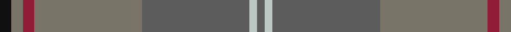

In pattern [BWBGRGK](/patterns/bwbgrgk/).

This was sourced from tartans-authority.  It is a [7 stripes tartan](/stripes/stripes7/).

Original link http://www.tartansauthority.com/tartan-ferret/display/7170/

## Thread count
K/6 Nb6 DR6 Nb56 N56 Na4 N/4

## Palette
Each colour and its ΔE from the base-6 reference it is a variant of.

| Colour | Shade | Base | ΔE (OKLab) |
|---|---|---|---|
| DR | <code style="background-color:#901C38;">#901C38</code> `#901C38` | R <code style="background-color:#CC0000;">#CC0000</code> | 0.13 |
| K | <code style="background-color:#101010;">#101010</code> `#101010` | K <code style="background-color:#000000;">#000000</code> | 0.17 |
| N | <code style="background-color:#5C5C5C;">#5C5C5C</code> `#5C5C5C` | B <code style="background-color:#2A418A;">#2A418A</code> | 0.15 |
| Na | <code style="background-color:#BCC8C4;">#BCC8C4</code> `#BCC8C4` | W <code style="background-color:#F7F7F7;">#F7F7F7</code> | 0.15 |
| Nb | <code style="background-color:#787468;">#787468</code> `#787468` | G <code style="background-color:#006100;">#006100</code> | 0.19 |

# Sample pattern

## Nearest tartans

The nearest existing variants by ΔTartan distance.

1. [Granite City (Fashion)](/setts/s8/k3b3k3b21ba21k3ba3y1x2~b5c5c5c-ba505050-k101010-ya0a0a0/) — ΔT 1.45
1. [Clyde](/setts/s10/r5b3r22ra3b6ba17ra2ba4ra2ba4x2~b646464-ba5c5c5c-r8c8c8c-ra8c0000/) — ΔT 1.57
1. [Outlander #1](/setts/s6/r52y2b24ra3ya26b4x2~b5c5c5c-r888888-raa00000-yfccc00-yaa08858/) — ΔT 1.59
1. [Hanna of Leith (yellow line)](/setts/s10/g9b4g2b4g2b30g9b4ba14y2x2~b5c5c5c-ba2888c4-g603800-yd09800/) — ΔT 1.84
1. [Outlander #1](/setts/s6/g52y2b24r3ya26b4x2~b5c5c5c-g808080-r960000-ye8c000-yaa08858/) — ΔT 1.85
1. [Wicklow, County (District)](/setts/s10/b1ba2g6ba1b3bb1ba12b1ba1g1x4~b4c3428-ba5c5c5c-bb5c8ca8-g006818/) — ΔT 1.86
1. [Scottish Borderland (Fashion)](/setts/s9/w2g2b1g30ba10b20g1b2y1x2~b405460-ba646464-g005020-wc8c8c8-yc88c00/) — ΔT 1.92
1. [Historic Scotland Corporate Tartan Tartan Number: 2122. Earliest known date: 1988 Custodians at Historic Scotland properties throughout Scotland, including Edinburgh Castle, wear this distinctive tartan. See products available Copyright © Blair Urquhart, Comrie, 2015](/setts/s9/g2r1g1r2g21ga9k1ga7k2x2~g604000-ga5c6428-k101010-r888888/) — ΔT 1.94
1. [Annan (Fashion)](/setts/s10/g16r2g2ra2g2r2g2b6ba10g3x2~b441800-ba5c5c5c-g8c7038-r888888-rab84c00/) — ΔT 1.99
1. [Isaia (Fashion)](/setts/s7/r80ra8r4g4y4g45b8~b5c5c5c-g604000-rac6c64-ra904c40-ya0a0a0/) — ΔT 2.02

## Neighbour map

Every grey dot is one of 15726 variants placed by the first two principal components of the ΔTartan feature space (44% of its variance). Red is this tartan; blue dots are its nearest — click one to open its page.

<svg viewBox="0 0 640 380" role="img" style="max-width:100%;height:auto;border:1px solid #e0e0e0;border-radius:4px;display:block" xmlns="http://www.w3.org/2000/svg"><image href="/nn/cloud.v1.png" width="640" height="380"/><a href="/setts/s8/k3b3k3b21ba21k3ba3y1x2~b5c5c5c-ba505050-k101010-ya0a0a0/"><circle cx="394.3" cy="208.3" r="4" fill="#3465a4"><title>Granite City (Fashion)</title></circle></a><a href="/setts/s10/r5b3r22ra3b6ba17ra2ba4ra2ba4x2~b646464-ba5c5c5c-r8c8c8c-ra8c0000/"><circle cx="337.8" cy="220.3" r="4" fill="#3465a4"><title>Clyde</title></circle></a><a href="/setts/s6/r52y2b24ra3ya26b4x2~b5c5c5c-r888888-raa00000-yfccc00-yaa08858/"><circle cx="409.5" cy="203.0" r="4" fill="#3465a4"><title>Outlander #1</title></circle></a><a href="/setts/s10/g9b4g2b4g2b30g9b4ba14y2x2~b5c5c5c-ba2888c4-g603800-yd09800/"><circle cx="396.1" cy="203.2" r="4" fill="#3465a4"><title>Hanna of Leith (yellow line)</title></circle></a><a href="/setts/s6/g52y2b24r3ya26b4x2~b5c5c5c-g808080-r960000-ye8c000-yaa08858/"><circle cx="424.7" cy="210.3" r="4" fill="#3465a4"><title>Outlander #1</title></circle></a><a href="/setts/s10/b1ba2g6ba1b3bb1ba12b1ba1g1x4~b4c3428-ba5c5c5c-bb5c8ca8-g006818/"><circle cx="455.2" cy="226.5" r="4" fill="#3465a4"><title>Wicklow, County (District)</title></circle></a><a href="/setts/s9/w2g2b1g30ba10b20g1b2y1x2~b405460-ba646464-g005020-wc8c8c8-yc88c00/"><circle cx="413.5" cy="167.1" r="4" fill="#3465a4"><title>Scottish Borderland (Fashion)</title></circle></a><a href="/setts/s9/g2r1g1r2g21ga9k1ga7k2x2~g604000-ga5c6428-k101010-r888888/"><circle cx="457.3" cy="197.6" r="4" fill="#3465a4"><title>Historic Scotland Corporate Tartan Tartan Number: 2122. Earliest known date: 1988 Custodians at Historic Scotland properties throughout Scotland, including Edinburgh Castle, wear this distinctive tartan. See products available Copyright © Blair Urquhart, Comrie, 2015</title></circle></a><a href="/setts/s10/g16r2g2ra2g2r2g2b6ba10g3x2~b441800-ba5c5c5c-g8c7038-r888888-rab84c00/"><circle cx="348.3" cy="209.6" r="4" fill="#3465a4"><title>Annan (Fashion)</title></circle></a><a href="/setts/s7/r80ra8r4g4y4g45b8~b5c5c5c-g604000-rac6c64-ra904c40-ya0a0a0/"><circle cx="443.0" cy="173.4" r="4" fill="#3465a4"><title>Isaia (Fashion)</title></circle></a><circle cx="395.8" cy="205.6" r="5" fill="#c00000"/></svg>

ID: /setts/s7/k3g3r3g28b28w2b2x2~b5c5c5c-g787468-k101010-r901c38-wbcc8c4/
