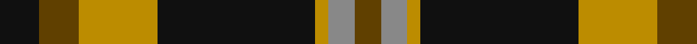

In pattern [GRYKYGK](/patterns/grykygk/).

This was sourced from tartans-authority.  It is a [7 stripes tartan](/stripes/stripes7/).

Original link http://www.tartansauthority.com/tartan-ferret/display/10750/

## Thread count
K/12 T12 DY24 K48 DY4 N8 T/8

## Palette
Each colour and its ΔE from the base-6 reference it is a variant of.

| Colour | Shade | Base | ΔE (OKLab) |
|---|---|---|---|
| DY | <code style="background-color:#BC8C00;">#BC8C00</code> `#BC8C00` | Y <code style="background-color:#F2BF00;">#F2BF00</code> | 0.16 |
| K | <code style="background-color:#101010;">#101010</code> `#101010` | K <code style="background-color:#000000;">#000000</code> | 0.17 |
| N | <code style="background-color:#888888;">#888888</code> `#888888` | R <code style="background-color:#CC0000;">#CC0000</code> | 0.24 |
| T | <code style="background-color:#604000;">#604000</code> `#604000` | G <code style="background-color:#006100;">#006100</code> | 0.14 |

# Sample pattern

## Nearest tartans

The nearest existing variants by ΔTartan distance.

1. [New Glasgow (Canada)](/setts/s8/g28r4b25w5r22g27r4b2x2~b000048-g004c00-rdc0000-wffffff/) — ΔT 0.79
1. [Ardmore (Fashion)](/setts/s8/k21r2k8w2r16b6k2b8x2~b5c5c5c-k101010-ra07c58-we0e0e0/) — ΔT 0.82
1. [MacDuck](/setts/s6/k4g5k2r21ga8k2x2~g003000-ga30a010-k000000-r806050/) — ΔT 0.90
1. [Bro-Leon](/setts/s9/b4k22y2k2g7y2k2y17k4x2~b2c2c80-g408060-k101010-ybc8c00/) — ΔT 0.91
1. [Blackstock Hunting](/setts/s7/k2r7k6g12y1g1k2x4~g006818-k101010-rc80000-ye8c000/) — ΔT 0.99
1. [MacMillan - 2002 (Black - Unofficial](/setts/s6/g3k31r17g6y18k3x2~g004810-k101010-r880000-ybc8c00/) — ΔT 1.06
1. [Drambuie Dress](/setts/s6/w6g36k48r4k5y6~g604000-k101010-rc80000-we0e0e0-ye8c000/) — ΔT 1.07
1. [Blair Atholl (Fashion)](/setts/s8/b2y2k6b3k2r14k1r1x4~b441800-k101010-ra07c58-yb8b8b8/) — ΔT 1.08
1. [New Glasgow (Canada)](/setts/s8/g28r4b25w5r22g27r4b2x2~b440044-g285800-rc80000-wfcfcfc/) — ΔT 1.10
1. [Finnlaggan](/setts/s6/g7w1g18b6r18g2x2~b304080-g003000-rc00000-we0e0e0/) — ΔT 1.12

## Neighbour map

Every grey dot is one of 15726 variants placed by the first two principal components of the ΔTartan feature space (44% of its variance). Red is this tartan; blue dots are its nearest — click one to open its page.

<svg viewBox="0 0 640 380" role="img" style="max-width:100%;height:auto;border:1px solid #e0e0e0;border-radius:4px;display:block" xmlns="http://www.w3.org/2000/svg"><image href="/nn/cloud.v1.png" width="640" height="380"/><a href="/setts/s8/g28r4b25w5r22g27r4b2x2~b000048-g004c00-rdc0000-wffffff/"><circle cx="226.0" cy="187.3" r="4" fill="#3465a4"><title>New Glasgow (Canada)</title></circle></a><a href="/setts/s8/k21r2k8w2r16b6k2b8x2~b5c5c5c-k101010-ra07c58-we0e0e0/"><circle cx="237.1" cy="198.1" r="4" fill="#3465a4"><title>Ardmore (Fashion)</title></circle></a><a href="/setts/s6/k4g5k2r21ga8k2x2~g003000-ga30a010-k000000-r806050/"><circle cx="242.6" cy="196.5" r="4" fill="#3465a4"><title>MacDuck</title></circle></a><a href="/setts/s9/b4k22y2k2g7y2k2y17k4x2~b2c2c80-g408060-k101010-ybc8c00/"><circle cx="246.5" cy="170.6" r="4" fill="#3465a4"><title>Bro-Leon</title></circle></a><a href="/setts/s7/k2r7k6g12y1g1k2x4~g006818-k101010-rc80000-ye8c000/"><circle cx="227.2" cy="195.1" r="4" fill="#3465a4"><title>Blackstock Hunting</title></circle></a><a href="/setts/s6/g3k31r17g6y18k3x2~g004810-k101010-r880000-ybc8c00/"><circle cx="216.2" cy="211.2" r="4" fill="#3465a4"><title>MacMillan - 2002 (Black - Unofficial</title></circle></a><a href="/setts/s6/w6g36k48r4k5y6~g604000-k101010-rc80000-we0e0e0-ye8c000/"><circle cx="264.7" cy="175.2" r="4" fill="#3465a4"><title>Drambuie Dress</title></circle></a><a href="/setts/s8/b2y2k6b3k2r14k1r1x4~b441800-k101010-ra07c58-yb8b8b8/"><circle cx="266.2" cy="162.7" r="4" fill="#3465a4"><title>Blair Atholl (Fashion)</title></circle></a><a href="/setts/s8/g28r4b25w5r22g27r4b2x2~b440044-g285800-rc80000-wfcfcfc/"><circle cx="248.3" cy="189.4" r="4" fill="#3465a4"><title>New Glasgow (Canada)</title></circle></a><a href="/setts/s6/g7w1g18b6r18g2x2~b304080-g003000-rc00000-we0e0e0/"><circle cx="314.6" cy="198.4" r="4" fill="#3465a4"><title>Finnlaggan</title></circle></a><circle cx="262.6" cy="195.2" r="5" fill="#c00000"/></svg>

ID: /setts/s7/k3g3y6k12y1r2g2x4~g604000-k101010-r888888-ybc8c00/
