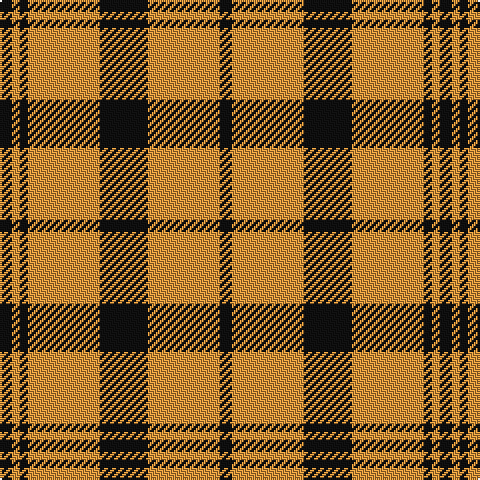

This page is one **sett** — a single exact thread-count. It belongs to the [tartan](/tartans/k3oa2k2oa18k12o18ka3/)
(the same proportion at any scale), whose colour order is pattern [KYKYKYK](/stripes/kykykyk/).

Sourced from tartans-authority.  It is a [7 stripe tartan](/stripes/stripes7/).

Original link http://www.tartansauthority.com/tartan-ferret/display/3003/

## Thread count
K/6 Oa4 K4 Oa36 K24 O36 Ka/6

## Palette
Each colour and the base-6 reference it is a variant of.

| Colour | Shade | Base |
|---|---|---|
| K | <code style="background-color:#101010;">#101010</code> `oklch(17.3% 0.000 89.9)` <small>#101010</small> | K <code style="background-color:#000000;">#000000</code> |
| Ka | <code style="background-color:#101010;">#101010</code> `oklch(17.3% 0.000 89.9)` <small>#101010</small> | K <code style="background-color:#000000;">#000000</code> |
| O | <code style="background-color:#DC943C;">#DC943C</code> `oklch(72.3% 0.133 67.9)` <small>#DC943C</small> | Y <code style="background-color:#F2BF00;">#F2BF00</code> |
| Oa | <code style="background-color:#DC943C;">#DC943C</code> `oklch(72.3% 0.133 67.9)` <small>#DC943C</small> | Y <code style="background-color:#F2BF00;">#F2BF00</code> |

# Sample pattern

## Nearest tartans

The nearest existing variants by ΔTartan distance, with this tartan at the top so the swatches line up against it.

ΔTartan

Tartan

Sett

—

<a href="/ttd/edit/#slug=k3lo18k12lo18k2lo2k3~x2">Kinloch Anderson Check (Fashion)</a> <a class="nn-out" href="/setts/s7/k3lo18k12lo18k2lo2k3~x2/" title="open its dictionary page">↗</a>

1.04

<a href="/ttd/edit/#slug=dr2lo2dr15lo1w10o15lo2o2~x2">Bannockbane</a> <a class="nn-out" href="/setts/s8/dr2lo2dr15lo1w10o15lo2o2~x2/" title="open its dictionary page">↗</a>

1.05

<a href="/ttd/edit/#slug=t12lo75k22w12k22w16t8">Orange Fanaticos (Corporate)</a> <a class="nn-out" href="/setts/s7/t12lo75k22w12k22w16t8/" title="open its dictionary page">↗</a>

1.09

<a href="/ttd/edit/#slug=do2lo2do15lo1w10lo15lo2lo2~x2">Bannockbane Orange Stripes</a> <a class="nn-out" href="/setts/s8/do2lo2do15lo1w10lo15lo2lo2~x2/" title="open its dictionary page">↗</a>

1.11

<a href="/ttd/edit/#slug=do4r3do21r2w14o22r3o4~x2">Bannock Bane M.405</a> <a class="nn-out" href="/setts/s8/do4r3do21r2w14o22r3o4~x2/" title="open its dictionary page">↗</a>

1.19

<a href="/ttd/edit/#slug=k4w26k10lo8k3lo8k10r26w4~x2">Lord Laird</a> <a class="nn-out" href="/setts/s9/k4w26k10lo8k3lo8k10r26w4~x2/" title="open its dictionary page">↗</a>

1.19

<a href="/ttd/edit/#slug=do2r2do15r1w10dy15r2dy2~x2">Bannockbane Brown #1</a> <a class="nn-out" href="/setts/s8/do2r2do15r1w10dy15r2dy2~x2/" title="open its dictionary page">↗</a>

1.21

<a href="/ttd/edit/#slug=lb23k4lb4k4lb4k22o23lo5~x2">Aberlour</a> <a class="nn-out" href="/setts/s8/lb23k4lb4k4lb4k22o23lo5~x2/" title="open its dictionary page">↗</a>

1.21

<a href="/ttd/edit/#slug=ly2g7k6r12k1r1ly2~x4">Blackstock, dress</a> <a class="nn-out" href="/setts/s7/ly2g7k6r12k1r1ly2~x4/" title="open its dictionary page">↗</a>

1.22

<a href="/ttd/edit/#slug=r24w2ly3g16k16w2ly3~x2">MacLachlan Old Clan Tartan Tartan Number: 1710. Earliest known date: 1790 It is the oldest MacLachlan tartan actually bearing the name. The sett has been refered to as Old MacLachlan, MacLachlan and Hunting MacLachlan. Although the sett did not appear in books until D.W. Stewart's Old &amp; Rare Scottish Tartans of 1893, there are samples of it in the collections of Campbell of Craignish in 1790 and in the Highland Society of London (circa 1816). See products available Copyright © Blair Urquhart, Comrie, 2015</a> <a class="nn-out" href="/setts/s7/r24w2ly3g16k16w2ly3~x2/" title="open its dictionary page">↗</a>

1.23

<a href="/ttd/edit/#slug=r36w3lo4g24w24k3lo6~x2">MacLachlan Dress</a> <a class="nn-out" href="/setts/s7/r36w3lo4g24w24k3lo6~x2/" title="open its dictionary page">↗</a>

## Neighbour map

Every grey dot is one of 14299 variants placed by the first two principal components of the ΔTartan feature space (44% of its variance). Red is this tartan; blue dots are its nearest — click one to open its page.

<svg viewBox="0 0 640 380" role="img" style="max-width:100%;height:auto;border:1px solid #e0e0e0;border-radius:4px;display:block" xmlns="http://www.w3.org/2000/svg"><image href="/nn/cloud.v1.png" width="640" height="380"/><a href="/setts/s8/dr2lo2dr15lo1w10o15lo2o2~x2/"><circle cx="186.2" cy="149.5" r="4" fill="#3465a4"><title>Bannockbane</title></circle></a><a href="/setts/s7/t12lo75k22w12k22w16t8/"><circle cx="198.6" cy="172.1" r="4" fill="#3465a4"><title>Orange Fanaticos (Corporate)</title></circle></a><a href="/setts/s8/do2lo2do15lo1w10lo15lo2lo2~x2/"><circle cx="185.6" cy="151.1" r="4" fill="#3465a4"><title>Bannockbane Orange Stripes</title></circle></a><a href="/setts/s8/do4r3do21r2w14o22r3o4~x2/"><circle cx="185.4" cy="171.2" r="4" fill="#3465a4"><title>Bannock Bane M.405</title></circle></a><a href="/setts/s9/k4w26k10lo8k3lo8k10r26w4~x2/"><circle cx="107.2" cy="166.1" r="4" fill="#3465a4"><title>Lord Laird</title></circle></a><a href="/setts/s8/do2r2do15r1w10dy15r2dy2~x2/"><circle cx="194.0" cy="157.1" r="4" fill="#3465a4"><title>Bannockbane Brown #1</title></circle></a><a href="/setts/s8/lb23k4lb4k4lb4k22o23lo5~x2/"><circle cx="131.0" cy="191.8" r="4" fill="#3465a4"><title>Aberlour</title></circle></a><a href="/setts/s7/ly2g7k6r12k1r1ly2~x4/"><circle cx="190.5" cy="168.3" r="4" fill="#3465a4"><title>Blackstock, dress</title></circle></a><a href="/setts/s7/r24w2ly3g16k16w2ly3~x2/"><circle cx="155.1" cy="154.7" r="4" fill="#3465a4"><title>MacLachlan Old Clan Tartan Tartan Number: 1710. Earliest known date: 1790 It is the oldest MacLachlan tartan actually bearing the name. The sett has been refered to as Old MacLachlan, MacLachlan and Hunting MacLachlan. Although the sett did not appear in books until D.W. Stewart's Old &amp; Rare Scottish Tartans of 1893, there are samples of it in the collections of Campbell of Craignish in 1790 and in the Highland Society of London (circa 1816). See products available Copyright © Blair Urquhart, Comrie, 2015</title></circle></a><a href="/setts/s7/r36w3lo4g24w24k3lo6~x2/"><circle cx="140.3" cy="146.4" r="4" fill="#3465a4"><title>MacLachlan Dress</title></circle></a><circle cx="161.5" cy="181.7" r="5" fill="#c00000"/></svg>

ID: /setts/s7/k3lo18k12lo18k2lo2k3~x2/
