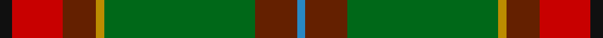

In pattern [BGGYGRK](/stripes/bggygrk/).

This was sourced from tartans-authority.  It is a [7 stripe tartan](/stripes/stripes7/).

Original link http://www.tartansauthority.com/tartan-ferret/display/7804/

## Also known as

This cloth is also recorded under:

- Snelgrove Hunting

## Attestations

This cloth appears in 2 source records; the oldest owns this page.

- 2003 — Snelgrove Htg (Name) (tartans-authority, [record](http://www.tartansauthority.com/tartan-ferret/display/7804/))
- undated — Snelgrove Hunting (register-of-tartans, [record](https://www.tartanregister.gov.uk/tartanDetails.aspx?ref=5766))

## Register references

External register numbers recorded for this tartan.

- Scottish Register of Tartans: [5766](https://www.tartanregister.gov.uk/tartanDetails.aspx?ref=5766)
- Scottish Tartans Authority (ITI): 7804

## Thread count
K/6 R24 T16 DY4 G72 T20 B/4

## Palette
Each colour and the base-6 reference it is a variant of.

| Colour | Shade | Base |
|---|---|---|
| B | <code style="background-color:#2888C4;">#2888C4</code> `oklch(60.1% 0.125 241.5)` <small>#2888C4</small> | B <code style="background-color:#2A418A;">#2A418A</code> |
| DY | <code style="background-color:#BC8C00;">#BC8C00</code> `oklch(66.8% 0.137 84.1)` <small>#BC8C00</small> | Y <code style="background-color:#F2BF00;">#F2BF00</code> |
| G | <code style="background-color:#006818;">#006818</code> `oklch(45.0% 0.142 145.0)` <small>#006818</small> | G <code style="background-color:#006100;">#006100</code> |
| K | <code style="background-color:#101010;">#101010</code> `oklch(17.3% 0.000 89.9)` <small>#101010</small> | K <code style="background-color:#000000;">#000000</code> |
| R | <code style="background-color:#C80000;">#C80000</code> `oklch(52.3% 0.215 29.2)` <small>#C80000</small> | R <code style="background-color:#CC0000;">#CC0000</code> |
| T | <code style="background-color:#642000;">#642000</code> `oklch(34.6% 0.106 41.3)` <small>#642000</small> | G <code style="background-color:#006100;">#006100</code> |

# Sample pattern

## Nearest tartans

The nearest existing variants by ΔTartan distance.

1. [Red Rum](/setts/s7/k2o30g4w2g14m13ly2~x2/) — ΔT 0.99
1. [California Highway Patrol (Corporate](/setts/s8/k3y3dy28lo3dy3lo28db3ly2~x2/) — ΔT 1.12
1. [MacFie Hunting (Clan?)](/setts/s9/lr1do12g2r2g16r2g2do12lo1~x4/) — ΔT 1.32
1. [Ogg of Tarragann Hunting (Personal)](/setts/s12/r2t6r1dy14r1dy14r1k6g10lo1g2lo2~x2/) — ΔT 1.38
1. [Wagland (Name)](/setts/s7/r3db6ly2db15g12dg39w3~x2/) — ΔT 1.42
1. [Manitoba District Tartan Tartan Number: 144. Earliest known date: 1962 The official recording of the sett shows the letter G for the dark green stripe. In heraldic terms this means 'Gules' - red. The designer, Hugh Kirkwood Rankine, clearly intended dark green and this is reproduced here.It was given Royal Assent in 1962. See products available Copyright © Blair Urquhart, Comrie, 2015](/setts/s8/t2g1t1g12dg2g1r6ly2~x4/) — ΔT 1.42
1. [Telfer Green](/setts/s8/g7lo2g5dg37db6r16db5b2~x2/) — ΔT 1.44
1. [T.H.E. C.O.G. USA (Corporate)](/setts/s6/lo9g18t9r1w1db1~x4/) — ΔT 1.45
1. [Manitoba District Tartan Tartan Number: 146. Earliest known date: 1962 The tartan as it would appear with red in place of green, the 'G' of green having been interpreted as 'Gules'. The designer, Hugh Kirkwood Rankine, clearly intended a green stripe. This version can be found in the shops. See products available Copyright © Blair Urquhart, Comrie, 2015](/setts/s8/t2g1t1g12r2g1m6ly2~x2/) — ΔT 1.46
1. [Manitoba Red](/setts/s8/t2dg1t1dg12r2dg1r6ly2~x2/) — ΔT 1.48

## Neighbour map

Every grey dot is one of 14299 variants placed by the first two principal components of the ΔTartan feature space (44% of its variance). Red is this tartan; blue dots are its nearest — click one to open its page.

<svg viewBox="0 0 640 380" role="img" style="max-width:100%;height:auto;border:1px solid #e0e0e0;border-radius:4px;display:block" xmlns="http://www.w3.org/2000/svg"><image href="/nn/cloud.v1.png" width="640" height="380"/><a href="/setts/s7/k2o30g4w2g14m13ly2~x2/"><circle cx="244.4" cy="155.1" r="4" fill="#3465a4"><title>Red Rum</title></circle></a><a href="/setts/s8/k3y3dy28lo3dy3lo28db3ly2~x2/"><circle cx="277.3" cy="146.0" r="4" fill="#3465a4"><title>California Highway Patrol (Corporate</title></circle></a><a href="/setts/s9/lr1do12g2r2g16r2g2do12lo1~x4/"><circle cx="321.2" cy="176.7" r="4" fill="#3465a4"><title>MacFie Hunting (Clan?)</title></circle></a><a href="/setts/s12/r2t6r1dy14r1dy14r1k6g10lo1g2lo2~x2/"><circle cx="243.6" cy="150.4" r="4" fill="#3465a4"><title>Ogg of Tarragann Hunting (Personal)</title></circle></a><a href="/setts/s7/r3db6ly2db15g12dg39w3~x2/"><circle cx="271.9" cy="154.2" r="4" fill="#3465a4"><title>Wagland (Name)</title></circle></a><a href="/setts/s8/t2g1t1g12dg2g1r6ly2~x4/"><circle cx="280.6" cy="173.0" r="4" fill="#3465a4"><title>Manitoba District Tartan Tartan Number: 144. Earliest known date: 1962 The official recording of the sett shows the letter G for the dark green stripe. In heraldic terms this means 'Gules' - red. The designer, Hugh Kirkwood Rankine, clearly intended dark green and this is reproduced here.It was given Royal Assent in 1962. See products available Copyright © Blair Urquhart, Comrie, 2015</title></circle></a><a href="/setts/s8/g7lo2g5dg37db6r16db5b2~x2/"><circle cx="285.3" cy="163.1" r="4" fill="#3465a4"><title>Telfer Green</title></circle></a><a href="/setts/s6/lo9g18t9r1w1db1~x4/"><circle cx="269.0" cy="171.9" r="4" fill="#3465a4"><title>T.H.E. C.O.G. USA (Corporate)</title></circle></a><a href="/setts/s8/t2g1t1g12r2g1m6ly2~x2/"><circle cx="274.3" cy="163.3" r="4" fill="#3465a4"><title>Manitoba District Tartan Tartan Number: 146. Earliest known date: 1962 The tartan as it would appear with red in place of green, the 'G' of green having been interpreted as 'Gules'. The designer, Hugh Kirkwood Rankine, clearly intended a green stripe. This version can be found in the shops. See products available Copyright © Blair Urquhart, Comrie, 2015</title></circle></a><a href="/setts/s8/t2dg1t1dg12r2dg1r6ly2~x2/"><circle cx="274.2" cy="164.0" r="4" fill="#3465a4"><title>Manitoba Red</title></circle></a><circle cx="287.5" cy="153.8" r="5" fill="#c00000"/></svg>

ID: /setts/s7/k3r12dy8lo2g36dy10t2~x2/
