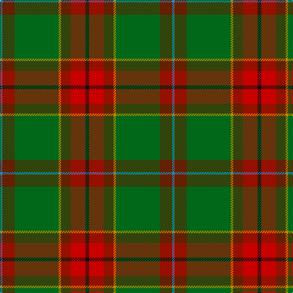

In pattern [BGGYGRK](/patterns/bggygrk/).

This was sourced from tartans-authority.  It is a [7 stripes tartan](/stripes/stripes7/).

Original link http://www.tartansauthority.com/tartan-ferret/display/7804/

## Attestations

This cloth appears in 2 source records; the oldest owns this page.

- 2003 — Snelgrove Htg (Name) (tartans-authority, [record](http://www.tartansauthority.com/tartan-ferret/display/7804/))
- undated — Snelgrove Hunting (register-of-tartans, [record](https://www.tartanregister.gov.uk/tartanDetails.aspx?ref=5766))

## Thread count
B/4 T20 G72 DY4 T16 R24 K/6

## Palette
Each colour and its ΔE from the base-6 reference it is a variant of.

| Colour | Shade | Base | ΔE (OKLab) |
|---|---|---|---|
| B | <code style="background-color:#2888C4;">#2888C4</code> `#2888C4` | B <code style="background-color:#2A418A;">#2A418A</code> | 0.21 |
| DY | <code style="background-color:#BC8C00;">#BC8C00</code> `#BC8C00` | Y <code style="background-color:#F2BF00;">#F2BF00</code> | 0.16 |
| G | <code style="background-color:#006818;">#006818</code> `#006818` | G <code style="background-color:#006100;">#006100</code> | 0.02 |
| K | <code style="background-color:#101010;">#101010</code> `#101010` | K <code style="background-color:#000000;">#000000</code> | 0.17 |
| R | <code style="background-color:#C80000;">#C80000</code> `#C80000` | R <code style="background-color:#CC0000;">#CC0000</code> | 0.01 |
| T | <code style="background-color:#642000;">#642000</code> `#642000` | G <code style="background-color:#006100;">#006100</code> | 0.21 |

# Sample pattern

## Nearest tartans

The nearest existing variants by ΔTartan distance.

1. [Red Rum](/setts/s7/k2r30g4w2g14ra13y2x2~g008000-k000000-r806050-ra802040-we0e0e0-yf0c000/) — ΔT 0.99
1. [California Highway Patrol (Corporate](/setts/s8/k3g3ga28y3ga3y28b3ya2x2~b2c2c80-g5c6428-ga604000-k101010-ya08858-yae8c000/) — ΔT 1.11
1. [MacFie Hunting (Clan?)](/setts/s9/y1b12g2r2g16r2g2b12ya1x4~b441800-g006818-r880000-yb8b8b8-yad09800/) — ΔT 1.32
1. [Ogg of Tarragann Hunting (Personal)](/setts/s12/r2b6r1g14r1g14r1k6ga10y1ga2y2x2~b5c8ca8-g604000-ga006818-k101010-rc80000-ybc8c00/) — ΔT 1.39
1. [Wagland (Name)](/setts/s7/r3b6y2b15g12ga39w3x2~b2c2c80-g006818-ga285800-rc80000-we0e0e0-ye8c000/) — ΔT 1.41
1. [Manitoba District Tartan Tartan Number: 144. Earliest known date: 1962 The official recording of the sett shows the letter G for the dark green stripe. In heraldic terms this means 'Gules' - red. The designer, Hugh Kirkwood Rankine, clearly intended dark green and this is reproduced here.It was given Royal Assent in 1962. See products available Copyright © Blair Urquhart, Comrie, 2015](/setts/s8/b2g1b1g12ga2g1r6y2x4~b5c8ca8-g006818-ga003820-r901c38-ye8c000/) — ΔT 1.42
1. [Telfer Green](/setts/s8/g7y2g5ga37b6r16b5ba2x2~b1c1c50-ba3850c8-g006818-ga104c20-r880000-yf09400/) — ΔT 1.44
1. [T.H.E. C.O.G. USA (Corporate)](/setts/s6/y9g18b9r1w1ba1x4~b5c7888-ba2c2c80-g006818-rc8002c-we0e0e0-ybc8c00/) — ΔT 1.45
1. [Manitoba District Tartan Tartan Number: 146. Earliest known date: 1962 The tartan as it would appear with red in place of green, the 'G' of green having been interpreted as 'Gules'. The designer, Hugh Kirkwood Rankine, clearly intended a green stripe. This version can be found in the shops. See products available Copyright © Blair Urquhart, Comrie, 2015](/setts/s8/b2g1b1g12r2g1ra6y2x2~b5c8ca8-g006818-rc80000-raa00048-ye8c000/) — ΔT 1.46
1. [Manitoba Red](/setts/s8/b2g1b1g12r2g1ra6y2x2~b3c82af-g005020-rdc0000-ra960028-ye8c000/) — ΔT 1.48

## Neighbour map

Every grey dot is one of 15726 variants placed by the first two principal components of the ΔTartan feature space (44% of its variance). Red is this tartan; blue dots are its nearest — click one to open its page.

<svg viewBox="0 0 640 380" role="img" style="max-width:100%;height:auto;border:1px solid #e0e0e0;border-radius:4px;display:block" xmlns="http://www.w3.org/2000/svg"><image href="/nn/cloud.v1.png" width="640" height="380"/><a href="/setts/s7/k2r30g4w2g14ra13y2x2~g008000-k000000-r806050-ra802040-we0e0e0-yf0c000/"><circle cx="242.9" cy="150.3" r="4" fill="#3465a4"><title>Red Rum</title></circle></a><a href="/setts/s8/k3g3ga28y3ga3y28b3ya2x2~b2c2c80-g5c6428-ga604000-k101010-ya08858-yae8c000/"><circle cx="276.1" cy="140.6" r="4" fill="#3465a4"><title>California Highway Patrol (Corporate</title></circle></a><a href="/setts/s9/y1b12g2r2g16r2g2b12ya1x4~b441800-g006818-r880000-yb8b8b8-yad09800/"><circle cx="319.6" cy="171.0" r="4" fill="#3465a4"><title>MacFie Hunting (Clan?)</title></circle></a><a href="/setts/s12/r2b6r1g14r1g14r1k6ga10y1ga2y2x2~b5c8ca8-g604000-ga006818-k101010-rc80000-ybc8c00/"><circle cx="242.2" cy="142.5" r="4" fill="#3465a4"><title>Ogg of Tarragann Hunting (Personal)</title></circle></a><a href="/setts/s7/r3b6y2b15g12ga39w3x2~b2c2c80-g006818-ga285800-rc80000-we0e0e0-ye8c000/"><circle cx="269.3" cy="148.1" r="4" fill="#3465a4"><title>Wagland (Name)</title></circle></a><a href="/setts/s8/b2g1b1g12ga2g1r6y2x4~b5c8ca8-g006818-ga003820-r901c38-ye8c000/"><circle cx="278.6" cy="169.1" r="4" fill="#3465a4"><title>Manitoba District Tartan Tartan Number: 144. Earliest known date: 1962 The official recording of the sett shows the letter G for the dark green stripe. In heraldic terms this means 'Gules' - red. The designer, Hugh Kirkwood Rankine, clearly intended dark green and this is reproduced here.It was given Royal Assent in 1962. See products available Copyright © Blair Urquhart, Comrie, 2015</title></circle></a><a href="/setts/s8/g7y2g5ga37b6r16b5ba2x2~b1c1c50-ba3850c8-g006818-ga104c20-r880000-yf09400/"><circle cx="283.3" cy="153.1" r="4" fill="#3465a4"><title>Telfer Green</title></circle></a><a href="/setts/s6/y9g18b9r1w1ba1x4~b5c7888-ba2c2c80-g006818-rc8002c-we0e0e0-ybc8c00/"><circle cx="267.1" cy="164.6" r="4" fill="#3465a4"><title>T.H.E. C.O.G. USA (Corporate)</title></circle></a><a href="/setts/s8/b2g1b1g12r2g1ra6y2x2~b5c8ca8-g006818-rc80000-raa00048-ye8c000/"><circle cx="272.7" cy="161.3" r="4" fill="#3465a4"><title>Manitoba District Tartan Tartan Number: 146. Earliest known date: 1962 The tartan as it would appear with red in place of green, the 'G' of green having been interpreted as 'Gules'. The designer, Hugh Kirkwood Rankine, clearly intended a green stripe. This version can be found in the shops. See products available Copyright © Blair Urquhart, Comrie, 2015</title></circle></a><a href="/setts/s8/b2g1b1g12r2g1ra6y2x2~b3c82af-g005020-rdc0000-ra960028-ye8c000/"><circle cx="272.4" cy="162.1" r="4" fill="#3465a4"><title>Manitoba Red</title></circle></a><circle cx="286.1" cy="148.5" r="5" fill="#c00000"/></svg>

ID: /setts/s7/k3r12g8y2ga36g10b2x2~b2888c4-g642000-ga006818-k101010-rc80000-ybc8c00/
