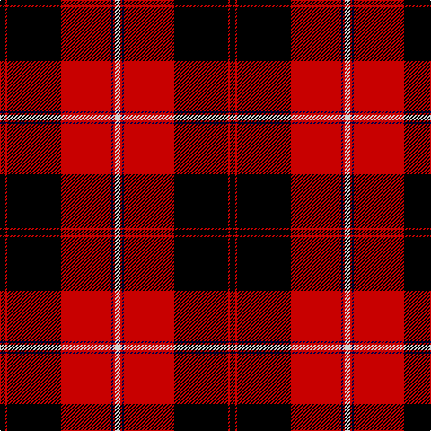

In pattern [KRKRBRW](/stripes/krkrbrw/).

This was sourced from weddslist.  It is a [7 stripe tartan](/stripes/stripes7/).

Original link http://www.weddslist.com/cgi-bin/tartans/pg.pl?source=rb

## Register references

External register numbers recorded for this tartan.

- Scottish Register of Tartans: [1166](https://www.tartanregister.gov.uk/tartanDetails.aspx?ref=1166)
- Scottish Register of Tartans: [1758](https://www.tartanregister.gov.uk/tartanDetails.aspx?ref=1758)
- Scottish Register of Tartans: [2307](https://www.tartanregister.gov.uk/tartanDetails.aspx?ref=2307)
- Scottish Register of Tartans: [2540](https://www.tartanregister.gov.uk/tartanDetails.aspx?ref=2540)
- Scottish Register of Tartans: [2666](https://www.tartanregister.gov.uk/tartanDetails.aspx?ref=2666)
- Scottish Register of Tartans: [2862](https://www.tartanregister.gov.uk/tartanDetails.aspx?ref=2862)
- Scottish Register of Tartans: [3808](https://www.tartanregister.gov.uk/tartanDetails.aspx?ref=3808)
- Scottish Register of Tartans: [982](https://www.tartanregister.gov.uk/tartanDetails.aspx?ref=982)
- Scottish Tartans Authority (ITI): 218
- Scottish Tartans World Register: 1010
- Scottish Tartans World Register: 1042
- Scottish Tartans World Register: 127
- Scottish Tartans World Register: 1585
- Scottish Tartans World Register: 218
- Scottish Tartans World Register: 2218
- Scottish Tartans World Register: 737
- Scottish Tartans World Register: 897

## Thread count
K/6 R2 K60 R56 DB2 R2 N/6

## Palette
Each colour and its ΔE from the base-6 reference it is a variant of.

| Colour | Shade | Base | ΔE (OKLab) |
|---|---|---|---|
| DB | <code style="background-color:#00004C;">#00004C</code> `#00004C` | B <code style="background-color:#2A418A;">#2A418A</code> | 0.21 |
| K | <code style="background-color:#000000;">#000000</code> `#000000` | K <code style="background-color:#000000;">#000000</code> | 0.00 |
| N | <code style="background-color:#D0D0D0;">#D0D0D0</code> `#D0D0D0` | W <code style="background-color:#F7F7F7;">#F7F7F7</code> | 0.12 |
| R | <code style="background-color:#C80000;">#C80000</code> `#C80000` | R <code style="background-color:#CC0000;">#CC0000</code> | 0.01 |

# Sample pattern

## Nearest tartans

The nearest existing variants by ΔTartan distance.

1. [Cunningham](/setts/s7/k3r1k30r28db1r1lr3~x2/) — ΔT 0.45
1. [Ramsay](/setts/s6/k4w2k28r30dp1r3~x2/) — ΔT 0.57
1. [Ramsay](/setts/s6/k4lb2k28r30db1r3~x2/) — ΔT 0.58
1. [Ramsay](/setts/s6/k4lr2k28r30n1r3~x2/) — ΔT 0.66
1. [Cunningham D](/setts/s7/k3r1k30r28k1r1lb3~x2/) — ΔT 0.86
1. [Marjoribanks](/setts/s8/w3k3w3k36r40w1r2ly3~x2/) — ΔT 0.87
1. [Cunningham D](/setts/s7/k3r1k30r28k1r1lr3~x2/) — ΔT 0.97
1. [Cunningham #3](/setts/s7/k3r1k30r28db1r1w3~x2/) — ΔT 1.03
1. [Sutherland de Albergaria (Personal)](/setts/s8/w10k2w2k66ly6r48k5r8/) — ΔT 1.22
1. [Wemyss](/setts/s9/r4k12lr1k12r4k4r24dg1r4~x2/) — ΔT 1.24

## Neighbour map

Every grey dot is one of 14299 variants placed by the first two principal components of the ΔTartan feature space (44% of its variance). Red is this tartan; blue dots are its nearest — click one to open its page.

<svg viewBox="0 0 640 380" role="img" style="max-width:100%;height:auto;border:1px solid #e0e0e0;border-radius:4px;display:block" xmlns="http://www.w3.org/2000/svg"><image href="/nn/cloud.v1.png" width="640" height="380"/><a href="/setts/s7/k3r1k30r28db1r1lr3~x2/"><circle cx="348.4" cy="126.5" r="4" fill="#3465a4"><title>Cunningham</title></circle></a><a href="/setts/s6/k4w2k28r30dp1r3~x2/"><circle cx="339.2" cy="137.2" r="4" fill="#3465a4"><title>Ramsay</title></circle></a><a href="/setts/s6/k4lb2k28r30db1r3~x2/"><circle cx="338.1" cy="136.2" r="4" fill="#3465a4"><title>Ramsay</title></circle></a><a href="/setts/s6/k4lr2k28r30n1r3~x2/"><circle cx="345.8" cy="143.0" r="4" fill="#3465a4"><title>Ramsay</title></circle></a><a href="/setts/s7/k3r1k30r28k1r1lb3~x2/"><circle cx="367.9" cy="135.1" r="4" fill="#3465a4"><title>Cunningham D</title></circle></a><a href="/setts/s8/w3k3w3k36r40w1r2ly3~x2/"><circle cx="320.8" cy="93.4" r="4" fill="#3465a4"><title>Marjoribanks</title></circle></a><a href="/setts/s7/k3r1k30r28k1r1lr3~x2/"><circle cx="375.5" cy="142.1" r="4" fill="#3465a4"><title>Cunningham D</title></circle></a><a href="/setts/s7/k3r1k30r28db1r1w3~x2/"><circle cx="350.0" cy="117.7" r="4" fill="#3465a4"><title>Cunningham #3</title></circle></a><a href="/setts/s8/w10k2w2k66ly6r48k5r8/"><circle cx="321.3" cy="107.1" r="4" fill="#3465a4"><title>Sutherland de Albergaria (Personal)</title></circle></a><a href="/setts/s9/r4k12lr1k12r4k4r24dg1r4~x2/"><circle cx="348.9" cy="143.3" r="4" fill="#3465a4"><title>Wemyss</title></circle></a><circle cx="340.7" cy="119.5" r="5" fill="#c00000"/></svg>

ID: /setts/s7/k3r1k30r28db1r1lb3~x2/
