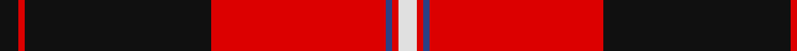
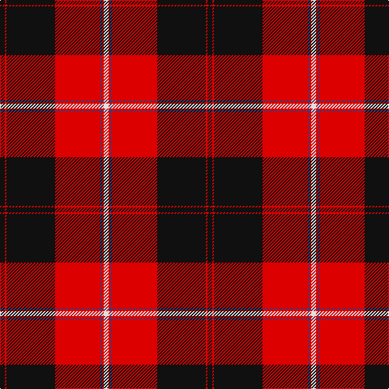

This page is one **sett** — a single exact thread-count. It belongs to the [tartan](/tartans/k3r1k30r28b1r1ln3/)
(the same proportion at any scale), whose colour order is pattern [KRKRBRW](/stripes/krkrbrw/).

Sourced from register-of-tartans.  It is a [7 stripe tartan](/stripes/stripes7/).

Original link https://www.tartanregister.gov.uk/tartanDetails.aspx?ref=844

## Also known as

This cloth is also recorded under:

- Cunningham #3

3 attestations — the source records this cloth was collapsed from (oldest owns this page)

<ul>
<li>undated — Cunningham #3 (register-of-tartans, <a href="https://www.tartanregister.gov.uk/tartanDetails.aspx?ref=844">record</a>)</li>
<li>undated — Cunningham (weddslist, <a href="http://www.weddslist.com/cgi-bin/tartans/pg.pl?source=sts">record</a>)</li>
<li>undated — Cunningham (VS) Clan Tartan Tartan Number: 1200. Earliest known date: 1842 The origin of the name comes from the district of Cunningham in Ayrshire. Alexander de Cunningham was created 1st Earl of Glencairn in 1488. The family is now widespread throughout Scotland. Cunningham was one of the names adopted by the MacGregors when their own was proscribed. There is a similarity with the MacGregor tartan but the true origin is unknown as the claims of antiquity made in the Vestiarium Scoticum, where the Cunningham tartan was first recorded, are unreliable. See products available Copyright © Blair Urquhart, Comrie, 2015 (house-of-tartan, <a href="http://www.house-of-tartan.scotland.net/house/TartanViewjs.asp?colr=Def&tnam=1200">record</a>)</li>
</ul>

## Register references

External register numbers recorded for this tartan.

- Scottish Register of Tartans: [844](https://www.tartanregister.gov.uk/tartanDetails.aspx?ref=844)
- Scottish Tartans World Register: 1200

## Thread count
K/6 R2 K60 R56 B2 R2 LN/6

## Palette
Each colour and the base-6 reference it is a variant of.

| Colour | Shade | Base |
|---|---|---|
| B | <code style="background-color:#2C4084;">#2C4084</code> `oklch(39.4% 0.117 268.3)` <small>#2C4084</small> | B <code style="background-color:#2A418A;">#2A418A</code> |
| K | <code style="background-color:#101010;">#101010</code> `oklch(17.3% 0.000 89.9)` <small>#101010</small> | K <code style="background-color:#000000;">#000000</code> |
| LN | <code style="background-color:#E0E0E0;">#E0E0E0</code> `oklch(90.7% 0.000 89.9)` <small>#E0E0E0</small> | W <code style="background-color:#F7F7F7;">#F7F7F7</code> |
| R | <code style="background-color:#DC0000;">#DC0000</code> `oklch(56.2% 0.230 29.2)` <small>#DC0000</small> | R <code style="background-color:#CC0000;">#CC0000</code> |

# Sample pattern

## Nearest tartans

The nearest existing variants by ΔTartan distance, with this tartan at the top so the swatches line up against it.

ΔTartan

Tartan

Sett

—

<a href="/ttd/edit/#slug=k3r1k30r28db1r1w3~x2">Cunningham #3</a> <a class="nn-out" href="/setts/s7/k3r1k30r28db1r1w3~x2/" title="open its dictionary page">↗</a>

0.71

<a href="/ttd/edit/#slug=k4w1k28r30dp1r3~x2">Ramsay (Red)</a> <a class="nn-out" href="/setts/s6/k4w1k28r30dp1r3~x2/" title="open its dictionary page">↗</a>

0.74

<a href="/ttd/edit/#slug=w10k2w2k66ly6r48k5r8">Sutherland de Albergaria (Personal)</a> <a class="nn-out" href="/setts/s8/w10k2w2k66ly6r48k5r8/" title="open its dictionary page">↗</a>

0.78

<a href="/ttd/edit/#slug=w3k3w3k37r40w1r2lo3~x2">Marjoribanks (Clan)</a> <a class="nn-out" href="/setts/s8/w3k3w3k37r40w1r2lo3~x2/" title="open its dictionary page">↗</a>

0.86

<a href="/ttd/edit/#slug=k3r1k30r28k1r1w3~x2">Cunningham</a> <a class="nn-out" href="/setts/s7/k3r1k30r28k1r1w3~x2/" title="open its dictionary page">↗</a>

0.92

<a href="/ttd/edit/#slug=lo4k17r1k4r2k4r33w3~x2">Mens Bigi</a> <a class="nn-out" href="/setts/s8/lo4k17r1k4r2k4r33w3~x2/" title="open its dictionary page">↗</a>

0.95

<a href="/ttd/edit/#slug=r4k6ly1k6r4db16r32k1~x2">Leslie</a> <a class="nn-out" href="/setts/s8/r4k6ly1k6r4db16r32k1~x2/" title="open its dictionary page">↗</a>

0.99

<a href="/ttd/edit/#slug=r1k3lb2k28r30k1r2lb1~x2">Las Vegas Fire Fighters</a> <a class="nn-out" href="/setts/s8/r1k3lb2k28r30k1r2lb1~x2/" title="open its dictionary page">↗</a>

1.02

<a href="/ttd/edit/#slug=w3k3w3k36r40w1r2ly3~x2">Marjoribanks</a> <a class="nn-out" href="/setts/s8/w3k3w3k36r40w1r2ly3~x2/" title="open its dictionary page">↗</a>

1.02

<a href="/ttd/edit/#slug=r4k6ly1k6r4db16r32db1~x2">Leslie Dress</a> <a class="nn-out" href="/setts/s8/r4k6ly1k6r4db16r32db1~x2/" title="open its dictionary page">↗</a>

1.03

<a href="/ttd/edit/#slug=k6r4lb3r44k32r3k3lo3k2r3~x2">Smeaton 1985 (Name)</a> <a class="nn-out" href="/setts/s10/k6r4lb3r44k32r3k3lo3k2r3~x2/" title="open its dictionary page">↗</a>

## Neighbour map

Every grey dot is one of 14299 variants placed by the first two principal components of the ΔTartan feature space (44% of its variance). Red is this tartan; blue dots are its nearest — click one to open its page.

<svg viewBox="0 0 640 380" role="img" style="max-width:100%;height:auto;border:1px solid #e0e0e0;border-radius:4px;display:block" xmlns="http://www.w3.org/2000/svg"><image href="/nn/cloud.v1.png" width="640" height="380"/><a href="/setts/s6/k4w1k28r30dp1r3~x2/"><circle cx="367.7" cy="140.7" r="4" fill="#3465a4"><title>Ramsay (Red)</title></circle></a><a href="/setts/s8/w10k2w2k66ly6r48k5r8/"><circle cx="321.3" cy="107.1" r="4" fill="#3465a4"><title>Sutherland de Albergaria (Personal)</title></circle></a><a href="/setts/s8/w3k3w3k37r40w1r2lo3~x2/"><circle cx="328.5" cy="93.4" r="4" fill="#3465a4"><title>Marjoribanks (Clan)</title></circle></a><a href="/setts/s7/k3r1k30r28k1r1w3~x2/"><circle cx="377.1" cy="133.3" r="4" fill="#3465a4"><title>Cunningham</title></circle></a><a href="/setts/s8/lo4k17r1k4r2k4r33w3~x2/"><circle cx="364.9" cy="122.5" r="4" fill="#3465a4"><title>Mens Bigi</title></circle></a><a href="/setts/s8/r4k6ly1k6r4db16r32k1~x2/"><circle cx="360.2" cy="119.4" r="4" fill="#3465a4"><title>Leslie</title></circle></a><a href="/setts/s8/r1k3lb2k28r30k1r2lb1~x2/"><circle cx="382.6" cy="127.4" r="4" fill="#3465a4"><title>Las Vegas Fire Fighters</title></circle></a><a href="/setts/s8/w3k3w3k36r40w1r2ly3~x2/"><circle cx="320.8" cy="93.4" r="4" fill="#3465a4"><title>Marjoribanks</title></circle></a><a href="/setts/s8/r4k6ly1k6r4db16r32db1~x2/"><circle cx="353.0" cy="117.3" r="4" fill="#3465a4"><title>Leslie Dress</title></circle></a><a href="/setts/s10/k6r4lb3r44k32r3k3lo3k2r3~x2/"><circle cx="359.5" cy="112.6" r="4" fill="#3465a4"><title>Smeaton 1985 (Name)</title></circle></a><circle cx="350.0" cy="117.7" r="5" fill="#c00000"/></svg>

ID: /setts/s7/k3r1k30r28db1r1w3~x2/
