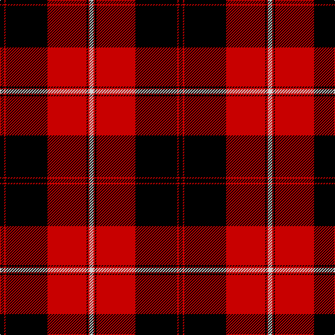

In pattern [KRKRKRW](/stripes/krkrkrw/).

This was sourced from weddslist.  It is a [7 stripe tartan](/stripes/stripes7/).

Original link http://www.weddslist.com/cgi-bin/tartans/pg.pl?source=rb

## Thread count
K/6 R2 K60 R56 K2 R2 N/6

## Palette
Each colour and the base-6 reference it is a variant of.

| Colour | Shade | Base |
|---|---|---|
| K | <code style="background-color:#000000;">#000000</code> `oklch(0.0% 0.000 0.0)` <small>#000000</small> | K <code style="background-color:#000000;">#000000</code> |
| N | <code style="background-color:#D0D0D0;">#D0D0D0</code> `oklch(85.8% 0.000 89.9)` <small>#D0D0D0</small> | W <code style="background-color:#F7F7F7;">#F7F7F7</code> |
| R | <code style="background-color:#C80000;">#C80000</code> `oklch(52.3% 0.215 29.2)` <small>#C80000</small> | R <code style="background-color:#CC0000;">#CC0000</code> |

# Sample pattern

## Nearest tartans

The nearest existing variants by ΔTartan distance.

1. [Cunningham D](/setts/s7/k3r1k30r28k1r1lr3~x2/) — ΔT 0.45
1. [Cunningham](/setts/s7/k3r1k30r28db1r1lb3~x2/) — ΔT 0.86
1. [Cunningham](/setts/s7/k3r1k30r28db1r1lr3~x2/) — ΔT 0.97
1. [Cunningham](/setts/s7/k3r1k30r28k1r1w3~x2/) — ΔT 1.02
1. [Ramsay](/setts/s6/k4w2k28r30dp1r3~x2/) — ΔT 1.02
1. [Ramsay](/setts/s6/k4lb2k28r30db1r3~x2/) — ΔT 1.03
1. [Ramsay](/setts/s6/k4lr2k28r30n1r3~x2/) — ΔT 1.08
1. [Las Vegas Fire Fighters](/setts/s8/r1k3lb2k28r30k1r2lb1~x2/) — ΔT 1.22
1. [Ramsay of Dalhousie](/setts/s6/k4w2k28r30k1r3~x2/) — ΔT 1.27
1. [Marjoribanks](/setts/s8/w3k3w3k36r40w1r2ly3~x2/) — ΔT 1.29

## Neighbour map

Every grey dot is one of 14299 variants placed by the first two principal components of the ΔTartan feature space (44% of its variance). Red is this tartan; blue dots are its nearest — click one to open its page.

<svg viewBox="0 0 640 380" role="img" style="max-width:100%;height:auto;border:1px solid #e0e0e0;border-radius:4px;display:block" xmlns="http://www.w3.org/2000/svg"><image href="/nn/cloud.v1.png" width="640" height="380"/><a href="/setts/s7/k3r1k30r28k1r1lr3~x2/"><circle cx="375.5" cy="142.1" r="4" fill="#3465a4"><title>Cunningham D</title></circle></a><a href="/setts/s7/k3r1k30r28db1r1lb3~x2/"><circle cx="340.7" cy="119.5" r="4" fill="#3465a4"><title>Cunningham</title></circle></a><a href="/setts/s7/k3r1k30r28db1r1lr3~x2/"><circle cx="348.4" cy="126.5" r="4" fill="#3465a4"><title>Cunningham</title></circle></a><a href="/setts/s7/k3r1k30r28k1r1w3~x2/"><circle cx="377.1" cy="133.3" r="4" fill="#3465a4"><title>Cunningham</title></circle></a><a href="/setts/s6/k4w2k28r30dp1r3~x2/"><circle cx="339.2" cy="137.2" r="4" fill="#3465a4"><title>Ramsay</title></circle></a><a href="/setts/s6/k4lb2k28r30db1r3~x2/"><circle cx="338.1" cy="136.2" r="4" fill="#3465a4"><title>Ramsay</title></circle></a><a href="/setts/s6/k4lr2k28r30n1r3~x2/"><circle cx="345.8" cy="143.0" r="4" fill="#3465a4"><title>Ramsay</title></circle></a><a href="/setts/s8/r1k3lb2k28r30k1r2lb1~x2/"><circle cx="382.6" cy="127.4" r="4" fill="#3465a4"><title>Las Vegas Fire Fighters</title></circle></a><a href="/setts/s6/k4w2k28r30k1r3~x2/"><circle cx="370.8" cy="150.7" r="4" fill="#3465a4"><title>Ramsay of Dalhousie</title></circle></a><a href="/setts/s8/w3k3w3k36r40w1r2ly3~x2/"><circle cx="320.8" cy="93.4" r="4" fill="#3465a4"><title>Marjoribanks</title></circle></a><circle cx="367.9" cy="135.1" r="5" fill="#c00000"/></svg>

ID: /setts/s7/k3r1k30r28k1r1lb3~x2/
