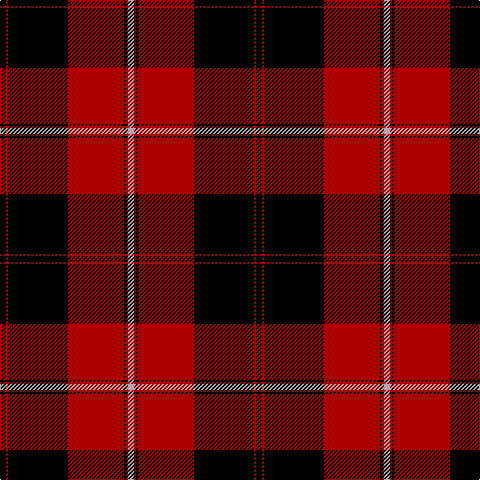

This page is one **sett** — a single exact thread-count. It belongs to the [tartan](/tartans/k3r1k30r28k1r1lr3/)
(the same proportion at any scale), whose colour order is pattern [KRKRKRY](/stripes/krkrkry/).

Sourced from weddslist.  It is a [7 stripe tartan](/stripes/stripes7/).

Original link http://www.weddslist.com/cgi-bin/tartans/pg.pl?source=tinsel

2 attestations — the source records this cloth was collapsed from (oldest owns this page)

<ul>
<li>undated — Cunningham D (weddslist, <a href="http://www.weddslist.com/cgi-bin/tartans/pg.pl?source=tinsel">record</a>)</li>
<li>undated — Cunningham D (weddslist, <a href="http://www.weddslist.com/cgi-bin/tartans/pg.pl?source=x">record</a>)</li>
</ul>

## Thread count
K/6 DR2 K60 DR56 K2 DR2 N/6

## Palette

Palette: <strong>Ingles Buchan</strong> <small style="color:#888">(1 of 3 colours)</small>
<table><thead><tr><th>Colour</th><th>Threads</th><th>Shade</th><th>Base</th><th>OKLCh</th></tr></thead><tbody><tr><td>K/</td><td style="text-align:right;font-variant-numeric:tabular-nums">6</td><td><code style="background-color:#000000;">#000000</code> <small style="color:#888">#000000</small></td><td>K <code style="background-color:#000000;">#000000</code></td><td><small style="color:#888">oklch(0.0% 0.000 0.0)</small></td></tr><tr><td>DR</td><td style="text-align:right;font-variant-numeric:tabular-nums">2</td><td><code style="background-color:#AA0000;">#AA0000</code> <small style="color:#888">#AA0000</small></td><td>R <code style="background-color:#CC0000;">#CC0000</code></td><td><small style="color:#888">oklch(46.3% 0.190 29.2)</small></td></tr><tr><td>K</td><td style="text-align:right;font-variant-numeric:tabular-nums">60</td><td><code style="background-color:#000000;">#000000</code> <small style="color:#888">#000000</small></td><td>K <code style="background-color:#000000;">#000000</code></td><td><small style="color:#888">oklch(0.0% 0.000 0.0)</small></td></tr><tr><td>DR</td><td style="text-align:right;font-variant-numeric:tabular-nums">56</td><td><code style="background-color:#AA0000;">#AA0000</code> <small style="color:#888">#AA0000</small></td><td>R <code style="background-color:#CC0000;">#CC0000</code></td><td><small style="color:#888">oklch(46.3% 0.190 29.2)</small></td></tr><tr><td>K</td><td style="text-align:right;font-variant-numeric:tabular-nums">2</td><td><code style="background-color:#000000;">#000000</code> <small style="color:#888">#000000</small></td><td>K <code style="background-color:#000000;">#000000</code></td><td><small style="color:#888">oklch(0.0% 0.000 0.0)</small></td></tr><tr><td>DR</td><td style="text-align:right;font-variant-numeric:tabular-nums">2</td><td><code style="background-color:#AA0000;">#AA0000</code> <small style="color:#888">#AA0000</small></td><td>R <code style="background-color:#CC0000;">#CC0000</code></td><td><small style="color:#888">oklch(46.3% 0.190 29.2)</small></td></tr><tr><td>N/</td><td style="text-align:right;font-variant-numeric:tabular-nums">6</td><td><code style="background-color:#AAAAAA;">#AAAAAA</code> <small style="color:#888">#AAAAAA</small></td><td>Y <code style="background-color:#F2BF00;">#F2BF00</code></td><td><small style="color:#888">oklch(73.8% 0.000 89.9)</small></td></tr></tbody></table>

# Sample pattern

## Nearest tartans

The nearest existing variants by ΔTartan distance, with this tartan at the top so the swatches line up against it.

ΔTartan

Tartan

Sett

—

<a href="/ttd/edit/#slug=k3r1k30r28k1r1lr3~x2">Cunningham D</a> <a class="nn-out" href="/setts/s7/k3r1k30r28k1r1lr3~x2/" title="open its dictionary page">↗</a>

0.45

<a href="/ttd/edit/#slug=k3r1k30r28k1r1lb3~x2">Cunningham D</a> <a class="nn-out" href="/setts/s7/k3r1k30r28k1r1lb3~x2/" title="open its dictionary page">↗</a>

0.86

<a href="/ttd/edit/#slug=k3r1k30r28db1r1lr3~x2">Cunningham</a> <a class="nn-out" href="/setts/s7/k3r1k30r28db1r1lr3~x2/" title="open its dictionary page">↗</a>

0.97

<a href="/ttd/edit/#slug=k3r1k30r28db1r1lb3~x2">Cunningham</a> <a class="nn-out" href="/setts/s7/k3r1k30r28db1r1lb3~x2/" title="open its dictionary page">↗</a>

1.03

<a href="/ttd/edit/#slug=k4lr2k28r30n1r3~x2">Ramsay</a> <a class="nn-out" href="/setts/s6/k4lr2k28r30n1r3~x2/" title="open its dictionary page">↗</a>

1.13

<a href="/ttd/edit/#slug=k4w2k28r30dp1r3~x2">Ramsay</a> <a class="nn-out" href="/setts/s6/k4w2k28r30dp1r3~x2/" title="open its dictionary page">↗</a>

1.16

<a href="/ttd/edit/#slug=k4lb2k28r30db1r3~x2">Ramsay</a> <a class="nn-out" href="/setts/s6/k4lb2k28r30db1r3~x2/" title="open its dictionary page">↗</a>

1.25

<a href="/ttd/edit/#slug=k3r1k30r28k1r1w3~x2">Cunningham</a> <a class="nn-out" href="/setts/s7/k3r1k30r28k1r1w3~x2/" title="open its dictionary page">↗</a>

1.34

<a href="/ttd/edit/#slug=r1k3lb2k28r30k1r2lb1~x2">Las Vegas Fire Fighters</a> <a class="nn-out" href="/setts/s8/r1k3lb2k28r30k1r2lb1~x2/" title="open its dictionary page">↗</a>

1.35

<a href="/ttd/edit/#slug=k2r2k12r2k2r18k2r2k12r2w1~x2">Hebridean 8</a> <a class="nn-out" href="/setts/s11/k2r2k12r2k2r18k2r2k12r2w1~x2/" title="open its dictionary page">↗</a>

1.38

<a href="/ttd/edit/#slug=w2k3r10k5r3k5r15k35w1~x2">Bertea, A H (Personal)</a> <a class="nn-out" href="/setts/s9/w2k3r10k5r3k5r15k35w1~x2/" title="open its dictionary page">↗</a>

## Neighbour map

Every grey dot is one of 14299 variants placed by the first two principal components of the ΔTartan feature space (44% of its variance). Red is this tartan; blue dots are its nearest — click one to open its page.

<svg viewBox="0 0 640 380" role="img" style="max-width:100%;height:auto;border:1px solid #e0e0e0;border-radius:4px;display:block" xmlns="http://www.w3.org/2000/svg"><image href="/nn/cloud.v1.png" width="640" height="380"/><a href="/setts/s7/k3r1k30r28k1r1lb3~x2/"><circle cx="367.9" cy="135.1" r="4" fill="#3465a4"><title>Cunningham D</title></circle></a><a href="/setts/s7/k3r1k30r28db1r1lr3~x2/"><circle cx="348.4" cy="126.5" r="4" fill="#3465a4"><title>Cunningham</title></circle></a><a href="/setts/s7/k3r1k30r28db1r1lb3~x2/"><circle cx="340.7" cy="119.5" r="4" fill="#3465a4"><title>Cunningham</title></circle></a><a href="/setts/s6/k4lr2k28r30n1r3~x2/"><circle cx="345.8" cy="143.0" r="4" fill="#3465a4"><title>Ramsay</title></circle></a><a href="/setts/s6/k4w2k28r30dp1r3~x2/"><circle cx="339.2" cy="137.2" r="4" fill="#3465a4"><title>Ramsay</title></circle></a><a href="/setts/s6/k4lb2k28r30db1r3~x2/"><circle cx="338.1" cy="136.2" r="4" fill="#3465a4"><title>Ramsay</title></circle></a><a href="/setts/s7/k3r1k30r28k1r1w3~x2/"><circle cx="377.1" cy="133.3" r="4" fill="#3465a4"><title>Cunningham</title></circle></a><a href="/setts/s8/r1k3lb2k28r30k1r2lb1~x2/"><circle cx="382.6" cy="127.4" r="4" fill="#3465a4"><title>Las Vegas Fire Fighters</title></circle></a><a href="/setts/s11/k2r2k12r2k2r18k2r2k12r2w1~x2/"><circle cx="348.0" cy="150.7" r="4" fill="#3465a4"><title>Hebridean 8</title></circle></a><a href="/setts/s9/w2k3r10k5r3k5r15k35w1~x2/"><circle cx="413.8" cy="130.9" r="4" fill="#3465a4"><title>Bertea, A H (Personal)</title></circle></a><circle cx="375.5" cy="142.1" r="5" fill="#c00000"/></svg>

ID: /setts/s7/k3r1k30r28k1r1lr3~x2/
