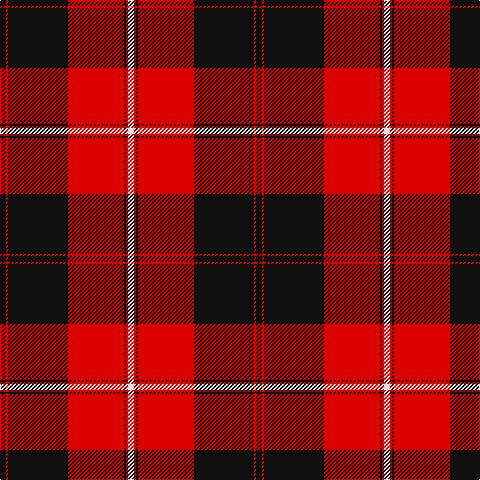

This page is one **sett** — a single exact thread-count. It belongs to the [tartan](/tartans/k3r1k30r28k1r1w3/)
(the same proportion at any scale), whose colour order is pattern [KRKRKRW](/stripes/krkrkrw/).

Sourced from register-of-tartans.  It is a [7 stripe tartan](/stripes/stripes7/).

Original link https://www.tartanregister.gov.uk/tartanDetails.aspx?ref=842

2 attestations — the source records this cloth was collapsed from (oldest owns this page)

<ul>
<li>undated — Cunningham (register-of-tartans, <a href="https://www.tartanregister.gov.uk/tartanDetails.aspx?ref=842">record</a>)</li>
<li>undated — Cunningham (weddslist, <a href="http://www.weddslist.com/cgi-bin/tartans/pg.pl?source=sts">record</a>)</li>
</ul>

## Register references

External register numbers recorded for this tartan.

- Scottish Register of Tartans: [842](https://www.tartanregister.gov.uk/tartanDetails.aspx?ref=842)
- Scottish Tartans World Register: 1117

## Thread count
K/6 R2 K60 R56 K2 R2 LN/6

## Palette

Palette: <strong>Tartan Register</strong>
<table><thead><tr><th>Colour</th><th>Threads</th><th>Shade</th><th>Base</th><th>OKLCh</th></tr></thead><tbody><tr><td>K/</td><td style="text-align:right;font-variant-numeric:tabular-nums">6</td><td><code style="background-color:#101010;">#101010</code> <small style="color:#888">#101010</small></td><td>K <code style="background-color:#000000;">#000000</code></td><td><small style="color:#888">oklch(17.3% 0.000 89.9)</small></td></tr><tr><td>R</td><td style="text-align:right;font-variant-numeric:tabular-nums">2</td><td><code style="background-color:#DC0000;">#DC0000</code> <small style="color:#888">#DC0000</small></td><td>R <code style="background-color:#CC0000;">#CC0000</code></td><td><small style="color:#888">oklch(56.2% 0.230 29.2)</small></td></tr><tr><td>K</td><td style="text-align:right;font-variant-numeric:tabular-nums">60</td><td><code style="background-color:#101010;">#101010</code> <small style="color:#888">#101010</small></td><td>K <code style="background-color:#000000;">#000000</code></td><td><small style="color:#888">oklch(17.3% 0.000 89.9)</small></td></tr><tr><td>R</td><td style="text-align:right;font-variant-numeric:tabular-nums">56</td><td><code style="background-color:#DC0000;">#DC0000</code> <small style="color:#888">#DC0000</small></td><td>R <code style="background-color:#CC0000;">#CC0000</code></td><td><small style="color:#888">oklch(56.2% 0.230 29.2)</small></td></tr><tr><td>K</td><td style="text-align:right;font-variant-numeric:tabular-nums">2</td><td><code style="background-color:#101010;">#101010</code> <small style="color:#888">#101010</small></td><td>K <code style="background-color:#000000;">#000000</code></td><td><small style="color:#888">oklch(17.3% 0.000 89.9)</small></td></tr><tr><td>R</td><td style="text-align:right;font-variant-numeric:tabular-nums">2</td><td><code style="background-color:#DC0000;">#DC0000</code> <small style="color:#888">#DC0000</small></td><td>R <code style="background-color:#CC0000;">#CC0000</code></td><td><small style="color:#888">oklch(56.2% 0.230 29.2)</small></td></tr><tr><td>LN/</td><td style="text-align:right;font-variant-numeric:tabular-nums">6</td><td><code style="background-color:#E0E0E0;">#E0E0E0</code> <small style="color:#888">#E0E0E0</small></td><td>W <code style="background-color:#F7F7F7;">#F7F7F7</code></td><td><small style="color:#888">oklch(90.7% 0.000 89.9)</small></td></tr></tbody></table>

# Sample pattern

## Nearest tartans

The nearest existing variants by ΔTartan distance, with this tartan at the top so the swatches line up against it.

ΔTartan

Tartan

Sett

—

<a href="/ttd/edit/#slug=k3r1k30r28k1r1w3~x2">Cunningham</a> <a class="nn-out" href="/setts/s7/k3r1k30r28k1r1w3~x2/" title="open its dictionary page">↗</a>

0.52

<a href="/ttd/edit/#slug=r1k3lb2k28r30k1r2lb1~x2">Las Vegas Fire Fighters</a> <a class="nn-out" href="/setts/s8/r1k3lb2k28r30k1r2lb1~x2/" title="open its dictionary page">↗</a>

0.61

<a href="/ttd/edit/#slug=k4w2k28r30k1r3~x2">Ramsay of Dalhousie</a> <a class="nn-out" href="/setts/s6/k4w2k28r30k1r3~x2/" title="open its dictionary page">↗</a>

0.79

<a href="/ttd/edit/#slug=w6k2w2k31r41k2r2k4~x2">University of Nebraska Alumni Association</a> <a class="nn-out" href="/setts/s8/w6k2w2k31r41k2r2k4~x2/" title="open its dictionary page">↗</a>

0.86

<a href="/ttd/edit/#slug=k3r1k30r28db1r1w3~x2">Cunningham #3</a> <a class="nn-out" href="/setts/s7/k3r1k30r28db1r1w3~x2/" title="open its dictionary page">↗</a>

1.02

<a href="/ttd/edit/#slug=k3r1k30r28k1r1lb3~x2">Cunningham D</a> <a class="nn-out" href="/setts/s7/k3r1k30r28k1r1lb3~x2/" title="open its dictionary page">↗</a>

1.08

<a href="/ttd/edit/#slug=k4w1k28r30dp1r3~x2">Ramsay (Red)</a> <a class="nn-out" href="/setts/s6/k4w1k28r30dp1r3~x2/" title="open its dictionary page">↗</a>

1.09

<a href="/ttd/edit/#slug=k3r2k30r28k2r2w3~x2">Cunningham #2</a> <a class="nn-out" href="/setts/s7/k3r2k30r28k2r2w3~x2/" title="open its dictionary page">↗</a>

1.13

<a href="/ttd/edit/#slug=r42k2w2k18w2k5~x2">Forget Family (Red)</a> <a class="nn-out" href="/setts/s6/r42k2w2k18w2k5~x2/" title="open its dictionary page">↗</a>

1.15

<a href="/ttd/edit/#slug=k6r31k1r6k1w2k1r4k6r2k31r6~x2">University of Georgia (Corporate)</a> <a class="nn-out" href="/setts/s12/k6r31k1r6k1w2k1r4k6r2k31r6~x2/" title="open its dictionary page">↗</a>

1.19

<a href="/ttd/edit/#slug=w10k2w2k66ly6r48k5r8">Sutherland de Albergaria (Personal)</a> <a class="nn-out" href="/setts/s8/w10k2w2k66ly6r48k5r8/" title="open its dictionary page">↗</a>

## Neighbour map

Every grey dot is one of 14299 variants placed by the first two principal components of the ΔTartan feature space (44% of its variance). Red is this tartan; blue dots are its nearest — click one to open its page.

<svg viewBox="0 0 640 380" role="img" style="max-width:100%;height:auto;border:1px solid #e0e0e0;border-radius:4px;display:block" xmlns="http://www.w3.org/2000/svg"><image href="/nn/cloud.v1.png" width="640" height="380"/><a href="/setts/s8/r1k3lb2k28r30k1r2lb1~x2/"><circle cx="382.6" cy="127.4" r="4" fill="#3465a4"><title>Las Vegas Fire Fighters</title></circle></a><a href="/setts/s6/k4w2k28r30k1r3~x2/"><circle cx="370.8" cy="150.7" r="4" fill="#3465a4"><title>Ramsay of Dalhousie</title></circle></a><a href="/setts/s8/w6k2w2k31r41k2r2k4~x2/"><circle cx="335.8" cy="137.6" r="4" fill="#3465a4"><title>University of Nebraska Alumni Association</title></circle></a><a href="/setts/s7/k3r1k30r28db1r1w3~x2/"><circle cx="350.0" cy="117.7" r="4" fill="#3465a4"><title>Cunningham #3</title></circle></a><a href="/setts/s7/k3r1k30r28k1r1lb3~x2/"><circle cx="367.9" cy="135.1" r="4" fill="#3465a4"><title>Cunningham D</title></circle></a><a href="/setts/s6/k4w1k28r30dp1r3~x2/"><circle cx="367.7" cy="140.7" r="4" fill="#3465a4"><title>Ramsay (Red)</title></circle></a><a href="/setts/s7/k3r2k30r28k2r2w3~x2/"><circle cx="350.9" cy="166.8" r="4" fill="#3465a4"><title>Cunningham #2</title></circle></a><a href="/setts/s6/r42k2w2k18w2k5~x2/"><circle cx="401.4" cy="150.9" r="4" fill="#3465a4"><title>Forget Family (Red)</title></circle></a><a href="/setts/s12/k6r31k1r6k1w2k1r4k6r2k31r6~x2/"><circle cx="381.4" cy="111.8" r="4" fill="#3465a4"><title>University of Georgia (Corporate)</title></circle></a><a href="/setts/s8/w10k2w2k66ly6r48k5r8/"><circle cx="321.3" cy="107.1" r="4" fill="#3465a4"><title>Sutherland de Albergaria (Personal)</title></circle></a><circle cx="377.1" cy="133.3" r="5" fill="#c00000"/></svg>

ID: /setts/s7/k3r1k30r28k1r1w3~x2/
