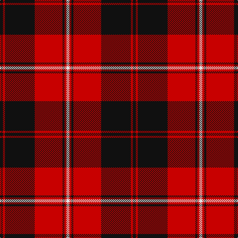

**Bands:** [KRKRKRW](/stripes/krkrkrw/) · **Stripes:** [K R K R K R W](/stripes/stripes7/) K R K R K R W

This was sourced from register-of-tartans.  It is a [7 band tartan](/bands/bands7/).

Original link https://www.tartanregister.gov.uk/tartanDetails.aspx?ref=843

## Also known as

This cloth is also recorded under:

- Cunningham #2

## Attestations

This cloth appears in 2 source records; the oldest owns this page.

- 01/01/1880 — Cunningham #2 (register-of-tartans, [record](https://www.tartanregister.gov.uk/tartanDetails.aspx?ref=843))
- pre 1880 — Cunningham (Clan) (tartans-authority, [record](http://www.tartansauthority.com/tartan-ferret/display/4644/))

## Register references

External register numbers recorded for this tartan.

- Scottish Register of Tartans: [843](https://www.tartanregister.gov.uk/tartanDetails.aspx?ref=843)
- Scottish Tartans Authority (ITI): 4644

## Variants

Other setts woven to the same stripe pattern.

- [Cunningham](/setts/s7/k3r1k30r28k1r1w3~x2/)

## Thread count
K/6 R4 K60 R56 K4 R4 LN/6

## Palette
Each colour and its ΔE from the base-6 reference it is a variant of.

| Colour | Shade | Base | ΔE (OKLab) |
|---|---|---|---|
| K | <code style="background-color:#101010;">#101010</code> `#101010` | K <code style="background-color:#000000;">#000000</code> | 0.17 |
| LN | <code style="background-color:#E0E0E0;">#E0E0E0</code> `#E0E0E0` | W <code style="background-color:#F7F7F7;">#F7F7F7</code> | 0.07 |
| R | <code style="background-color:#C80000;">#C80000</code> `#C80000` | R <code style="background-color:#CC0000;">#CC0000</code> | 0.01 |

# Sample pattern

## Nearest tartans

The nearest existing variants by ΔTartan distance.

1. [Monmouth College](/setts/s6/k4r33k24w3k4r3~x2/) — ΔT 0.78
1. [University of Nebraska Alumni Association](/setts/s8/w6k2w2k31r41k2r2k4~x2/) — ΔT 0.82
1. [Dunbar Ancient](/setts/s6/r28k4w2k13~x2/) — ΔT 0.90
1. [Ramsay Red Clan Tartan Tartan Number: 1238. Earliest known date: 1842 Ramsay was one of the names adopted by members of the Clan MacGregor when their own was proscribed. It is not surprising then that an early MacGregor sett was used as a basis for the Ramsay tartan. It is possible that the tartan was in existance long before the earliest recorded date given. See products available Copyright © Blair Urquhart, Comrie, 2015](/setts/s6/r5m2r30k28w2k4~x2/) — ΔT 1.06
1. [MacIver](/setts/s5/k16r2k2r12w1~x2/) — ΔT 1.08
1. [Cunningham](/setts/s7/k3r1k30r28k1r1w3~x2/) — ΔT 1.09
1. [Brodie (Clan)](/setts/s6/k2r16k8ly1k8r2~x4/) — ΔT 1.10
1. [Las Vegas Fire Fighters](/setts/s8/r1k3lb2k28r30k1r2lb1~x2/) — ΔT 1.17
1. [Ramsay of Dalhousie](/setts/s6/k4w2k28r30k1r3~x2/) — ΔT 1.18
1. [Masai Shuka 15 (Artefact)](/setts/s5/r20k2r2k15w1~x2/) — ΔT 1.18

## Neighbour map

Every grey dot is one of 14299 variants placed by the first two principal components of the ΔTartan feature space (44% of its variance). Red is this tartan; blue dots are its nearest — click one to open its page.

<svg viewBox="0 0 640 380" role="img" style="max-width:100%;height:auto;border:1px solid #e0e0e0;border-radius:4px;display:block" xmlns="http://www.w3.org/2000/svg"><image href="/nn/cloud.v1.png" width="640" height="380"/><a href="/setts/s6/k4r33k24w3k4r3~x2/"><circle cx="335.4" cy="193.5" r="4" fill="#3465a4"><title>Monmouth College</title></circle></a><a href="/setts/s8/w6k2w2k31r41k2r2k4~x2/"><circle cx="335.8" cy="137.6" r="4" fill="#3465a4"><title>University of Nebraska Alumni Association</title></circle></a><a href="/setts/s6/r28k4w2k13~x2/"><circle cx="334.4" cy="176.8" r="4" fill="#3465a4"><title>Dunbar Ancient</title></circle></a><a href="/setts/s6/r5m2r30k28w2k4~x2/"><circle cx="325.6" cy="168.7" r="4" fill="#3465a4"><title>Ramsay Red Clan Tartan Tartan Number: 1238. Earliest known date: 1842 Ramsay was one of the names adopted by members of the Clan MacGregor when their own was proscribed. It is not surprising then that an early MacGregor sett was used as a basis for the Ramsay tartan. It is possible that the tartan was in existance long before the earliest recorded date given. See products available Copyright © Blair Urquhart, Comrie, 2015</title></circle></a><a href="/setts/s5/k16r2k2r12w1~x2/"><circle cx="360.3" cy="195.2" r="4" fill="#3465a4"><title>MacIver</title></circle></a><a href="/setts/s7/k3r1k30r28k1r1w3~x2/"><circle cx="377.1" cy="133.3" r="4" fill="#3465a4"><title>Cunningham</title></circle></a><a href="/setts/s6/k2r16k8ly1k8r2~x4/"><circle cx="341.2" cy="198.6" r="4" fill="#3465a4"><title>Brodie (Clan)</title></circle></a><a href="/setts/s8/r1k3lb2k28r30k1r2lb1~x2/"><circle cx="382.6" cy="127.4" r="4" fill="#3465a4"><title>Las Vegas Fire Fighters</title></circle></a><a href="/setts/s6/k4w2k28r30k1r3~x2/"><circle cx="370.8" cy="150.7" r="4" fill="#3465a4"><title>Ramsay of Dalhousie</title></circle></a><a href="/setts/s5/r20k2r2k15w1~x2/"><circle cx="386.4" cy="183.9" r="4" fill="#3465a4"><title>Masai Shuka 15 (Artefact)</title></circle></a><circle cx="350.9" cy="166.8" r="5" fill="#c00000"/></svg>

ID: /setts/s7/k3r2k30r28k2r2w3~x2/
