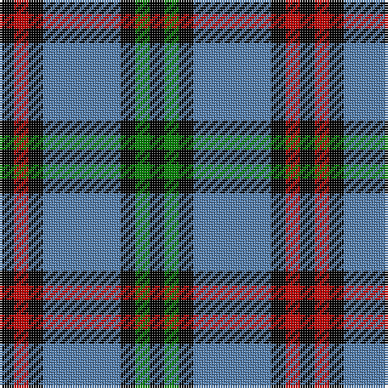

This page is one **sett** — a single exact thread-count. It belongs to the [tartan](/tartans/k3r3k3t16k3g3k3/)
(the same proportion at any scale), whose colour order is pattern [KGKBKRK](/stripes/kgkbkrk/).

Sourced from weddslist.  It is a [7 stripe tartan](/stripes/stripes7/).

Original link http://www.weddslist.com/cgi-bin/tartans/pg.pl?source=sts

2 attestations — the source records this cloth was collapsed from (oldest owns this page)

<ul>
<li>undated — Eglinton (weddslist, <a href="http://www.weddslist.com/cgi-bin/tartans/pg.pl?source=sts">record</a>)</li>
<li>undated — Eglinton District Tartan Tartan Number: 2075. Earliest known date: pre 1847 The Eglinton tartan is the Montgomerie with a narrower ground. D W Stewart in his book, Old and Rare, was of the opinion that the Montgomerie tartan was adopted by the Montgomeries of Ayrshire in 1707. He stated that in 1893 there were historic relics at Eglinton Castle which furnished evidence of the early use of the tartan. See products available Copyright © Blair Urquhart, Comrie, 2015 (house-of-tartan, <a href="http://www.house-of-tartan.scotland.net/house/TartanViewjs.asp?colr=Def&tnam=2075">record</a>)</li>
</ul>

## Thread count
K/6 R6 K6 B32 K6 G6 K/6

## Palette

Palette: <strong>Ingles Buchan</strong> <small style="color:#888">(1 of 4 colours)</small>
<table><thead><tr><th>Colour</th><th>Threads</th><th>Shade</th><th>Base</th><th>OKLCh</th></tr></thead><tbody><tr><td>K/</td><td style="text-align:right;font-variant-numeric:tabular-nums">6</td><td><code style="background-color:#000000;">#000000</code> <small style="color:#888">#000000</small></td><td>K <code style="background-color:#000000;">#000000</code></td><td><small style="color:#888">oklch(0.0% 0.000 0.0)</small></td></tr><tr><td>R</td><td style="text-align:right;font-variant-numeric:tabular-nums">6</td><td><code style="background-color:#C00000;">#C00000</code> <small style="color:#888">#C00000</small></td><td>R <code style="background-color:#CC0000;">#CC0000</code></td><td><small style="color:#888">oklch(50.7% 0.208 29.2)</small></td></tr><tr><td>K</td><td style="text-align:right;font-variant-numeric:tabular-nums">6</td><td><code style="background-color:#000000;">#000000</code> <small style="color:#888">#000000</small></td><td>K <code style="background-color:#000000;">#000000</code></td><td><small style="color:#888">oklch(0.0% 0.000 0.0)</small></td></tr><tr><td>B</td><td style="text-align:right;font-variant-numeric:tabular-nums">32</td><td><code style="background-color:#5480B0;">#5480B0</code> <small style="color:#888">#5480B0</small></td><td>B <code style="background-color:#2A418A;">#2A418A</code></td><td><small style="color:#888">oklch(58.8% 0.089 251.5)</small></td></tr><tr><td>K</td><td style="text-align:right;font-variant-numeric:tabular-nums">6</td><td><code style="background-color:#000000;">#000000</code> <small style="color:#888">#000000</small></td><td>K <code style="background-color:#000000;">#000000</code></td><td><small style="color:#888">oklch(0.0% 0.000 0.0)</small></td></tr><tr><td>G</td><td style="text-align:right;font-variant-numeric:tabular-nums">6</td><td><code style="background-color:#008000;">#008000</code> <small style="color:#888">#008000</small></td><td>G <code style="background-color:#006100;">#006100</code></td><td><small style="color:#888">oklch(52.0% 0.177 142.5)</small></td></tr><tr><td>K/</td><td style="text-align:right;font-variant-numeric:tabular-nums">6</td><td><code style="background-color:#000000;">#000000</code> <small style="color:#888">#000000</small></td><td>K <code style="background-color:#000000;">#000000</code></td><td><small style="color:#888">oklch(0.0% 0.000 0.0)</small></td></tr></tbody></table>

# Sample pattern

## Nearest tartans

The nearest existing variants by ΔTartan distance, with this tartan at the top so the swatches line up against it.

ΔTartan

Tartan

Sett

—

<a href="/ttd/edit/#slug=k3r3k3t16k3g3k3~x2">Eglinton</a> <a class="nn-out" href="/setts/s7/k3r3k3t16k3g3k3~x2/" title="open its dictionary page">↗</a>

0.71

<a href="/ttd/edit/#slug=k3dg3k3b16k3r3k3~x2">Eglinton</a> <a class="nn-out" href="/setts/s7/k3dg3k3b16k3r3k3~x2/" title="open its dictionary page">↗</a>

0.71

<a href="/ttd/edit/#slug=k3dg3k3b16k3r3k3">Eglinton</a> <a class="nn-out" href="/setts/s7/k3dg3k3b16k3r3k3/" title="open its dictionary page">↗</a>

1.08

<a href="/ttd/edit/#slug=g6db11lr8k4lr8k4lr8k27lr4~x2">Brittany National (District)</a> <a class="nn-out" href="/setts/s9/g6db11lr8k4lr8k4lr8k27lr4~x2/" title="open its dictionary page">↗</a>

1.10

<a href="/ttd/edit/#slug=db2ly1db7w1k7w2~x6">Hawick Rugby Club (Corporate)</a> <a class="nn-out" href="/setts/s6/db2ly1db7w1k7w2~x6/" title="open its dictionary page">↗</a>

1.20

<a href="/ttd/edit/#slug=k4r5k4db28k4g5k4~x2">Montgomerie of Eglinton</a> <a class="nn-out" href="/setts/s7/k4r5k4db28k4g5k4~x2/" title="open its dictionary page">↗</a>

1.23

<a href="/ttd/edit/#slug=k5w5k5t11k3y17k30t3~x2">Australian Police</a> <a class="nn-out" href="/setts/s8/k5w5k5t11k3y17k30t3~x2/" title="open its dictionary page">↗</a>

1.28

<a href="/ttd/edit/#slug=r5db25w5db3dg25db3~x2">Thayer USA</a> <a class="nn-out" href="/setts/s6/r5db25w5db3dg25db3~x2/" title="open its dictionary page">↗</a>

1.29

<a href="/setts/s10/db2ly1db7w1k7w2~x6/">Hawick Rugby Club</a>

1.29

<a href="/ttd/edit/#slug=g14db2g2k8p9k2~x2">MacArthur of Milton, hunting</a> <a class="nn-out" href="/setts/s6/g14db2g2k8p9k2~x2/" title="open its dictionary page">↗</a>

1.29

<a href="/ttd/edit/#slug=k3db2ly3k2ly5db18g3k3g2db3~x2">St Andrews University Corporate Tartan Tartan Number: 2398. Earliest known date: pre 1998 Originally named St. Andrews International. Apparently a Gordon Paton MD, bought the company from North East Fife Enterprise Trust in 1997, the aim being to brand quality Scottish products for export worldwide. The company intended to set up a membership scheme but the company went into liquidation. The intended venue belonged to St Andrews University and it appears that the ownership of the tartan has fallen to the University and its name has been changed from 'International' to 'University' (Deirdre Kinloch Anderson, Aug 2004).No thread count given so this entry is based on an estimate from a small computer graphic. Has since been corrected to conform to the SRT (Scottish Register of Tartans) See products available Copyright © Blair Urquhart, Comrie, 2015</a> <a class="nn-out" href="/setts/s10/k3db2ly3k2ly5db18g3k3g2db3~x2/" title="open its dictionary page">↗</a>

## Neighbour map

Every grey dot is one of 14359 variants placed by the first two principal components of the ΔTartan feature space (44% of its variance). Red is this tartan; blue dots are its nearest — click one to open its page.

<svg viewBox="0 0 640 380" role="img" style="max-width:100%;height:auto;border:1px solid #e0e0e0;border-radius:4px;display:block" xmlns="http://www.w3.org/2000/svg"><image href="/nn/cloud.v1.png" width="640" height="380"/><a href="/setts/s7/k3dg3k3b16k3r3k3~x2/"><circle cx="212.0" cy="216.4" r="4" fill="#3465a4"><title>Eglinton</title></circle></a><a href="/setts/s7/k3dg3k3b16k3r3k3/"><circle cx="212.0" cy="216.4" r="4" fill="#3465a4"><title>Eglinton</title></circle></a><a href="/setts/s9/g6db11lr8k4lr8k4lr8k27lr4~x2/"><circle cx="171.9" cy="201.0" r="4" fill="#3465a4"><title>Brittany National (District)</title></circle></a><a href="/setts/s6/db2ly1db7w1k7w2~x6/"><circle cx="196.8" cy="218.7" r="4" fill="#3465a4"><title>Hawick Rugby Club (Corporate)</title></circle></a><a href="/setts/s7/k4r5k4db28k4g5k4~x2/"><circle cx="263.5" cy="203.2" r="4" fill="#3465a4"><title>Montgomerie of Eglinton</title></circle></a><a href="/setts/s8/k5w5k5t11k3y17k30t3~x2/"><circle cx="257.5" cy="189.9" r="4" fill="#3465a4"><title>Australian Police</title></circle></a><a href="/setts/s6/r5db25w5db3dg25db3~x2/"><circle cx="250.0" cy="216.7" r="4" fill="#3465a4"><title>Thayer USA</title></circle></a><a href="/setts/s10/db2ly1db7w1k7w2~x6/"><circle cx="195.0" cy="202.7" r="4" fill="#3465a4"><title>Hawick Rugby Club</title></circle></a><a href="/setts/s6/g14db2g2k8p9k2~x2/"><circle cx="177.6" cy="225.9" r="4" fill="#3465a4"><title>MacArthur of Milton, hunting</title></circle></a><a href="/setts/s10/k3db2ly3k2ly5db18g3k3g2db3~x2/"><circle cx="246.3" cy="173.5" r="4" fill="#3465a4"><title>St Andrews University Corporate Tartan Tartan Number: 2398. Earliest known date: pre 1998 Originally named St. Andrews International. Apparently a Gordon Paton MD, bought the company from North East Fife Enterprise Trust in 1997, the aim being to brand quality Scottish products for export worldwide. The company intended to set up a membership scheme but the company went into liquidation. The intended venue belonged to St Andrews University and it appears that the ownership of the tartan has fallen to the University and its name has been changed from 'International' to 'University' (Deirdre Kinloch Anderson, Aug 2004).No thread count given so this entry is based on an estimate from a small computer graphic. Has since been corrected to conform to the SRT (Scottish Register of Tartans) See products available Copyright © Blair Urquhart, Comrie, 2015</title></circle></a><circle cx="200.6" cy="209.5" r="5" fill="#c00000"/></svg>

ID: /setts/s7/k3r3k3t16k3g3k3~x2/
