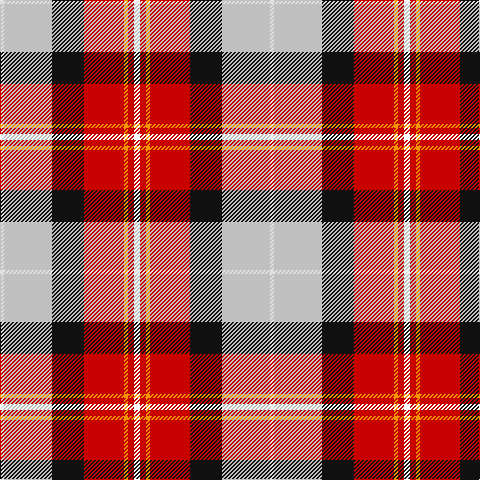

In pattern [KRYRKWW](/stripes/kryrkww/).

This was sourced from house-of-tartan.  It is a [7 stripe tartan](/stripes/stripes7/).

Original link http://www.house-of-tartan.scotland.net/house/TartanViewjs.asp?colr=Def&tnam=10356

## Thread count
YY/6 R6 DY4 R40 K32 N48 LN/4

## Palette
Each colour and the base-6 reference it is a variant of.

| Colour | Shade | Base |
|---|---|---|
| DY | <code style="background-color:#F09400;">#F09400</code> `oklch(74.5% 0.165 66.9)` <small>#F09400</small> | Y <code style="background-color:#F2BF00;">#F2BF00</code> |
| G | <code style="background-color:#289C18;">#289C18</code> `oklch(60.6% 0.191 141.6)` <small>#289C18</small> | G <code style="background-color:#006100;">#006100</code> |
| K | <code style="background-color:#101010;">#101010</code> `oklch(17.3% 0.000 89.9)` <small>#101010</small> | K <code style="background-color:#000000;">#000000</code> |
| LN | <code style="background-color:#E0E0E0;">#E0E0E0</code> `oklch(90.7% 0.000 89.9)` <small>#E0E0E0</small> | W <code style="background-color:#F7F7F7;">#F7F7F7</code> |
| N | <code style="background-color:#C0C0C0;">#C0C0C0</code> `oklch(80.8% 0.000 89.9)` <small>#C0C0C0</small> | W <code style="background-color:#F7F7F7;">#F7F7F7</code> |
| O | <code style="background-color:#D87C00;">#D87C00</code> `oklch(67.3% 0.155 61.8)` <small>#D87C00</small> | Y <code style="background-color:#F2BF00;">#F2BF00</code> |
| R | <code style="background-color:#C80000;">#C80000</code> `oklch(52.3% 0.215 29.2)` <small>#C80000</small> | R <code style="background-color:#CC0000;">#CC0000</code> |
| Y | <code style="background-color:#FCFC00;">#FCFC00</code> `oklch(95.9% 0.209 109.8)` <small>#FCFC00</small> | Y <code style="background-color:#F2BF00;">#F2BF00</code> |

# Sample pattern

## Nearest tartans

The nearest existing variants by ΔTartan distance, with this tartan at the top so the swatches line up against it.

ΔTartan

Tartan

Sett

—

<a href="/ttd/edit/#slug=k3r3lo2r20k16lb24w2~x2">Oor Wullie Corporate Tartan Tartan Number: 10356. Earliest known date: August 2010 Oor Wullie's tartan is based on the Black Watch which was his Uncle Wattie's regiment and in this new design the red is from the hackle on their famous bonnets. The silver grey is for Wullie's iconic bucket and for his faithful pet, Jeemie the moose. The black is for his mentor PC Murdoch and for Wullie's dungarees, the yellow is for his tousled gold locks that never see a comb. The three lines on the yellow are for his best pals Fat Bob, Soapy Soutar and Wee Eck. The black and white are for the newsprint of The Sunday Post in which Wullie and his pals have lived for 75 years. See products available Copyright © Blair Urquhart, Comrie, 2015</a> <a class="nn-out" href="/setts/s7/k3r3lo2r20k16lb24w2~x2/" title="open its dictionary page">↗</a>

0.39

<a href="/ttd/edit/#slug=ly3r3ly2r20k16lb24w2~x2">Oor Wullie (Corporate)</a> <a class="nn-out" href="/setts/s7/ly3r3ly2r20k16lb24w2~x2/" title="open its dictionary page">↗</a>

0.99

<a href="/ttd/edit/#slug=t4w4t4w5k8g2r19lo1~x2">Edinburgh Napier University (Corp.)</a> <a class="nn-out" href="/setts/s8/t4w4t4w5k8g2r19lo1~x2/" title="open its dictionary page">↗</a>

1.00

<a href="/ttd/edit/#slug=r6t3m20ly2k20w20k2w5~x2">Humming Bird (Fashion)</a> <a class="nn-out" href="/setts/s8/r6t3m20ly2k20w20k2w5~x2/" title="open its dictionary page">↗</a>

1.03

<a href="/ttd/edit/#slug=ly3r3lo2r20k16w24w2~x2">Oor Wullie (DC Thomson)</a> <a class="nn-out" href="/setts/s7/ly3r3lo2r20k16w24w2~x2/" title="open its dictionary page">↗</a>

1.07

<a href="/ttd/edit/#slug=ly6k2r15g5r8k12w24t2w4t2~x2">Gillies, dress Red</a> <a class="nn-out" href="/setts/s10/ly6k2r15g5r8k12w24t2w4t2~x2/" title="open its dictionary page">↗</a>

1.12

<a href="/ttd/edit/#slug=dg20r3y3r15w19dg3t2~x2">Glasgow</a> <a class="nn-out" href="/setts/s7/dg20r3y3r15w19dg3t2~x2/" title="open its dictionary page">↗</a>

1.18

<a href="/ttd/edit/#slug=r2w12y1k12o12k1~x2">Dutch Dress</a> <a class="nn-out" href="/setts/s6/r2w12y1k12o12k1~x2/" title="open its dictionary page">↗</a>

1.20

<a href="/ttd/edit/#slug=r3n2r25o12k25w2lb2~x2">Bombeiros Voluntarios De Galicia (Co</a> <a class="nn-out" href="/setts/s7/r3n2r25o12k25w2lb2~x2/" title="open its dictionary page">↗</a>

1.21

<a href="/ttd/edit/#slug=r2w12t1k12lo12k1~x2">Dutch, dress</a> <a class="nn-out" href="/setts/s6/r2w12t1k12lo12k1~x2/" title="open its dictionary page">↗</a>

1.27

<a href="/ttd/edit/#slug=r26t7p8ly3r3w3g20p10w2~x2">Wilson's, No 227</a> <a class="nn-out" href="/setts/s9/r26t7p8ly3r3w3g20p10w2~x2/" title="open its dictionary page">↗</a>

## Neighbour map

Every grey dot is one of 14299 variants placed by the first two principal components of the ΔTartan feature space (44% of its variance). Red is this tartan; blue dots are its nearest — click one to open its page.

<svg viewBox="0 0 640 380" role="img" style="max-width:100%;height:auto;border:1px solid #e0e0e0;border-radius:4px;display:block" xmlns="http://www.w3.org/2000/svg"><image href="/nn/cloud.v1.png" width="640" height="380"/><a href="/setts/s7/ly3r3ly2r20k16lb24w2~x2/"><circle cx="129.5" cy="127.7" r="4" fill="#3465a4"><title>Oor Wullie (Corporate)</title></circle></a><a href="/setts/s8/t4w4t4w5k8g2r19lo1~x2/"><circle cx="161.8" cy="107.0" r="4" fill="#3465a4"><title>Edinburgh Napier University (Corp.)</title></circle></a><a href="/setts/s8/r6t3m20ly2k20w20k2w5~x2/"><circle cx="91.0" cy="133.3" r="4" fill="#3465a4"><title>Humming Bird (Fashion)</title></circle></a><a href="/setts/s7/ly3r3lo2r20k16w24w2~x2/"><circle cx="120.4" cy="117.3" r="4" fill="#3465a4"><title>Oor Wullie (DC Thomson)</title></circle></a><a href="/setts/s10/ly6k2r15g5r8k12w24t2w4t2~x2/"><circle cx="93.0" cy="111.2" r="4" fill="#3465a4"><title>Gillies, dress Red</title></circle></a><a href="/setts/s7/dg20r3y3r15w19dg3t2~x2/"><circle cx="134.8" cy="157.9" r="4" fill="#3465a4"><title>Glasgow</title></circle></a><a href="/setts/s6/r2w12y1k12o12k1~x2/"><circle cx="132.4" cy="162.1" r="4" fill="#3465a4"><title>Dutch Dress</title></circle></a><a href="/setts/s7/r3n2r25o12k25w2lb2~x2/"><circle cx="186.5" cy="135.3" r="4" fill="#3465a4"><title>Bombeiros Voluntarios De Galicia (Co</title></circle></a><a href="/setts/s6/r2w12t1k12lo12k1~x2/"><circle cx="121.0" cy="154.0" r="4" fill="#3465a4"><title>Dutch, dress</title></circle></a><a href="/setts/s9/r26t7p8ly3r3w3g20p10w2~x2/"><circle cx="145.8" cy="131.6" r="4" fill="#3465a4"><title>Wilson's, No 227</title></circle></a><circle cx="128.2" cy="128.7" r="5" fill="#c00000"/></svg>

ID: /setts/s7/k3r3lo2r20k16lb24w2~x2/
