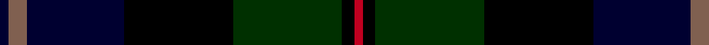

In pattern [KRKKGKR](/patterns/krkkgkr/).

This was sourced from weddslist.  It is a [7 stripes tartan](/stripes/stripes7/).

Original link http://www.weddslist.com/cgi-bin/tartans/pg.pl?source=sts

## Thread count
DB/3 LT6 DB32 K36 DG36 K4 R/3

## Palette
Each colour and its ΔE from the base-6 reference it is a variant of.

| Colour | Shade | Base | ΔE (OKLab) |
|---|---|---|---|
| DB | <code style="background-color:#000030;">#000030</code> `#000030` | K <code style="background-color:#000000;">#000000</code> | 0.17 |
| DG | <code style="background-color:#003000;">#003000</code> `#003000` | G <code style="background-color:#006100;">#006100</code> | 0.17 |
| K | <code style="background-color:#000000;">#000000</code> `#000000` | K <code style="background-color:#000000;">#000000</code> | 0.00 |
| LT | <code style="background-color:#806050;">#806050</code> `#806050` | R <code style="background-color:#CC0000;">#CC0000</code> | 0.17 |
| R | <code style="background-color:#C00020;">#C00020</code> `#C00020` | R <code style="background-color:#CC0000;">#CC0000</code> | 0.03 |

# Sample pattern

## Nearest tartans

The nearest existing variants by ΔTartan distance.

1. [MacThomas LC](/setts/s7/b5ba3b32k16g32bb3g5~b000052-ba7f0066-bb6d3855-g11450d-k000000~x2/) — ΔT 1.04
1. [MacThomas LC](/setts/s7/b5ba3b32k16g32bb3g5~b000052-ba7f0066-bb6d3855-g11450d-k000000/) — ΔT 1.04
1. [Coarse Kilt](/setts/s7/r3k2b25k28g25k2r3~b000048-g044028-k000000-rc80000~x2/) — ΔT 1.20
1. [Ferguson of Balquhidder](/setts/s6/g2b12r1k12g12k2~b000052-g11450d-k000000-raa0000~x2/) — ΔT 1.24
1. [Ferguson of Balquhidder](/setts/s6/g2b12r1k12g12k2~b000052-g11450d-k000000-raa0000/) — ΔT 1.24
1. [MacThomas](/setts/s7/b3ba2b21k11g21ba2g3~b000052-ba59110d-g11450d-k000000~x2/) — ΔT 1.25
1. [MacThomas](/setts/s7/b3ba2b21k11g21ba2g3~b000052-ba59110d-g11450d-k000000/) — ΔT 1.25
1. [Scotch House 2000, original](/setts/s8/b22r3b2r3b2k17g18ra4~b000050-g004010-k000000-rc00000-ra906030~x2/) — ΔT 1.25
1. [MacLeod](/setts/s7/r3k2g15k10b20k2y2~b000052-g11450d-k000000-raa0000-yaaaa00~x2/) — ΔT 1.28
1. [MacLeod](/setts/s7/r3k2g15k10b20k2y2~b000052-g11450d-k000000-raa0000-yaaaa00/) — ΔT 1.28

## Neighbour map

Every grey dot is one of 15726 variants placed by the first two principal components of the ΔTartan feature space (44% of its variance). Red is this tartan; blue dots are its nearest — click one to open its page.

<svg viewBox="0 0 640 380" role="img" style="max-width:100%;height:auto;border:1px solid #e0e0e0;border-radius:4px;display:block" xmlns="http://www.w3.org/2000/svg"><image href="/nn/cloud.v1.png" width="640" height="380"/><a href="/setts/s7/b5ba3b32k16g32bb3g5~b000052-ba7f0066-bb6d3855-g11450d-k000000~x2/"><circle cx="226.7" cy="206.8" r="4" fill="#3465a4"><title>MacThomas LC</title></circle></a><a href="/setts/s7/b5ba3b32k16g32bb3g5~b000052-ba7f0066-bb6d3855-g11450d-k000000/"><circle cx="226.7" cy="206.8" r="4" fill="#3465a4"><title>MacThomas LC</title></circle></a><a href="/setts/s7/r3k2b25k28g25k2r3~b000048-g044028-k000000-rc80000~x2/"><circle cx="227.3" cy="203.9" r="4" fill="#3465a4"><title>Coarse Kilt</title></circle></a><a href="/setts/s6/g2b12r1k12g12k2~b000052-g11450d-k000000-raa0000~x2/"><circle cx="214.9" cy="234.2" r="4" fill="#3465a4"><title>Ferguson of Balquhidder</title></circle></a><a href="/setts/s6/g2b12r1k12g12k2~b000052-g11450d-k000000-raa0000/"><circle cx="214.9" cy="234.2" r="4" fill="#3465a4"><title>Ferguson of Balquhidder</title></circle></a><a href="/setts/s7/b3ba2b21k11g21ba2g3~b000052-ba59110d-g11450d-k000000~x2/"><circle cx="246.9" cy="225.1" r="4" fill="#3465a4"><title>MacThomas</title></circle></a><a href="/setts/s7/b3ba2b21k11g21ba2g3~b000052-ba59110d-g11450d-k000000/"><circle cx="246.9" cy="225.1" r="4" fill="#3465a4"><title>MacThomas</title></circle></a><a href="/setts/s8/b22r3b2r3b2k17g18ra4~b000050-g004010-k000000-rc00000-ra906030~x2/"><circle cx="175.2" cy="185.3" r="4" fill="#3465a4"><title>Scotch House 2000, original</title></circle></a><a href="/setts/s7/r3k2g15k10b20k2y2~b000052-g11450d-k000000-raa0000-yaaaa00~x2/"><circle cx="178.4" cy="196.5" r="4" fill="#3465a4"><title>MacLeod</title></circle></a><a href="/setts/s7/r3k2g15k10b20k2y2~b000052-g11450d-k000000-raa0000-yaaaa00/"><circle cx="178.4" cy="196.5" r="4" fill="#3465a4"><title>MacLeod</title></circle></a><circle cx="207.1" cy="205.3" r="5" fill="#c00000"/></svg>

ID: /setts/s7/k3r6k32ka36g36ka4ra3~g003000-k000030-ka000000-r806050-rac00020/
