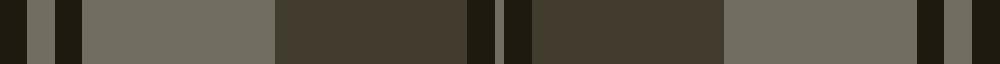

In pattern [GKGGKGK](/stripes/gkggkgk/).

This was sourced from house-of-tartan.  It is a [7 stripe tartan](/stripes/stripes7/).

Original link http://www.house-of-tartan.scotland.net/house/TartanViewjs.asp?colr=Def&tnam=7459

## Thread count
K/6 N6 K6 N42 T42 K6 N/2

## Palette
Each colour and the base-6 reference it is a variant of.

| Colour | Shade | Base |
|---|---|---|
| K | <code style="background-color:#1E1A10;">#1E1A10</code> `oklch(21.9% 0.019 88.7)` <small>#1E1A10</small> | K <code style="background-color:#000000;">#000000</code> |
| N | <code style="background-color:#716D61;">#716D61</code> `oklch(53.5% 0.019 91.7)` <small>#716D61</small> | G <code style="background-color:#006100;">#006100</code> |
| T | <code style="background-color:#413C2E;">#413C2E</code> `oklch(35.7% 0.024 90.7)` <small>#413C2E</small> | G <code style="background-color:#006100;">#006100</code> |

# Sample pattern

## Nearest tartans

The nearest existing variants by ΔTartan distance.

1. [Brave for Men (Fashion)](/setts/s8/k5dy5k5dy34n33k6n5o2/) — ΔT 1.18
1. [Lindsay](/setts/s9/dg20db2dg2db2dg2db8dr24db2dr3~x2/) — ΔT 1.51
1. [Lindsay](/setts/s9/dg20db2dg2db2dg2db8dr24db2dr3/) — ΔT 1.51
1. [Southdown Grey](/setts/s10/do3o2r1do2n6do6n4do6o22r3~x4/) — ΔT 1.55
1. [Nithsdale](/setts/s10/dg10r2y2r6y16r1y2r1y3r6~x4/) — ΔT 1.56
1. [Aisteach](/setts/s7/dp32dg16o14k4o6dp7k2~x2/) — ΔT 1.61
1. [Eastern Western Motor Group, Dalbraith](/setts/s8/dy28g2dy4db18g23db2g3lo4~x2/) — ΔT 1.63
1. [Hanna of Leith (yellow line)](/setts/s10/dy9n4dy2n4dy2n30dy9n4t14lo2~x2/) — ΔT 1.66
1. [Gray (Name)](/setts/s10/r3y33g10r3g3r3g3r8y10r3~x2/) — ΔT 1.67
1. [Gammell (Brown) (Personal)](/setts/s8/db20dy2db2dy2db2dy6g15dy2~x2/) — ΔT 1.74

## Neighbour map

Every grey dot is one of 14299 variants placed by the first two principal components of the ΔTartan feature space (44% of its variance). Red is this tartan; blue dots are its nearest — click one to open its page.

<svg viewBox="0 0 640 380" role="img" style="max-width:100%;height:auto;border:1px solid #e0e0e0;border-radius:4px;display:block" xmlns="http://www.w3.org/2000/svg"><image href="/nn/cloud.v1.png" width="640" height="380"/><a href="/setts/s8/k5dy5k5dy34n33k6n5o2/"><circle cx="356.4" cy="215.8" r="4" fill="#3465a4"><title>Brave for Men (Fashion)</title></circle></a><a href="/setts/s9/dg20db2dg2db2dg2db8dr24db2dr3~x2/"><circle cx="351.1" cy="230.4" r="4" fill="#3465a4"><title>Lindsay</title></circle></a><a href="/setts/s9/dg20db2dg2db2dg2db8dr24db2dr3/"><circle cx="351.1" cy="230.4" r="4" fill="#3465a4"><title>Lindsay</title></circle></a><a href="/setts/s10/do3o2r1do2n6do6n4do6o22r3~x4/"><circle cx="331.6" cy="177.0" r="4" fill="#3465a4"><title>Southdown Grey</title></circle></a><a href="/setts/s10/dg10r2y2r6y16r1y2r1y3r6~x4/"><circle cx="391.8" cy="231.1" r="4" fill="#3465a4"><title>Nithsdale</title></circle></a><a href="/setts/s7/dp32dg16o14k4o6dp7k2~x2/"><circle cx="351.8" cy="235.5" r="4" fill="#3465a4"><title>Aisteach</title></circle></a><a href="/setts/s8/dy28g2dy4db18g23db2g3lo4~x2/"><circle cx="289.4" cy="218.9" r="4" fill="#3465a4"><title>Eastern Western Motor Group, Dalbraith</title></circle></a><a href="/setts/s10/dy9n4dy2n4dy2n30dy9n4t14lo2~x2/"><circle cx="396.8" cy="215.8" r="4" fill="#3465a4"><title>Hanna of Leith (yellow line)</title></circle></a><a href="/setts/s10/r3y33g10r3g3r3g3r8y10r3~x2/"><circle cx="413.4" cy="225.0" r="4" fill="#3465a4"><title>Gray (Name)</title></circle></a><a href="/setts/s8/db20dy2db2dy2db2dy6g15dy2~x2/"><circle cx="340.6" cy="238.9" r="4" fill="#3465a4"><title>Gammell (Brown) (Personal)</title></circle></a><circle cx="396.2" cy="224.2" r="5" fill="#c00000"/></svg>

ID: /setts/s7/k3y3k3y21dy21k3y1~x2/
