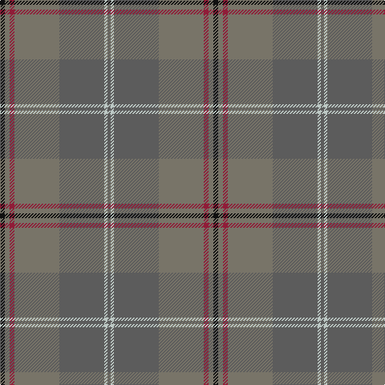

**Bands:** [BWBGRGK](/stripes/bwbgrgk/) · **Stripes:** [N LB N Y R Y K](/stripes/stripes7/) N LB N Y R Y K

This was sourced from tartans-authority.  It is a [7 band tartan](/bands/bands7/).

Original link http://www.tartansauthority.com/tartan-ferret/display/7170/

## Thread count
K/6 Nb6 DR6 Nb56 N56 Na4 N/4

## Palette
Each colour and its ΔE from the base-6 reference it is a variant of.

| Colour | Shade | Base | ΔE (OKLab) |
|---|---|---|---|
| DR | <code style="background-color:#901C38;">#901C38</code> `#901C38` | R <code style="background-color:#CC0000;">#CC0000</code> | 0.13 |
| K | <code style="background-color:#101010;">#101010</code> `#101010` | K <code style="background-color:#000000;">#000000</code> | 0.17 |
| N | <code style="background-color:#5C5C5C;">#5C5C5C</code> `#5C5C5C` | B <code style="background-color:#2A418A;">#2A418A</code> | 0.15 |
| Na | <code style="background-color:#BCC8C4;">#BCC8C4</code> `#BCC8C4` | W <code style="background-color:#F7F7F7;">#F7F7F7</code> | 0.15 |
| Nb | <code style="background-color:#787468;">#787468</code> `#787468` | G <code style="background-color:#006100;">#006100</code> | 0.19 |

# Sample pattern

## Nearest tartans

The nearest existing variants by ΔTartan distance.

1. [Granite City (Fashion)](/setts/s8/k3n3k3n21n21k3n3lr1~x2/) — ΔT 1.45
1. [Clyde](/setts/s10/o5n3o22r3n6n17r2n4r2n4~x2/) — ΔT 1.57
1. [Outlander #1](/setts/s6/o52ly2n24r3lo26n4~x2/) — ΔT 1.59
1. [Hanna of Leith (yellow line)](/setts/s10/dy9n4dy2n4dy2n30dy9n4t14lo2~x2/) — ΔT 1.83
1. [Outlander #1](/setts/s6/y52ly2n24r3lo26n4~x2/) — ΔT 1.85
1. [Wicklow, County (District)](/setts/s10/do1n2g6n1do3t1n12do1n1g1~x4/) — ΔT 1.86
1. [Scottish Borderland (Fashion)](/setts/s9/lb2dg2n1dg30n10n20dg1n2lo1~x2/) — ΔT 1.92
1. [Historic Scotland Corporate Tartan Tartan Number: 2122. Earliest known date: 1988 Custodians at Historic Scotland properties throughout Scotland, including Edinburgh Castle, wear this distinctive tartan. See products available Copyright © Blair Urquhart, Comrie, 2015](/setts/s9/dy2o1dy1o2dy21y9k1y7k2~x2/) — ΔT 1.94
1. [Annan (Fashion)](/setts/s10/y16o2y2o2y2o2y2do6n10y3~x2/) — ΔT 1.99
1. [Isaia (Fashion)](/setts/s7/o80o8o4dy4lr4dy45n8/) — ΔT 2.02

## Neighbour map

Every grey dot is one of 14313 variants placed by the first two principal components of the ΔTartan feature space (44% of its variance). Red is this tartan; blue dots are its nearest — click one to open its page.

<svg viewBox="0 0 640 380" role="img" style="max-width:100%;height:auto;border:1px solid #e0e0e0;border-radius:4px;display:block" xmlns="http://www.w3.org/2000/svg"><image href="/nn/cloud.v1.png" width="640" height="380"/><a href="/setts/s8/k3n3k3n21n21k3n3lr1~x2/"><circle cx="395.3" cy="224.6" r="4" fill="#3465a4"><title>Granite City (Fashion)</title></circle></a><a href="/setts/s10/o5n3o22r3n6n17r2n4r2n4~x2/"><circle cx="338.4" cy="236.4" r="4" fill="#3465a4"><title>Clyde</title></circle></a><a href="/setts/s6/o52ly2n24r3lo26n4~x2/"><circle cx="409.5" cy="220.9" r="4" fill="#3465a4"><title>Outlander #1</title></circle></a><a href="/setts/s10/dy9n4dy2n4dy2n30dy9n4t14lo2~x2/"><circle cx="397.1" cy="215.7" r="4" fill="#3465a4"><title>Hanna of Leith (yellow line)</title></circle></a><a href="/setts/s6/y52ly2n24r3lo26n4~x2/"><circle cx="424.5" cy="230.1" r="4" fill="#3465a4"><title>Outlander #1</title></circle></a><a href="/setts/s10/do1n2g6n1do3t1n12do1n1g1~x4/"><circle cx="455.9" cy="244.9" r="4" fill="#3465a4"><title>Wicklow, County (District)</title></circle></a><a href="/setts/s9/lb2dg2n1dg30n10n20dg1n2lo1~x2/"><circle cx="415.0" cy="184.6" r="4" fill="#3465a4"><title>Scottish Borderland (Fashion)</title></circle></a><a href="/setts/s9/dy2o1dy1o2dy21y9k1y7k2~x2/"><circle cx="457.6" cy="212.7" r="4" fill="#3465a4"><title>Historic Scotland Corporate Tartan Tartan Number: 2122. Earliest known date: 1988 Custodians at Historic Scotland properties throughout Scotland, including Edinburgh Castle, wear this distinctive tartan. See products available Copyright © Blair Urquhart, Comrie, 2015</title></circle></a><a href="/setts/s10/y16o2y2o2y2o2y2do6n10y3~x2/"><circle cx="348.5" cy="222.3" r="4" fill="#3465a4"><title>Annan (Fashion)</title></circle></a><a href="/setts/s7/o80o8o4dy4lr4dy45n8/"><circle cx="442.6" cy="184.3" r="4" fill="#3465a4"><title>Isaia (Fashion)</title></circle></a><circle cx="396.4" cy="221.6" r="5" fill="#c00000"/></svg>

ID: /setts/s7/k3y3r3y28n28lb2n2~x2/
