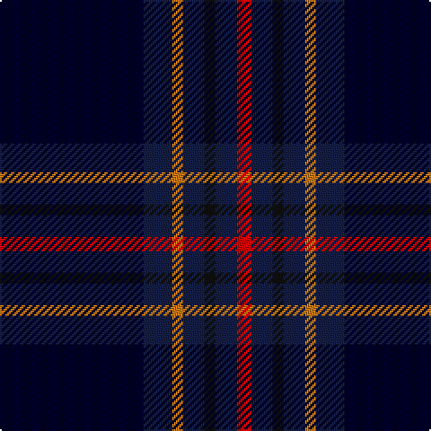

**Bands:** [KBRBKBR](/stripes/kbrbkbr/) · **Stripes:** [K DB O DB K DB R](/stripes/stripes7/) K DB O DB K DB R

This was sourced from register-of-tartans.  It is a [7 band tartan](/bands/bands7/).

Original link https://www.tartanregister.gov.uk/tartanDetails.aspx?ref=1076

## Register references

External register numbers recorded for this tartan.

- Scottish Register of Tartans: [1076](https://www.tartanregister.gov.uk/tartanDetails.aspx?ref=1076)
- Scottish Tartans World Register: 2982

## Thread count
DB/80 DBa16 O6 DBa12 K6 DBa12 R/8

## Palette
Each colour and its ΔE from the base-6 reference it is a variant of.

| Colour | Shade | Base | ΔE (OKLab) |
|---|---|---|---|
| DB | <code style="background-color:#000028;">#000028</code> `#000028` | K <code style="background-color:#000000;">#000000</code> | 0.15 |
| DBa | <code style="background-color:#141E46;">#141E46</code> `#141E46` | B <code style="background-color:#2A418A;">#2A418A</code> | 0.16 |
| K | <code style="background-color:#101010;">#101010</code> `#101010` | K <code style="background-color:#000000;">#000000</code> | 0.17 |
| O | <code style="background-color:#C87814;">#C87814</code> `#C87814` | R <code style="background-color:#CC0000;">#CC0000</code> | 0.17 |
| R | <code style="background-color:#DC0000;">#DC0000</code> `#DC0000` | R <code style="background-color:#CC0000;">#CC0000</code> | 0.03 |

# Sample pattern

## Nearest tartans

The nearest existing variants by ΔTartan distance.

1. [Wcwm 9275-1395](/setts/s7/db6dp3db56k24g6r6g6/) — ΔT 1.21
1. [Slanj Dress (Corporate)](/setts/s8/k4db36k4db4k34b3k3w4~x2/) — ΔT 1.24
1. [Edinburgh Crystal Corporate Tartan Tartan Number: 2307. Earliest known date: pre 1997 Designed by Sandra Campbell an employee of Edinburgh Crystal. See products available Copyright © Blair Urquhart, Comrie, 2015](/setts/s8/dt30lb2k6db3r3db3k6lb2~x4/) — ΔT 1.24
1. [Moray Council](/setts/s8/db8r2db33dt15g12lo2g2r2~x2/) — ΔT 1.31
1. [Auckland (Fashion)](/setts/s8/dg3k3db2k16db2k2db24lb2~x2/) — ΔT 1.32
1. [American National Fashion Tartan Tartan Number: 6882. Earliest known date: 01/01/2006 Designed by Erica Randall of The House of Edgar for Houston Kilts of Glasgow. Letter of appreciation on Scottish Tartans Authority file from President Bush thanking Ken MacDonald of Houston Kilts for 'the kilt outfit'./Threadcount and colours aren't 100% original. Generated manually./ See products available Copyright © Blair Urquhart, Comrie, 2015](/setts/s8/k3r3dg4db7k3k39db15w3~x2/) — ΔT 1.34
1. [City of Rome Pipe Band (Corporate)](/setts/s7/r12lo6k88db45k6db6ly6/) — ΔT 1.45
1. [Trotter (Personal)](/setts/s9/dt23k2dt2k2dt2k28r2k4n2~x2/) — ΔT 1.45
1. [Patriot, The (Fashion)](/setts/s7/k10db4k34dt2k2dt30w3~x2/) — ΔT 1.55
1. [Eglinton](/setts/s7/k1g1k1db7k1r1k1~x8/) — ΔT 1.55

## Neighbour map

Every grey dot is one of 14313 variants placed by the first two principal components of the ΔTartan feature space (44% of its variance). Red is this tartan; blue dots are its nearest — click one to open its page.

<svg viewBox="0 0 640 380" role="img" style="max-width:100%;height:auto;border:1px solid #e0e0e0;border-radius:4px;display:block" xmlns="http://www.w3.org/2000/svg"><image href="/nn/cloud.v1.png" width="640" height="380"/><a href="/setts/s7/db6dp3db56k24g6r6g6/"><circle cx="358.4" cy="170.9" r="4" fill="#3465a4"><title>Wcwm 9275-1395</title></circle></a><a href="/setts/s8/k4db36k4db4k34b3k3w4~x2/"><circle cx="348.3" cy="202.6" r="4" fill="#3465a4"><title>Slanj Dress (Corporate)</title></circle></a><a href="/setts/s8/dt30lb2k6db3r3db3k6lb2~x4/"><circle cx="330.9" cy="164.7" r="4" fill="#3465a4"><title>Edinburgh Crystal Corporate Tartan Tartan Number: 2307. Earliest known date: pre 1997 Designed by Sandra Campbell an employee of Edinburgh Crystal. See products available Copyright © Blair Urquhart, Comrie, 2015</title></circle></a><a href="/setts/s8/db8r2db33dt15g12lo2g2r2~x2/"><circle cx="326.8" cy="180.7" r="4" fill="#3465a4"><title>Moray Council</title></circle></a><a href="/setts/s8/dg3k3db2k16db2k2db24lb2~x2/"><circle cx="362.1" cy="205.1" r="4" fill="#3465a4"><title>Auckland (Fashion)</title></circle></a><a href="/setts/s8/k3r3dg4db7k3k39db15w3~x2/"><circle cx="292.4" cy="169.7" r="4" fill="#3465a4"><title>American National Fashion Tartan Tartan Number: 6882. Earliest known date: 01/01/2006 Designed by Erica Randall of The House of Edgar for Houston Kilts of Glasgow. Letter of appreciation on Scottish Tartans Authority file from President Bush thanking Ken MacDonald of Houston Kilts for 'the kilt outfit'./Threadcount and colours aren't 100% original. Generated manually./ See products available Copyright © Blair Urquhart, Comrie, 2015</title></circle></a><a href="/setts/s7/r12lo6k88db45k6db6ly6/"><circle cx="336.7" cy="167.3" r="4" fill="#3465a4"><title>City of Rome Pipe Band (Corporate)</title></circle></a><a href="/setts/s9/dt23k2dt2k2dt2k28r2k4n2~x2/"><circle cx="404.6" cy="198.9" r="4" fill="#3465a4"><title>Trotter (Personal)</title></circle></a><a href="/setts/s7/k10db4k34dt2k2dt30w3~x2/"><circle cx="388.6" cy="210.9" r="4" fill="#3465a4"><title>Patriot, The (Fashion)</title></circle></a><a href="/setts/s7/k1g1k1db7k1r1k1~x8/"><circle cx="333.9" cy="227.4" r="4" fill="#3465a4"><title>Eglinton</title></circle></a><circle cx="368.5" cy="191.6" r="5" fill="#c00000"/></svg>

ID: /setts/s7/k40db8o3db6k3db6r4~x2/
