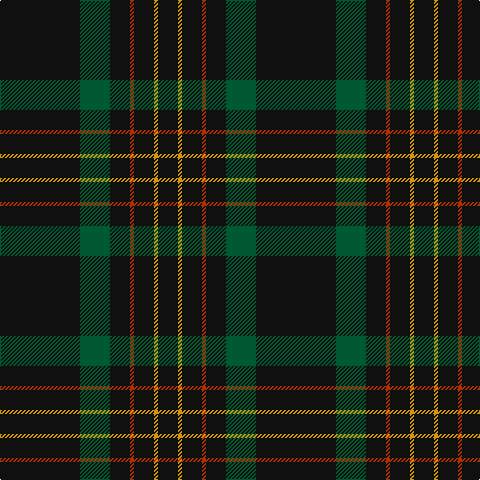

In pattern [KGKRKYK](/stripes/kgkrkyk/).

This was sourced from tartans-authority.  It is a [7 stripe tartan](/stripes/stripes7/).

Original link http://www.tartansauthority.com/tartan-ferret/display/3235/

## Thread count
K/80 G30 K20 R4 K20 DY4 K/20

## Palette
Each colour and the base-6 reference it is a variant of.

| Colour | Shade | Base |
|---|---|---|
| DY | <code style="background-color:#D09800;">#D09800</code> `oklch(71.4% 0.147 82.1)` <small>#D09800</small> | Y <code style="background-color:#F2BF00;">#F2BF00</code> |
| G | <code style="background-color:#005830;">#005830</code> `oklch(40.4% 0.100 155.2)` <small>#005830</small> | G <code style="background-color:#006100;">#006100</code> |
| K | <code style="background-color:#101010;">#101010</code> `oklch(17.3% 0.000 89.9)` <small>#101010</small> | K <code style="background-color:#000000;">#000000</code> |
| R | <code style="background-color:#B03000;">#B03000</code> `oklch(50.3% 0.171 36.3)` <small>#B03000</small> | R <code style="background-color:#CC0000;">#CC0000</code> |

# Sample pattern

## Nearest tartans

The nearest existing variants by ΔTartan distance.

1. [Langhein, Alex (Personal)](/setts/s8/k40dg15k10r2k10lo2k10lo2~x2/) — ΔT 0.79
1. [Langhein Family Tartan Tartan Number: 3235. Earliest known date: April 2002 Based on Black Watch Sett See products available Copyright © Blair Urquhart, Comrie, 2015](/setts/s7/k40dg15k10r2k10ly2k10~x2/) — ΔT 1.00
1. [Rikaco Vintage](/setts/s8/dt74m9dt4r5dt4m9dt37db9~x2/) — ΔT 1.39
1. [Laird Abdullah (Personal)](/setts/s8/k10n2k2n8k40r4k5r2~x2/) — ΔT 1.44
1. [Kalkofen (Name)](/setts/s6/k40dg15k10r2k10lo2~x2/) — ΔT 1.56
1. [MacLaine of Lochbuie Hunting](/setts/s5/dt32r3dt4k2lo3~x2/) — ΔT 1.60
1. [Renwick](/setts/s10/k3g2k20r2k12g2k4g2k6g2~x2/) — ΔT 1.65
1. [MacNathair Sgianach](/setts/s4/db1r1k12g1~x4/) — ΔT 1.69
1. [Spirit of Glyndwr Gold (Fashion)](/setts/s8/k24n18k11n4k11n18k53r4/) — ΔT 1.74
1. [Harley Davidson](/setts/s10/k49o8k4n6o4n6k4o8k49o2/) — ΔT 1.79

## Neighbour map

Every grey dot is one of 14299 variants placed by the first two principal components of the ΔTartan feature space (44% of its variance). Red is this tartan; blue dots are its nearest — click one to open its page.

<svg viewBox="0 0 640 380" role="img" style="max-width:100%;height:auto;border:1px solid #e0e0e0;border-radius:4px;display:block" xmlns="http://www.w3.org/2000/svg"><image href="/nn/cloud.v1.png" width="640" height="380"/><a href="/setts/s8/k40dg15k10r2k10lo2k10lo2~x2/"><circle cx="544.5" cy="212.9" r="4" fill="#3465a4"><title>Langhein, Alex (Personal)</title></circle></a><a href="/setts/s7/k40dg15k10r2k10ly2k10~x2/"><circle cx="568.7" cy="233.2" r="4" fill="#3465a4"><title>Langhein Family Tartan Tartan Number: 3235. Earliest known date: April 2002 Based on Black Watch Sett See products available Copyright © Blair Urquhart, Comrie, 2015</title></circle></a><a href="/setts/s8/dt74m9dt4r5dt4m9dt37db9~x2/"><circle cx="539.5" cy="182.6" r="4" fill="#3465a4"><title>Rikaco Vintage</title></circle></a><a href="/setts/s8/k10n2k2n8k40r4k5r2~x2/"><circle cx="538.5" cy="174.0" r="4" fill="#3465a4"><title>Laird Abdullah (Personal)</title></circle></a><a href="/setts/s6/k40dg15k10r2k10lo2~x2/"><circle cx="566.4" cy="243.2" r="4" fill="#3465a4"><title>Kalkofen (Name)</title></circle></a><a href="/setts/s5/dt32r3dt4k2lo3~x2/"><circle cx="585.6" cy="212.7" r="4" fill="#3465a4"><title>MacLaine of Lochbuie Hunting</title></circle></a><a href="/setts/s10/k3g2k20r2k12g2k4g2k6g2~x2/"><circle cx="562.3" cy="236.9" r="4" fill="#3465a4"><title>Renwick</title></circle></a><a href="/setts/s4/db1r1k12g1~x4/"><circle cx="567.4" cy="237.6" r="4" fill="#3465a4"><title>MacNathair Sgianach</title></circle></a><a href="/setts/s8/k24n18k11n4k11n18k53r4/"><circle cx="461.1" cy="239.3" r="4" fill="#3465a4"><title>Spirit of Glyndwr Gold (Fashion)</title></circle></a><a href="/setts/s10/k49o8k4n6o4n6k4o8k49o2/"><circle cx="508.2" cy="154.7" r="4" fill="#3465a4"><title>Harley Davidson</title></circle></a><circle cx="548.2" cy="220.3" r="5" fill="#c00000"/></svg>

ID: /setts/s7/k40dg15k10r2k10lo2k10~x2/
