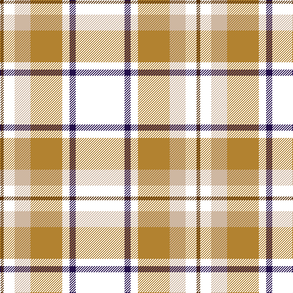

**Bands:** [GKYRKBK](/stripes/gkyrkbk/) · **Stripes:** [DY K LR O K DP K](/stripes/stripes7/) DY K LR O K DP K

This was sourced from register-of-tartans.  It is a [7 band tartan](/bands/bands7/).

Original link https://www.tartanregister.gov.uk/tartanDetails.aspx?ref=10577

## Register references

External register numbers recorded for this tartan.

- Scottish Register of Tartans: [10577](https://www.tartanregister.gov.uk/tartanDetails.aspx?ref=10577)

## Thread count
T/6 W18 N26 LT52 W12 DB10 W/80

## Palette
Each colour and its ΔE from the base-6 reference it is a variant of.

| Colour | Shade | Base | ΔE (OKLab) |
|---|---|---|---|
| DB | <code style="background-color:#240F4C;">#240F4C</code> `#240F4C` | B <code style="background-color:#2A418A;">#2A418A</code> | 0.17 |
| LT | <code style="background-color:#B28230;">#B28230</code> `#B28230` | R <code style="background-color:#CC0000;">#CC0000</code> | 0.20 |
| N | <code style="background-color:#CEB7A1;">#CEB7A1</code> `#CEB7A1` | Y <code style="background-color:#F2BF00;">#F2BF00</code> | 0.14 |
| T | <code style="background-color:#5B340A;">#5B340A</code> `#5B340A` | G <code style="background-color:#006100;">#006100</code> | 0.16 |

# Sample pattern

## Nearest tartans

The nearest existing variants by ΔTartan distance.

1. [Drambuie dress](/setts/s6/ly6k5r4k48o36w6/) — ΔT 0.66
1. [Drambuie](/setts/s6/ly6k5o4k48r36w6/) — ΔT 1.09
1. [Drambuie Dress](/setts/s6/ly6k5r4k48dy36w6/) — ΔT 1.27
1. [Holestone (Corporate)](/setts/s8/k4lo8k26o6g15o6k26w2~x2/) — ΔT 1.31
1. [York Region Pipe Band](/setts/s11/r10k3g2lb2k22db4k22r4g4r14lb3~x2/) — ΔT 1.33
1. [MacDonald, Sir John A.](/setts/s11/r12k4g2w2k21db3k22r4g4r15w3~x2/) — ΔT 1.35
1. [LP Cover (Dance)](/setts/s7/ly3k9b1k1r6k2ly3~x4/) — ΔT 1.36
1. [Papua New Guinea](/setts/s5/g3ly5r14k36w3~x2/) — ΔT 1.39
1. [Drambuie](/setts/s6/ly6k5lo4k48r36w6/) — ΔT 1.39
1. [MacDonald, Sir John A](/setts/s11/r10k3dg2lb2k22db4k22r4dg4r14lb3~x2/) — ΔT 1.42

## Neighbour map

Every grey dot is one of 14313 variants placed by the first two principal components of the ΔTartan feature space (44% of its variance). Red is this tartan; blue dots are its nearest — click one to open its page.

<svg viewBox="0 0 640 380" role="img" style="max-width:100%;height:auto;border:1px solid #e0e0e0;border-radius:4px;display:block" xmlns="http://www.w3.org/2000/svg"><image href="/nn/cloud.v1.png" width="640" height="380"/><a href="/setts/s6/ly6k5r4k48o36w6/"><circle cx="242.7" cy="163.5" r="4" fill="#3465a4"><title>Drambuie dress</title></circle></a><a href="/setts/s6/ly6k5o4k48r36w6/"><circle cx="252.9" cy="164.2" r="4" fill="#3465a4"><title>Drambuie</title></circle></a><a href="/setts/s6/ly6k5r4k48dy36w6/"><circle cx="266.9" cy="173.9" r="4" fill="#3465a4"><title>Drambuie Dress</title></circle></a><a href="/setts/s8/k4lo8k26o6g15o6k26w2~x2/"><circle cx="287.6" cy="181.0" r="4" fill="#3465a4"><title>Holestone (Corporate)</title></circle></a><a href="/setts/s11/r10k3g2lb2k22db4k22r4g4r14lb3~x2/"><circle cx="240.7" cy="157.2" r="4" fill="#3465a4"><title>York Region Pipe Band</title></circle></a><a href="/setts/s11/r12k4g2w2k21db3k22r4g4r15w3~x2/"><circle cx="228.7" cy="149.0" r="4" fill="#3465a4"><title>MacDonald, Sir John A.</title></circle></a><a href="/setts/s7/ly3k9b1k1r6k2ly3~x4/"><circle cx="210.4" cy="198.9" r="4" fill="#3465a4"><title>LP Cover (Dance)</title></circle></a><a href="/setts/s5/g3ly5r14k36w3~x2/"><circle cx="299.1" cy="169.5" r="4" fill="#3465a4"><title>Papua New Guinea</title></circle></a><a href="/setts/s6/ly6k5lo4k48r36w6/"><circle cx="266.4" cy="166.7" r="4" fill="#3465a4"><title>Drambuie</title></circle></a><a href="/setts/s11/r10k3dg2lb2k22db4k22r4dg4r14lb3~x2/"><circle cx="244.1" cy="158.9" r="4" fill="#3465a4"><title>MacDonald, Sir John A</title></circle></a><circle cx="239.5" cy="164.6" r="5" fill="#c00000"/></svg>

ID: /setts/s7/k40dp5k6o26lr13k9dy3~x2/
