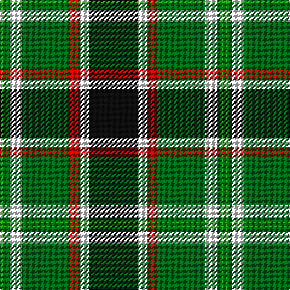

In pattern [GGWGRWK](/patterns/ggwgrwk/).

This was sourced from tartans-authority.  It is a [7 stripes tartan](/stripes/stripes7/).

Original link http://www.tartansauthority.com/tartan-ferret/display/10530/

## Thread count
G/4 Ga4 W10 Ga40 R8 W8 K/40

## Palette
Each colour and its ΔE from the base-6 reference it is a variant of.

| Colour | Shade | Base | ΔE (OKLab) |
|---|---|---|---|
| G | <code style="background-color:#289C18;">#289C18</code> `#289C18` | G <code style="background-color:#006100;">#006100</code> | 0.19 |
| Ga | <code style="background-color:#006818;">#006818</code> `#006818` | G <code style="background-color:#006100;">#006100</code> | 0.02 |
| K | <code style="background-color:#101010;">#101010</code> `#101010` | K <code style="background-color:#000000;">#000000</code> | 0.17 |
| R | <code style="background-color:#C80000;">#C80000</code> `#C80000` | R <code style="background-color:#CC0000;">#CC0000</code> | 0.01 |
| W | <code style="background-color:#FCFCFC;">#FCFCFC</code> `#FCFCFC` | W <code style="background-color:#F7F7F7;">#F7F7F7</code> | 0.01 |

# Sample pattern

## Nearest tartans

The nearest existing variants by ΔTartan distance.

1. [Mellor (Name)](/setts/s6/w16k32g64b6y10w10-b003c64-g006818-k101010-we0e0e0-ybc8c00/) — ΔT 0.90
1. [Lindley-Highfield Name Tartan Tartan Number: 10002. Earliest known date: 13 February 2009 'Lindley-Highfield of Ballumbie Castle' is a tartan of the family of the Lindley-Highfields of Ballumbie Castle, sometime Barons of Cartsburn. The colours of this particular tartan are taken from the armorial bearings of the Head of the Family of Lindley-Highfield of Ballumbie Castle. See products available Copyright © Blair Urquhart, Comrie, 2015](/setts/s7/g56b24w8y16g8k16b8-b800080-g006400-k000000-wffffff-y32cd32/) — ΔT 0.95
1. [Bannockbane, Green](/setts/s7/g8ga6g48w31r42gb6r8-g003000-ga30a010-gb008000-r906030-we0e0e0/) — ΔT 0.95
1. [Skene](/setts/s7/b48k8r6k8g48k8y8-b304080-g008000-k000000-rc00000-yff8500/) — ΔT 0.98
1. [Unidentified #46](/setts/s9/w32g4k10r4k20g22y4g22k4-g005020-k101010-rdc0000-we0e0e0-ye8c000/) — ΔT 0.98
1. [Unnamed 9](/setts/s9/w32g4k10r4k20g22y4g22k4-g008000-k000000-rc00000-we0e0e0-yf0c000/) — ΔT 1.06
1. [Cape Breton](/setts/s7/y10k10g34k12ga48k12y6-g008000-ga808080-k000000-yf0c000/) — ΔT 1.08
1. [MacLamroc](/setts/s6/y8k2g32k32r2w6-g285800-k101010-rc80000-we0e0e0-ye8c000/) — ΔT 1.08
1. [Corstorphine Trial A](/setts/s10/k12y4g36w6g26k6y8k6b36w6-b2c2c80-g006818-k101010-wfcfcfc-ye8c000/) — ΔT 1.14
1. [Afternoon Tea / Afternoon Tea](/setts/s6/w15k8r25k72g98y15-g408060-k1c1714-r781638-we0e0e0-yc89800/) — ΔT 1.14

## Neighbour map

Every grey dot is one of 15726 variants placed by the first two principal components of the ΔTartan feature space (44% of its variance). Red is this tartan; blue dots are its nearest — click one to open its page.

<svg viewBox="0 0 640 380" role="img" style="max-width:100%;height:auto;border:1px solid #e0e0e0;border-radius:4px;display:block" xmlns="http://www.w3.org/2000/svg"><image href="/nn/cloud.v1.png" width="640" height="380"/><a href="/setts/s6/w16k32g64b6y10w10-b003c64-g006818-k101010-we0e0e0-ybc8c00/"><circle cx="184.1" cy="178.5" r="4" fill="#3465a4"><title>Mellor (Name)</title></circle></a><a href="/setts/s7/g56b24w8y16g8k16b8-b800080-g006400-k000000-wffffff-y32cd32/"><circle cx="160.2" cy="189.6" r="4" fill="#3465a4"><title>Lindley-Highfield Name Tartan Tartan Number: 10002. Earliest known date: 13 February 2009 'Lindley-Highfield of Ballumbie Castle' is a tartan of the family of the Lindley-Highfields of Ballumbie Castle, sometime Barons of Cartsburn. The colours of this particular tartan are taken from the armorial bearings of the Head of the Family of Lindley-Highfield of Ballumbie Castle. See products available Copyright © Blair Urquhart, Comrie, 2015</title></circle></a><a href="/setts/s7/g8ga6g48w31r42gb6r8-g003000-ga30a010-gb008000-r906030-we0e0e0/"><circle cx="140.3" cy="184.4" r="4" fill="#3465a4"><title>Bannockbane, Green</title></circle></a><a href="/setts/s7/b48k8r6k8g48k8y8-b304080-g008000-k000000-rc00000-yff8500/"><circle cx="145.2" cy="181.4" r="4" fill="#3465a4"><title>Skene</title></circle></a><a href="/setts/s9/w32g4k10r4k20g22y4g22k4-g005020-k101010-rdc0000-we0e0e0-ye8c000/"><circle cx="121.5" cy="177.0" r="4" fill="#3465a4"><title>Unidentified #46</title></circle></a><a href="/setts/s9/w32g4k10r4k20g22y4g22k4-g008000-k000000-rc00000-we0e0e0-yf0c000/"><circle cx="109.7" cy="174.2" r="4" fill="#3465a4"><title>Unnamed 9</title></circle></a><a href="/setts/s7/y10k10g34k12ga48k12y6-g008000-ga808080-k000000-yf0c000/"><circle cx="130.0" cy="200.8" r="4" fill="#3465a4"><title>Cape Breton</title></circle></a><a href="/setts/s6/y8k2g32k32r2w6-g285800-k101010-rc80000-we0e0e0-ye8c000/"><circle cx="209.2" cy="162.2" r="4" fill="#3465a4"><title>MacLamroc</title></circle></a><a href="/setts/s10/k12y4g36w6g26k6y8k6b36w6-b2c2c80-g006818-k101010-wfcfcfc-ye8c000/"><circle cx="143.7" cy="167.4" r="4" fill="#3465a4"><title>Corstorphine Trial A</title></circle></a><a href="/setts/s6/w15k8r25k72g98y15-g408060-k1c1714-r781638-we0e0e0-yc89800/"><circle cx="198.3" cy="179.5" r="4" fill="#3465a4"><title>Afternoon Tea / Afternoon Tea</title></circle></a><circle cx="149.8" cy="166.4" r="5" fill="#c00000"/></svg>

ID: /setts/s7/k40w8r8g40w10g4ga4-g006818-ga289c18-k101010-rc80000-wfcfcfc/
