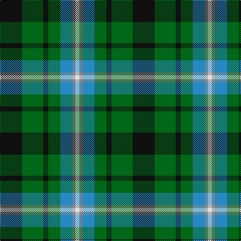

In pattern [KGKGBRW](/patterns/kgkgbrw/).

This was sourced from register-of-tartans.  It is a [7 stripes tartan](/stripes/stripes7/).

Original link https://www.tartanregister.gov.uk/tartanDetails.aspx?ref=11103

## Thread count
K/44 G42 K10 G24 B24 N6 LN/8

## Palette
Each colour and its ΔE from the base-6 reference it is a variant of.

| Colour | Shade | Base | ΔE (OKLab) |
|---|---|---|---|
| B | <code style="background-color:#2888C4;">#2888C4</code> `#2888C4` | B <code style="background-color:#2C4084;">#2C4084</code> | 0.21 |
| G | <code style="background-color:#006818;">#006818</code> `#006818` | G <code style="background-color:#006400;">#006400</code> | 0.02 |
| K | <code style="background-color:#101010;">#101010</code> `#101010` | K <code style="background-color:#000000;">#000000</code> | 0.17 |
| LN | <code style="background-color:#E0E0E0;">#E0E0E0</code> `#E0E0E0` | W <code style="background-color:#F4F4F0;">#F4F4F0</code> | 0.06 |
| N | <code style="background-color:#888888;">#888888</code> `#888888` | R <code style="background-color:#C80000;">#C80000</code> | 0.24 |

# Sample pattern

## Nearest tartans

The nearest existing variants by ΔTartan distance.

1. [Disciples of Christ MM (Switzerland)](/setts/s7/k44g42k10g24b24r6w8-b2888c4-g006818-k101010-r888888-wfcfcfc/) — ΔT 0.16
1. [Lanarkshire](/setts/s6/g62y8g12k38b36ba18-b2c2c80-ba5c8ca8-g006818-k101010-ye8c000/) — ΔT 0.72
1. [Scottish Odyssey Commemorative Tartan Tartan Number: 4071. Earliest known date: 01/01/2002 The Scottish Odyssey tartan from Lochcarron is a 'celebration of the wonderful experiences to be gained' from a visit to Scotland and some of the most spectacularly contrasting landscapes to be seen in Europe. See products available Copyright © Blair Urquhart, Comrie, 2015](/setts/s7/k14b22k6b22g22ga44b6-b2c4084-g663300-ga008800-k000000/) — ΔT 0.74
1. [MPS Emerald Society NCLEES 2012](/setts/s6/y8g60ga30b10ba20y8-b002f58-ba1977a8-g01351e-ga006217-yffe155/) — ΔT 0.95
1. [MPS Emerald Society](/setts/s6/y8g60ga30b10ba20y8-b2c2c80-ba1474b4-g003820-ga006818-yfccc00/) — ΔT 0.96
1. [Queen of the South](/setts/s8/w6b20b24g22ba6g22ga8g4-b102040-ba304080-g30a010-ga008000-we0e0e0/) — ΔT 0.97
1. [MacTaggert](/setts/s7/g18b4g2k12ba12r2ba2-b5480b0-ba304080-g008000-k000000-rc00000/) — ΔT 1.00
1. [Arrol Corporate Tartan Tartan Number: 1365. Earliest known date: c.1910 From James Johnston & Co. (Glasgow) pattern book covering 1863 to 1963. Designed early 20th century for Sir William Arrol, head of the engineering firm which built Forth Bridge, and of the Arrol-Johnston motor car company, but it is not clear whether it was intended as a corporate tartan or for his personal use. See products available Copyright © Blair Urquhart, Comrie, 2015](/setts/s9/r10b30k30g30w4g30k30g30w4-b2c2c80-g006818-k101010-rc80000-we0e0e0/) — ΔT 1.00
1. [MacRae, Ancient hunting](/setts/s8/g48k8g12r8g12k38b44w10-b304080-g008000-k000000-rc00000-we0e0e0/) — ΔT 1.01
1. [Dick (Personal)](/setts/s7/k10g60y6b30k30b14w6-b1474b4-g28802c-k101010-we0e0e0-ye8c000/) — ΔT 1.01

## Neighbour map

Every grey dot is one of 15726 variants placed by the first two principal components of the ΔTartan feature space (44% of its variance). Red is this tartan; blue dots are its nearest — click one to open its page.

<svg viewBox="0 0 640 380" role="img" style="max-width:100%;height:auto;border:1px solid #e0e0e0;border-radius:4px;display:block" xmlns="http://www.w3.org/2000/svg"><image href="/nn/cloud.v1.png" width="640" height="380"/><a href="/setts/s7/k44g42k10g24b24r6w8-b2888c4-g006818-k101010-r888888-wfcfcfc/"><circle cx="148.0" cy="217.0" r="4" fill="#3465a4"><title>Disciples of Christ MM (Switzerland)</title></circle></a><a href="/setts/s6/g62y8g12k38b36ba18-b2c2c80-ba5c8ca8-g006818-k101010-ye8c000/"><circle cx="161.7" cy="229.0" r="4" fill="#3465a4"><title>Lanarkshire</title></circle></a><a href="/setts/s7/k14b22k6b22g22ga44b6-b2c4084-g663300-ga008800-k000000/"><circle cx="124.2" cy="221.5" r="4" fill="#3465a4"><title>Scottish Odyssey Commemorative Tartan Tartan Number: 4071. Earliest known date: 01/01/2002 The Scottish Odyssey tartan from Lochcarron is a 'celebration of the wonderful experiences to be gained' from a visit to Scotland and some of the most spectacularly contrasting landscapes to be seen in Europe. See products available Copyright © Blair Urquhart, Comrie, 2015</title></circle></a><a href="/setts/s6/y8g60ga30b10ba20y8-b002f58-ba1977a8-g01351e-ga006217-yffe155/"><circle cx="170.9" cy="210.2" r="4" fill="#3465a4"><title>MPS Emerald Society NCLEES 2012</title></circle></a><a href="/setts/s6/y8g60ga30b10ba20y8-b2c2c80-ba1474b4-g003820-ga006818-yfccc00/"><circle cx="174.7" cy="210.9" r="4" fill="#3465a4"><title>MPS Emerald Society</title></circle></a><a href="/setts/s8/w6b20b24g22ba6g22ga8g4-b102040-ba304080-g30a010-ga008000-we0e0e0/"><circle cx="138.9" cy="223.9" r="4" fill="#3465a4"><title>Queen of the South</title></circle></a><a href="/setts/s7/g18b4g2k12ba12r2ba2-b5480b0-ba304080-g008000-k000000-rc00000/"><circle cx="140.5" cy="191.0" r="4" fill="#3465a4"><title>MacTaggert</title></circle></a><a href="/setts/s9/r10b30k30g30w4g30k30g30w4-b2c2c80-g006818-k101010-rc80000-we0e0e0/"><circle cx="162.6" cy="226.6" r="4" fill="#3465a4"><title>Arrol Corporate Tartan Tartan Number: 1365. Earliest known date: c.1910 From James Johnston &amp; Co. (Glasgow) pattern book covering 1863 to 1963. Designed early 20th century for Sir William Arrol, head of the engineering firm which built Forth Bridge, and of the Arrol-Johnston motor car company, but it is not clear whether it was intended as a corporate tartan or for his personal use. See products available Copyright © Blair Urquhart, Comrie, 2015</title></circle></a><a href="/setts/s8/g48k8g12r8g12k38b44w10-b304080-g008000-k000000-rc00000-we0e0e0/"><circle cx="115.1" cy="202.5" r="4" fill="#3465a4"><title>MacRae, Ancient hunting</title></circle></a><a href="/setts/s7/k10g60y6b30k30b14w6-b1474b4-g28802c-k101010-we0e0e0-ye8c000/"><circle cx="155.9" cy="188.5" r="4" fill="#3465a4"><title>Dick (Personal)</title></circle></a><circle cx="152.7" cy="219.2" r="5" fill="#c00000"/></svg>

ID: /setts/s7/k44g42k10g24b24r6w8-b2888c4-g006818-k101010-r888888-we0e0e0/
