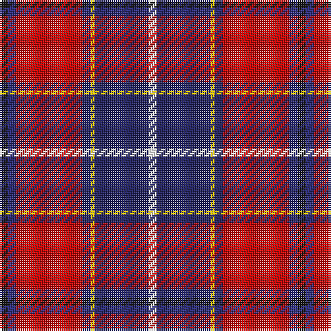

In pattern [KBRBYBW](/patterns/kbrbybw/).

This was sourced from house-of-tartan.  It is a [7 stripes tartan](/stripes/stripes7/).

Original link http://www.house-of-tartan.scotland.net/house/TartanViewjs.asp?colr=Def&tnam=2105

## Thread count
K/4 DB4 R32 DBa4 Y2 DBa26 LN/4

## Palette
Each colour and its ΔE from the base-6 reference it is a variant of.

| Colour | Shade | Base | ΔE (OKLab) |
|---|---|---|---|
| DB | <code style="background-color:#2C2C80;">#2C2C80</code> `#2C2C80` | B <code style="background-color:#2C4084;">#2C4084</code> | 0.05 |
| DBa | <code style="background-color:#202060;">#202060</code> `#202060` | B <code style="background-color:#2C4084;">#2C4084</code> | 0.11 |
| K | <code style="background-color:#101010;">#101010</code> `#101010` | K <code style="background-color:#000000;">#000000</code> | 0.17 |
| LN | <code style="background-color:#E0E0E0;">#E0E0E0</code> `#E0E0E0` | W <code style="background-color:#F4F4F0;">#F4F4F0</code> | 0.06 |
| R | <code style="background-color:#C80000;">#C80000</code> `#C80000` | R <code style="background-color:#C80000;">#C80000</code> | 0.00 |
| Y | <code style="background-color:#E8C000;">#E8C000</code> `#E8C000` | Y <code style="background-color:#E8C000;">#E8C000</code> | 0.00 |

# Sample pattern

## Nearest tartans

The nearest existing variants by ΔTartan distance.

1. [Wishart Dress (Clan)](/setts/s7/k14b8r62ba6y4ba54w8-b2c2c80-ba202060-k000000-rc80000-wc8c8c8-ye8c000/) — ΔT 0.47
1. [Wishart, dress](/setts/s7/k4b4r32ba4y2ba26w4-b304080-ba000050-k000000-rc00000-we0e0e0-yf0c000/) — ΔT 0.75
1. [Heirloom Red Alba (Fashion)](/setts/s9/r8y4r68b20g8b8ba8b46w6-b202060-ba2888c4-g5c6428-ra00000-we0e0e0-ye8c000/) — ΔT 0.89
1. [MacLeod Society of Scotland](/setts/s6/g6ga6r44k10b44y4-b2c2c80-g006818-ga289c18-k101010-rc80000-ye8c000/) — ΔT 0.99
1. [Bombeiros Voluntarios De Galicia (Co](/setts/s7/r6b4r50ra24k50w4wa4-b5c5c5c-k101010-rc80000-ra888888-we0e0e0-waa8ace8/) — ΔT 1.05
1. [MacCreary (Personal)](/setts/s9/k8b24w6b8g16y4r48b8r8-b1c0070-g006818-k101010-rcc4438-wa8ace8-yd09800/) — ΔT 1.06
1. [Bombeiros Voluntarios De Galicia](/setts/s7/r6b4r50ra24k50w4wa4-b5c5c5c-k101010-rc80000-ra888888-wffffff-waa8ace8/) — ΔT 1.06
1. [Asman Red (Personal)](/setts/s10/b8y6b44r12w4k12w4ra52k6ra8-b2c2c80-k101010-r888888-rac80000-wfcfcfc-ye8c000/) — ΔT 1.08
1. [Manitoba Masonic (Corporate)](/setts/s8/y6b16w6b68r68g8r8w4-b2c2c80-g006818-rc80000-wfcfcfc-yfccc00/) — ΔT 1.12
1. [Hyland Evening (Personal)](/setts/s8/b6y4r38ra8ba12k72ba4y6-b440044-ba780078-k101010-rc8002c-rab03000-ydc943c/) — ΔT 1.14

## Neighbour map

Every grey dot is one of 15726 variants placed by the first two principal components of the ΔTartan feature space (44% of its variance). Red is this tartan; blue dots are its nearest — click one to open its page.

<svg viewBox="0 0 640 380" role="img" style="max-width:100%;height:auto;border:1px solid #e0e0e0;border-radius:4px;display:block" xmlns="http://www.w3.org/2000/svg"><image href="/nn/cloud.v1.png" width="640" height="380"/><a href="/setts/s7/k14b8r62ba6y4ba54w8-b2c2c80-ba202060-k000000-rc80000-wc8c8c8-ye8c000/"><circle cx="196.9" cy="127.0" r="4" fill="#3465a4"><title>Wishart Dress (Clan)</title></circle></a><a href="/setts/s7/k4b4r32ba4y2ba26w4-b304080-ba000050-k000000-rc00000-we0e0e0-yf0c000/"><circle cx="207.7" cy="122.5" r="4" fill="#3465a4"><title>Wishart, dress</title></circle></a><a href="/setts/s9/r8y4r68b20g8b8ba8b46w6-b202060-ba2888c4-g5c6428-ra00000-we0e0e0-ye8c000/"><circle cx="249.2" cy="122.1" r="4" fill="#3465a4"><title>Heirloom Red Alba (Fashion)</title></circle></a><a href="/setts/s6/g6ga6r44k10b44y4-b2c2c80-g006818-ga289c18-k101010-rc80000-ye8c000/"><circle cx="185.4" cy="157.2" r="4" fill="#3465a4"><title>MacLeod Society of Scotland</title></circle></a><a href="/setts/s7/r6b4r50ra24k50w4wa4-b5c5c5c-k101010-rc80000-ra888888-we0e0e0-waa8ace8/"><circle cx="183.9" cy="136.0" r="4" fill="#3465a4"><title>Bombeiros Voluntarios De Galicia (Co</title></circle></a><a href="/setts/s9/k8b24w6b8g16y4r48b8r8-b1c0070-g006818-k101010-rcc4438-wa8ace8-yd09800/"><circle cx="179.4" cy="134.7" r="4" fill="#3465a4"><title>MacCreary (Personal)</title></circle></a><a href="/setts/s7/r6b4r50ra24k50w4wa4-b5c5c5c-k101010-rc80000-ra888888-wffffff-waa8ace8/"><circle cx="181.6" cy="135.0" r="4" fill="#3465a4"><title>Bombeiros Voluntarios De Galicia</title></circle></a><a href="/setts/s10/b8y6b44r12w4k12w4ra52k6ra8-b2c2c80-k101010-r888888-rac80000-wfcfcfc-ye8c000/"><circle cx="165.5" cy="111.6" r="4" fill="#3465a4"><title>Asman Red (Personal)</title></circle></a><a href="/setts/s8/y6b16w6b68r68g8r8w4-b2c2c80-g006818-rc80000-wfcfcfc-yfccc00/"><circle cx="267.2" cy="126.3" r="4" fill="#3465a4"><title>Manitoba Masonic (Corporate)</title></circle></a><a href="/setts/s8/b6y4r38ra8ba12k72ba4y6-b440044-ba780078-k101010-rc8002c-rab03000-ydc943c/"><circle cx="251.0" cy="112.1" r="4" fill="#3465a4"><title>Hyland Evening (Personal)</title></circle></a><circle cx="223.2" cy="124.5" r="5" fill="#c00000"/></svg>

ID: /setts/s7/k4b4r32ba4y2ba26w4-b2c2c80-ba202060-k101010-rc80000-we0e0e0-ye8c000/
