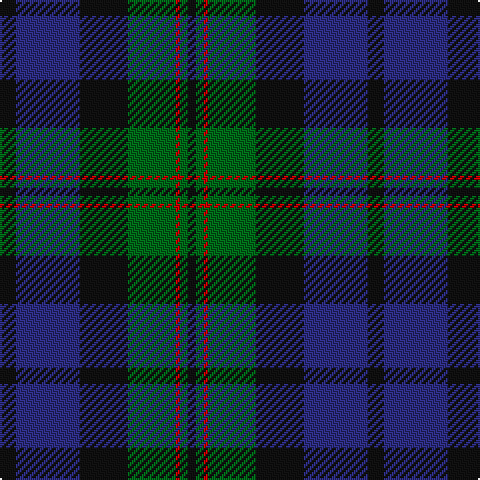

In pattern [KBKGRGK](/stripes/kbkgrgk/).

This was sourced from register-of-tartans.  It is a [7 stripe tartan](/stripes/stripes7/).

Original link https://www.tartanregister.gov.uk/tartanDetails.aspx?ref=1027

## Also known as

This cloth is also recorded under:

- Dundas #2

## Attestations

This cloth appears in 2 source records; the oldest owns this page.

- 01/01/1842 — Dundas #2 (register-of-tartans, [record](https://www.tartanregister.gov.uk/tartanDetails.aspx?ref=1027))
- 1842 — Dundas (Clan) (tartans-authority, [record](http://www.tartansauthority.com/tartan-ferret/display/1041/))

## Register references

External register numbers recorded for this tartan.

- Scottish Register of Tartans: [1027](https://www.tartanregister.gov.uk/tartanDetails.aspx?ref=1027)
- Scottish Tartans Authority (ITI): 1041
- Scottish Tartans World Register: 1041

## Thread count
K/8 DB32 K24 G24 R2 G4 K/4

## Palette
Each colour and the base-6 reference it is a variant of.

| Colour | Shade | Base |
|---|---|---|
| DB | <code style="background-color:#2C2C80;">#2C2C80</code> `oklch(35.0% 0.138 276.6)` <small>#2C2C80</small> | B <code style="background-color:#2A418A;">#2A418A</code> |
| G | <code style="background-color:#006818;">#006818</code> `oklch(45.0% 0.142 145.0)` <small>#006818</small> | G <code style="background-color:#006100;">#006100</code> |
| K | <code style="background-color:#101010;">#101010</code> `oklch(17.3% 0.000 89.9)` <small>#101010</small> | K <code style="background-color:#000000;">#000000</code> |
| R | <code style="background-color:#C80000;">#C80000</code> `oklch(52.3% 0.215 29.2)` <small>#C80000</small> | R <code style="background-color:#CC0000;">#CC0000</code> |

# Sample pattern

## Nearest tartans

The nearest existing variants by ΔTartan distance.

1. [Reid and Taylor](/setts/s7/k2g10k9db9r1k1db2~x2/) — ΔT 0.72
1. [Mowat (Clans Originaux)](/setts/s7/db24k3db5k23ly2k11g22~x2/) — ΔT 0.73
1. [Black Watch (Coarse Kilt)](/setts/s7/r4k4db24k24g24k2r3~x2/) — ΔT 0.76
1. [National Galleries of Scotland](/setts/s7/k7g22k22db6r2db15r2~x2/) — ΔT 0.78
1. [Gunn](/setts/s6/r2g12k12g1db12g2~x2/) — ΔT 0.78
1. [Baird (Old) Clan Tartan Tartan Number: 273. Earliest known date: c.1906 This tartan is first recorded in Johnston's work of 1906, and the sample from the Highland Society of London probably dates from the same period. In both these early references the triple stripes are rendered in red. Today, however, they are generally woven in purple. The name originates from 'bard' meaning poet. The Bairds owned estates in Aberdeenshire which were later purchased by the Gordons. See products available Copyright © Blair Urquhart, Comrie, 2015](/setts/s8/m7g3m2g33k31db31k3db3/) — ΔT 0.81
1. [Bedford High School](/setts/s8/db4k3db12k11g13g1g1g3~x2/) — ΔT 0.86
1. [MacRobart (Personal)](/setts/s6/db30k10g10lb2g15lb2~x2/) — ΔT 0.89
1. [Renfrew](/setts/s7/db6k2db18k18g18k3r2~x2/) — ΔT 0.89
1. [Unidentified #36](/setts/s8/k16dg16k2dg16k16w2dp16k1~x2/) — ΔT 0.89

## Neighbour map

Every grey dot is one of 14299 variants placed by the first two principal components of the ΔTartan feature space (44% of its variance). Red is this tartan; blue dots are its nearest — click one to open its page.

<svg viewBox="0 0 640 380" role="img" style="max-width:100%;height:auto;border:1px solid #e0e0e0;border-radius:4px;display:block" xmlns="http://www.w3.org/2000/svg"><image href="/nn/cloud.v1.png" width="640" height="380"/><a href="/setts/s7/k2g10k9db9r1k1db2~x2/"><circle cx="221.3" cy="231.7" r="4" fill="#3465a4"><title>Reid and Taylor</title></circle></a><a href="/setts/s7/db24k3db5k23ly2k11g22~x2/"><circle cx="238.5" cy="231.6" r="4" fill="#3465a4"><title>Mowat (Clans Originaux)</title></circle></a><a href="/setts/s7/r4k4db24k24g24k2r3~x2/"><circle cx="220.5" cy="218.1" r="4" fill="#3465a4"><title>Black Watch (Coarse Kilt)</title></circle></a><a href="/setts/s7/k7g22k22db6r2db15r2~x2/"><circle cx="218.5" cy="229.4" r="4" fill="#3465a4"><title>National Galleries of Scotland</title></circle></a><a href="/setts/s6/r2g12k12g1db12g2~x2/"><circle cx="216.6" cy="230.6" r="4" fill="#3465a4"><title>Gunn</title></circle></a><a href="/setts/s8/m7g3m2g33k31db31k3db3/"><circle cx="226.8" cy="192.2" r="4" fill="#3465a4"><title>Baird (Old) Clan Tartan Tartan Number: 273. Earliest known date: c.1906 This tartan is first recorded in Johnston's work of 1906, and the sample from the Highland Society of London probably dates from the same period. In both these early references the triple stripes are rendered in red. Today, however, they are generally woven in purple. The name originates from 'bard' meaning poet. The Bairds owned estates in Aberdeenshire which were later purchased by the Gordons. See products available Copyright © Blair Urquhart, Comrie, 2015</title></circle></a><a href="/setts/s8/db4k3db12k11g13g1g1g3~x2/"><circle cx="197.9" cy="212.5" r="4" fill="#3465a4"><title>Bedford High School</title></circle></a><a href="/setts/s6/db30k10g10lb2g15lb2~x2/"><circle cx="264.2" cy="217.4" r="4" fill="#3465a4"><title>MacRobart (Personal)</title></circle></a><a href="/setts/s7/db6k2db18k18g18k3r2~x2/"><circle cx="219.3" cy="238.9" r="4" fill="#3465a4"><title>Renfrew</title></circle></a><a href="/setts/s8/k16dg16k2dg16k16w2dp16k1~x2/"><circle cx="249.2" cy="222.0" r="4" fill="#3465a4"><title>Unidentified #36</title></circle></a><circle cx="248.7" cy="216.6" r="5" fill="#c00000"/></svg>

ID: /setts/s7/k4db16k12g12r1g2k2~x2/
