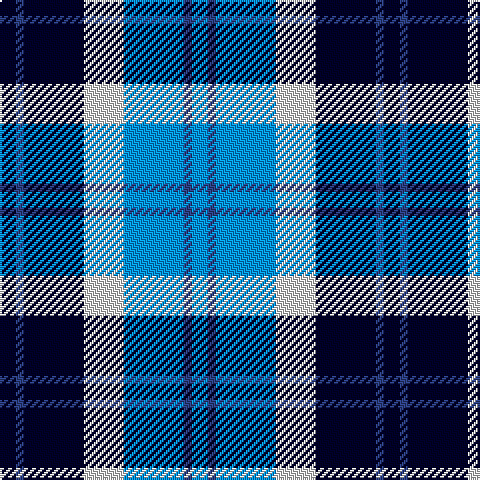

In pattern [BBBWKBK](/stripes/bbbwkbk/).

This was sourced from register-of-tartans.  It is a [7 stripe tartan](/stripes/stripes7/).

Original link https://www.tartanregister.gov.uk/tartanDetails.aspx?ref=3979

## Attestations

This cloth appears in 2 source records; the oldest owns this page.

- undated — Strathclyde (register-of-tartans, [record](https://www.tartanregister.gov.uk/tartanDetails.aspx?ref=3979))
- undated — Strathclyde (weddslist, [record](http://www.weddslist.com/cgi-bin/tartans/pg.pl?source=sts))

## Register references

External register numbers recorded for this tartan.

- Scottish Register of Tartans: [3979](https://www.tartanregister.gov.uk/tartanDetails.aspx?ref=3979)
- Scottish Tartans World Register: 30

## Thread count
DB/8 Ba4 DB30 LN20 B30 Ba4 B/8

## Palette
Each colour and the base-6 reference it is a variant of.

| Colour | Shade | Base |
|---|---|---|
| B | <code style="background-color:#0596FA;">#0596FA</code> `oklch(66.0% 0.180 248.9)` <small>#0596FA</small> | B <code style="background-color:#2A418A;">#2A418A</code> |
| Ba | <code style="background-color:#2C4084;">#2C4084</code> `oklch(39.4% 0.117 268.3)` <small>#2C4084</small> | B <code style="background-color:#2A418A;">#2A418A</code> |
| DB | <code style="background-color:#000028;">#000028</code> `oklch(12.5% 0.087 264.1)` <small>#000028</small> | K <code style="background-color:#000000;">#000000</code> |
| LN | <code style="background-color:#E0E0E0;">#E0E0E0</code> `oklch(90.7% 0.000 89.9)` <small>#E0E0E0</small> | W <code style="background-color:#F7F7F7;">#F7F7F7</code> |

# Sample pattern

## Nearest tartans

The nearest existing variants by ΔTartan distance, with this tartan at the top so the swatches line up against it.

ΔTartan

Tartan

Sett

—

<a href="/ttd/edit/#slug=k4db2k15w10b15db2b4~x2">Strathclyde</a> <a class="nn-out" href="/setts/s7/k4db2k15w10b15db2b4~x2/" title="open its dictionary page">↗</a>

0.91

<a href="/ttd/edit/#slug=b1lb6db1b3k3b1~x8">Thompson (Dance)</a> <a class="nn-out" href="/setts/s6/b1lb6db1b3k3b1~x8/" title="open its dictionary page">↗</a>

0.91

<a href="/ttd/edit/#slug=k2b16w2k16w15k2w2~x2">Strathclyde</a> <a class="nn-out" href="/setts/s7/k2b16w2k16w15k2w2~x2/" title="open its dictionary page">↗</a>

1.19

<a href="/ttd/edit/#slug=ly2b9r2db6ly1r1~x4">Lauder Primary School</a> <a class="nn-out" href="/setts/s6/ly2b9r2db6ly1r1~x4/" title="open its dictionary page">↗</a>

1.27

<a href="/ttd/edit/#slug=db2b9r1db5g5lb2~x4">American Express</a> <a class="nn-out" href="/setts/s6/db2b9r1db5g5lb2~x4/" title="open its dictionary page">↗</a>

1.28

<a href="/ttd/edit/#slug=db2lb4k2lb1db4k1db1g1~x4">Culloden - 1977 (Fashion)</a> <a class="nn-out" href="/setts/s8/db2lb4k2lb1db4k1db1g1~x4/" title="open its dictionary page">↗</a>

1.32

<a href="/ttd/edit/#slug=db1g7db7db2w6db1w1~x4">Blue Boy, The (Fashion)</a> <a class="nn-out" href="/setts/s7/db1g7db7db2w6db1w1~x4/" title="open its dictionary page">↗</a>

1.42

<a href="/ttd/edit/#slug=k4lo2k13lo1w8b13lo2b4~x2">Bannockbane Blue #1</a> <a class="nn-out" href="/setts/s8/k4lo2k13lo1w8b13lo2b4~x2/" title="open its dictionary page">↗</a>

1.55

<a href="/ttd/edit/#slug=k3lo1lb9lo1db9k3t1~x4">St. Francis Xavier University</a> <a class="nn-out" href="/setts/s7/k3lo1lb9lo1db9k3t1~x4/" title="open its dictionary page">↗</a>

1.55

<a href="/ttd/edit/#slug=b9r1db5g5lb2g5db5r1b9db2~x4">American Express Corporate Tartan Tartan Number: 2354. Earliest known date: April 1997 American Express began operating in Glasgow in 1903 and in 1920 acquired WA Williamson Ltd of Glasgow. This tartan (commissioned by VP Donald Daly) was designed for the 1997 American Association of Travel Agents conference in Glasgow and based on the MacWilliam tartan. For more details see archives. See products available Copyright © Blair Urquhart, Comrie, 2015</a> <a class="nn-out" href="/setts/s10/b9r1db5g5lb2g5db5r1b9db2~x4/" title="open its dictionary page">↗</a>

1.56

<a href="/ttd/edit/#slug=b24k4r3g24k4ly3~x2">(1) Skene</a> <a class="nn-out" href="/setts/s6/b24k4r3g24k4ly3~x2/" title="open its dictionary page">↗</a>

## Neighbour map

Every grey dot is one of 14299 variants placed by the first two principal components of the ΔTartan feature space (44% of its variance). Red is this tartan; blue dots are its nearest — click one to open its page.

<svg viewBox="0 0 640 380" role="img" style="max-width:100%;height:auto;border:1px solid #e0e0e0;border-radius:4px;display:block" xmlns="http://www.w3.org/2000/svg"><image href="/nn/cloud.v1.png" width="640" height="380"/><a href="/setts/s6/b1lb6db1b3k3b1~x8/"><circle cx="134.7" cy="214.5" r="4" fill="#3465a4"><title>Thompson (Dance)</title></circle></a><a href="/setts/s7/k2b16w2k16w15k2w2~x2/"><circle cx="129.1" cy="187.9" r="4" fill="#3465a4"><title>Strathclyde</title></circle></a><a href="/setts/s6/ly2b9r2db6ly1r1~x4/"><circle cx="178.3" cy="194.6" r="4" fill="#3465a4"><title>Lauder Primary School</title></circle></a><a href="/setts/s6/db2b9r1db5g5lb2~x4/"><circle cx="129.3" cy="208.4" r="4" fill="#3465a4"><title>American Express</title></circle></a><a href="/setts/s8/db2lb4k2lb1db4k1db1g1~x4/"><circle cx="124.3" cy="235.4" r="4" fill="#3465a4"><title>Culloden - 1977 (Fashion)</title></circle></a><a href="/setts/s7/db1g7db7db2w6db1w1~x4/"><circle cx="116.2" cy="202.4" r="4" fill="#3465a4"><title>Blue Boy, The (Fashion)</title></circle></a><a href="/setts/s8/k4lo2k13lo1w8b13lo2b4~x2/"><circle cx="149.3" cy="172.1" r="4" fill="#3465a4"><title>Bannockbane Blue #1</title></circle></a><a href="/setts/s7/k3lo1lb9lo1db9k3t1~x4/"><circle cx="110.9" cy="168.5" r="4" fill="#3465a4"><title>St. Francis Xavier University</title></circle></a><a href="/setts/s10/b9r1db5g5lb2g5db5r1b9db2~x4/"><circle cx="136.6" cy="194.6" r="4" fill="#3465a4"><title>American Express Corporate Tartan Tartan Number: 2354. Earliest known date: April 1997 American Express began operating in Glasgow in 1903 and in 1920 acquired WA Williamson Ltd of Glasgow. This tartan (commissioned by VP Donald Daly) was designed for the 1997 American Association of Travel Agents conference in Glasgow and based on the MacWilliam tartan. For more details see archives. See products available Copyright © Blair Urquhart, Comrie, 2015</title></circle></a><a href="/setts/s6/b24k4r3g24k4ly3~x2/"><circle cx="152.5" cy="188.5" r="4" fill="#3465a4"><title>(1) Skene</title></circle></a><circle cx="129.5" cy="207.5" r="5" fill="#c00000"/></svg>

ID: /setts/s7/k4db2k15w10b15db2b4~x2/
