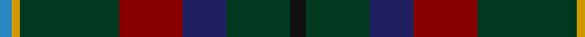

**Bands:** [BYGRBGK](/stripes/bygrbgk/) · **Stripes:** [T LO DG R DB DG K](/stripes/stripes7/) T LO DG R DB DG K

This was sourced from tartans-authority.  It is a [7 band tartan](/bands/bands7/).

Original link http://www.tartansauthority.com/tartan-ferret/display/2270/

## Thread count
B/6 DY4 DG50 DR32 DB22 DG32 K/8

## Palette
Each colour and its ΔE from the base-6 reference it is a variant of.

| Colour | Shade | Base | ΔE (OKLab) |
|---|---|---|---|
| B | <code style="background-color:#2888C4;">#2888C4</code> `#2888C4` | B <code style="background-color:#2A418A;">#2A418A</code> | 0.21 |
| DB | <code style="background-color:#202060;">#202060</code> `#202060` | B <code style="background-color:#2A418A;">#2A418A</code> | 0.11 |
| DG | <code style="background-color:#003820;">#003820</code> `#003820` | G <code style="background-color:#006100;">#006100</code> | 0.15 |
| DR | <code style="background-color:#880000;">#880000</code> `#880000` | R <code style="background-color:#CC0000;">#CC0000</code> | 0.15 |
| DY | <code style="background-color:#D09800;">#D09800</code> `#D09800` | Y <code style="background-color:#F2BF00;">#F2BF00</code> | 0.12 |
| K | <code style="background-color:#101010;">#101010</code> `#101010` | K <code style="background-color:#000000;">#000000</code> | 0.17 |

# Sample pattern

## Nearest tartans

The nearest existing variants by ΔTartan distance.

1. [Mayo, County](/setts/s12/t3lo2dg25r16db11dg16k4dg16db11r16dg25lo2~x2/) — ΔT 1.20
1. [Mayo Irish County Tartan Tartan Number: 2270. Earliest known date: 1994 One of a series of Irish District tartans designed by Polly Wittering of the House of Edgar, with colours reminiscent of the Country with soft warm colours dominating. See products available Copyright © Blair Urquhart, Comrie, 2015](/setts/s7/k4g16db11r16g25ly2g3~x2/) — ΔT 1.25
1. [Mica, Green (Fashion)](/setts/s8/dy6o2dy12k4dt14k1dy3ly2~x2/) — ΔT 1.29
1. [MacConnell](/setts/s10/dt20dg6dt6lb2dg20r8dg6r4dg10lr3~x2/) — ΔT 1.37
1. [Vass (Personal)](/setts/s8/db6w1y6dy12r2dy12y6w1~x4/) — ΔT 1.47
1. [Duchess of York (Fashion)](/setts/s9/db2dy18dg10dy1k10dy2dg10dy18w2~x2/) — ΔT 1.48
1. [Mackison](/setts/s6/dt18dp1dt12k14g14r2~x2/) — ΔT 1.51
1. [Dobson (Palm Bay) (Personal)](/setts/s6/g15lo1do2db5k4dg5~x6/) — ΔT 1.51
1. [Cultoquhey Hotel Corporate Tartan Tartan Number: 3393. Earliest known date: circa1990 Designed by Peter MacDonald as a Cook tartan for the former owners (David & Anna) of the Cultoquhey Hotel near Crieff. When they left, if became the house tartan of the hotel See products available Copyright © Blair Urquhart, Comrie, 2015](/setts/s5/ly3dg32k11db22r3~x2/) — ΔT 1.52
1. [Waterford, County](/setts/s6/dg42lo2y16db7do16r5~x2/) — ΔT 1.54

## Neighbour map

Every grey dot is one of 14313 variants placed by the first two principal components of the ΔTartan feature space (44% of its variance). Red is this tartan; blue dots are its nearest — click one to open its page.

<svg viewBox="0 0 640 380" role="img" style="max-width:100%;height:auto;border:1px solid #e0e0e0;border-radius:4px;display:block" xmlns="http://www.w3.org/2000/svg"><image href="/nn/cloud.v1.png" width="640" height="380"/><a href="/setts/s12/t3lo2dg25r16db11dg16k4dg16db11r16dg25lo2~x2/"><circle cx="292.4" cy="200.3" r="4" fill="#3465a4"><title>Mayo, County</title></circle></a><a href="/setts/s7/k4g16db11r16g25ly2g3~x2/"><circle cx="257.5" cy="193.4" r="4" fill="#3465a4"><title>Mayo Irish County Tartan Tartan Number: 2270. Earliest known date: 1994 One of a series of Irish District tartans designed by Polly Wittering of the House of Edgar, with colours reminiscent of the Country with soft warm colours dominating. See products available Copyright © Blair Urquhart, Comrie, 2015</title></circle></a><a href="/setts/s8/dy6o2dy12k4dt14k1dy3ly2~x2/"><circle cx="274.6" cy="194.8" r="4" fill="#3465a4"><title>Mica, Green (Fashion)</title></circle></a><a href="/setts/s10/dt20dg6dt6lb2dg20r8dg6r4dg10lr3~x2/"><circle cx="278.9" cy="224.9" r="4" fill="#3465a4"><title>MacConnell</title></circle></a><a href="/setts/s8/db6w1y6dy12r2dy12y6w1~x4/"><circle cx="293.3" cy="211.4" r="4" fill="#3465a4"><title>Vass (Personal)</title></circle></a><a href="/setts/s9/db2dy18dg10dy1k10dy2dg10dy18w2~x2/"><circle cx="334.1" cy="201.2" r="4" fill="#3465a4"><title>Duchess of York (Fashion)</title></circle></a><a href="/setts/s6/dt18dp1dt12k14g14r2~x2/"><circle cx="293.0" cy="235.6" r="4" fill="#3465a4"><title>Mackison</title></circle></a><a href="/setts/s6/g15lo1do2db5k4dg5~x6/"><circle cx="266.2" cy="207.2" r="4" fill="#3465a4"><title>Dobson (Palm Bay) (Personal)</title></circle></a><a href="/setts/s5/ly3dg32k11db22r3~x2/"><circle cx="271.2" cy="243.2" r="4" fill="#3465a4"><title>Cultoquhey Hotel Corporate Tartan Tartan Number: 3393. Earliest known date: circa1990 Designed by Peter MacDonald as a Cook tartan for the former owners (David &amp; Anna) of the Cultoquhey Hotel near Crieff. When they left, if became the house tartan of the hotel See products available Copyright © Blair Urquhart, Comrie, 2015</title></circle></a><a href="/setts/s6/dg42lo2y16db7do16r5~x2/"><circle cx="302.4" cy="191.3" r="4" fill="#3465a4"><title>Waterford, County</title></circle></a><circle cx="285.2" cy="211.4" r="5" fill="#c00000"/></svg>

ID: /setts/s7/k4dg16db11r16dg25lo2t3~x2/
