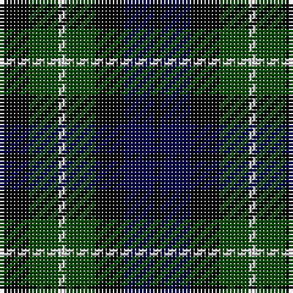

In pattern [KBKGWGK](/stripes/kbkgwgk/).

This was sourced from weddslist.  It is a [7 stripe tartan](/stripes/stripes7/).

Original link http://www.weddslist.com/cgi-bin/tartans/pg.pl?source=rb

## Register references

External register numbers recorded for this tartan.

- Scottish Register of Tartans: [1166](https://www.tartanregister.gov.uk/tartanDetails.aspx?ref=1166)
- Scottish Register of Tartans: [1758](https://www.tartanregister.gov.uk/tartanDetails.aspx?ref=1758)
- Scottish Register of Tartans: [2307](https://www.tartanregister.gov.uk/tartanDetails.aspx?ref=2307)
- Scottish Register of Tartans: [2540](https://www.tartanregister.gov.uk/tartanDetails.aspx?ref=2540)
- Scottish Register of Tartans: [2666](https://www.tartanregister.gov.uk/tartanDetails.aspx?ref=2666)
- Scottish Register of Tartans: [2862](https://www.tartanregister.gov.uk/tartanDetails.aspx?ref=2862)
- Scottish Register of Tartans: [3808](https://www.tartanregister.gov.uk/tartanDetails.aspx?ref=3808)
- Scottish Register of Tartans: [982](https://www.tartanregister.gov.uk/tartanDetails.aspx?ref=982)
- Scottish Tartans Authority (ITI): 218
- Scottish Tartans World Register: 1010
- Scottish Tartans World Register: 1042
- Scottish Tartans World Register: 127
- Scottish Tartans World Register: 1585
- Scottish Tartans World Register: 218
- Scottish Tartans World Register: 2218
- Scottish Tartans World Register: 737
- Scottish Tartans World Register: 897

## Thread count
K/8 G8 N2 G8 K8 DB8 K/2

## Palette
Each colour and its ΔE from the base-6 reference it is a variant of.

| Colour | Shade | Base | ΔE (OKLab) |
|---|---|---|---|
| DB | <code style="background-color:#00004C;">#00004C</code> `#00004C` | B <code style="background-color:#2A418A;">#2A418A</code> | 0.21 |
| G | <code style="background-color:#004C00;">#004C00</code> `#004C00` | G <code style="background-color:#006100;">#006100</code> | 0.07 |
| K | <code style="background-color:#000000;">#000000</code> `#000000` | K <code style="background-color:#000000;">#000000</code> | 0.00 |
| N | <code style="background-color:#D0D0D0;">#D0D0D0</code> `#D0D0D0` | W <code style="background-color:#F7F7F7;">#F7F7F7</code> | 0.12 |

# Sample pattern

## Nearest tartans

The nearest existing variants by ΔTartan distance.

1. [Campbell Breadalbane](/setts/s7/k9dg9ly2dg9k9db9k3/) — ΔT 0.28
1. [Graham of Montrose](/setts/s7/k4dg4lr1dg4k4db4k1~x2/) — ΔT 0.41
1. [Campbell of Breadalbane](/setts/s7/k9dg9ly2dg9k9db9k3~x2/) — ΔT 0.51
1. [Campbell of Breadalbane (Clan)](/setts/s7/k9g9ly2g9k9db9k3~x2/) — ΔT 0.64
1. [MacNeil of Colonsay](/setts/s7/db4dg6lb1dg6k6db6k2~x2/) — ΔT 0.94
1. [Norwich No.064](/setts/s8/db12k16g14k5g14k16db12g4~x2/) — ΔT 1.04
1. [Denholm](/setts/s8/g8k7db8r2db8k7g8k2~x2/) — ΔT 1.11
1. [MacNiel of Colonsay](/setts/s7/db4dg6lr1dg6k6db6k2~x2/) — ΔT 1.14
1. [Graham of Montrose](/setts/s7/k4g4w1g4k4db4k1~x4/) — ΔT 1.15
1. [MacKay, Coat](/setts/s7/k4g4ly1g4k4db4k1~x2/) — ΔT 1.16

## Neighbour map

Every grey dot is one of 14299 variants placed by the first two principal components of the ΔTartan feature space (44% of its variance). Red is this tartan; blue dots are its nearest — click one to open its page.

<svg viewBox="0 0 640 380" role="img" style="max-width:100%;height:auto;border:1px solid #e0e0e0;border-radius:4px;display:block" xmlns="http://www.w3.org/2000/svg"><image href="/nn/cloud.v1.png" width="640" height="380"/><a href="/setts/s7/k9dg9ly2dg9k9db9k3/"><circle cx="143.0" cy="291.2" r="4" fill="#3465a4"><title>Campbell Breadalbane</title></circle></a><a href="/setts/s7/k4dg4lr1dg4k4db4k1~x2/"><circle cx="145.7" cy="297.3" r="4" fill="#3465a4"><title>Graham of Montrose</title></circle></a><a href="/setts/s7/k9dg9ly2dg9k9db9k3~x2/"><circle cx="155.2" cy="297.3" r="4" fill="#3465a4"><title>Campbell of Breadalbane</title></circle></a><a href="/setts/s7/k9g9ly2g9k9db9k3~x2/"><circle cx="129.0" cy="281.7" r="4" fill="#3465a4"><title>Campbell of Breadalbane (Clan)</title></circle></a><a href="/setts/s7/db4dg6lb1dg6k6db6k2~x2/"><circle cx="145.5" cy="278.6" r="4" fill="#3465a4"><title>MacNeil of Colonsay</title></circle></a><a href="/setts/s8/db12k16g14k5g14k16db12g4~x2/"><circle cx="137.9" cy="306.8" r="4" fill="#3465a4"><title>Norwich No.064</title></circle></a><a href="/setts/s8/g8k7db8r2db8k7g8k2~x2/"><circle cx="87.1" cy="284.2" r="4" fill="#3465a4"><title>Denholm</title></circle></a><a href="/setts/s7/db4dg6lr1dg6k6db6k2~x2/"><circle cx="161.0" cy="286.0" r="4" fill="#3465a4"><title>MacNiel of Colonsay</title></circle></a><a href="/setts/s7/k4g4w1g4k4db4k1~x4/"><circle cx="109.3" cy="276.7" r="4" fill="#3465a4"><title>Graham of Montrose</title></circle></a><a href="/setts/s7/k4g4ly1g4k4db4k1~x2/"><circle cx="110.9" cy="277.3" r="4" fill="#3465a4"><title>MacKay, Coat</title></circle></a><circle cx="134.4" cy="292.0" r="5" fill="#c00000"/></svg>

ID: /setts/s7/k4dg4lb1dg4k4db4k1~x2/
