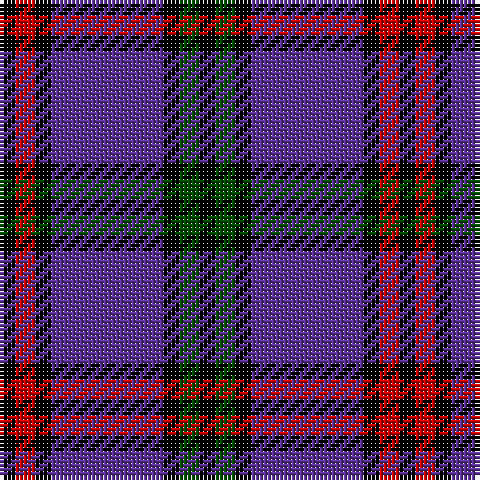

In pattern [KGKBKRK](/stripes/kgkbkrk/).

This was sourced from weddslist.  It is a [7 stripe tartan](/stripes/stripes7/).

Original link http://www.weddslist.com/cgi-bin/tartans/pg.pl?source=rb

## Thread count
K/4 R5 K4 P28 K4 G5 K/4

## Palette
Each colour and the base-6 reference it is a variant of.

| Colour | Shade | Base |
|---|---|---|
| G | <code style="background-color:#004C00;">#004C00</code> `oklch(36.1% 0.123 142.5)` <small>#004C00</small> | G <code style="background-color:#006100;">#006100</code> |
| K | <code style="background-color:#000000;">#000000</code> `oklch(0.0% 0.000 0.0)` <small>#000000</small> | K <code style="background-color:#000000;">#000000</code> |
| P | <code style="background-color:#5A3094;">#5A3094</code> `oklch(41.8% 0.156 298.7)` <small>#5A3094</small> | B <code style="background-color:#2A418A;">#2A418A</code> |
| R | <code style="background-color:#C80000;">#C80000</code> `oklch(52.3% 0.215 29.2)` <small>#C80000</small> | R <code style="background-color:#CC0000;">#CC0000</code> |

# Sample pattern

## Nearest tartans

The nearest existing variants by ΔTartan distance, with this tartan at the top so the swatches line up against it.

ΔTartan

Tartan

Sett

—

<a href="/ttd/edit/#slug=k4dg5k4dp28k4r5k4">Montgomery</a> <a class="nn-out" href="/setts/s7/k4dg5k4dp28k4r5k4/" title="open its dictionary page">↗</a>

1.00

<a href="/ttd/edit/#slug=k4r5k4db28k4g5k4~x2">Montgomerie of Eglinton</a> <a class="nn-out" href="/setts/s7/k4r5k4db28k4g5k4~x2/" title="open its dictionary page">↗</a>

1.31

<a href="/ttd/edit/#slug=k3dg3k3b16k3r3k3~x2">Eglinton</a> <a class="nn-out" href="/setts/s7/k3dg3k3b16k3r3k3~x2/" title="open its dictionary page">↗</a>

1.31

<a href="/ttd/edit/#slug=k3dg3k3b16k3r3k3">Eglinton</a> <a class="nn-out" href="/setts/s7/k3dg3k3b16k3r3k3/" title="open its dictionary page">↗</a>

1.33

<a href="/ttd/edit/#slug=k8r1k1r1k4b11ly1b2~x6">Rutherford</a> <a class="nn-out" href="/setts/s8/k8r1k1r1k4b11ly1b2~x6/" title="open its dictionary page">↗</a>

1.38

<a href="/ttd/edit/#slug=r5db35k25db8ly10r5~x2">University of Notre Dame</a> <a class="nn-out" href="/setts/s6/r5db35k25db8ly10r5~x2/" title="open its dictionary page">↗</a>

1.42

<a href="/ttd/edit/#slug=r10db15g2db2w1db1w1~x4">Ikelman #4 (Personal)</a> <a class="nn-out" href="/setts/s7/r10db15g2db2w1db1w1~x4/" title="open its dictionary page">↗</a>

1.45

<a href="/ttd/edit/#slug=k21db8r4db2r2db23k4w2~x2">Murdoch Clebration (Personal)</a> <a class="nn-out" href="/setts/s8/k21db8r4db2r2db23k4w2~x2/" title="open its dictionary page">↗</a>

1.48

<a href="/ttd/edit/#slug=k15lb3k3w4k3lb3k15db4k4db30k4~x2">Shalom (Fashion)</a> <a class="nn-out" href="/setts/s11/k15lb3k3w4k3lb3k15db4k4db30k4~x2/" title="open its dictionary page">↗</a>

1.49

<a href="/setts/s8/b8r1k1r1k1~x8/">Laing of Archiestown Clan/Family Tartan Tartan Number: 2544. Earliest known date: 1783 Said to have been woven in 1783 in Knockando Morayshire, by William Donald Laing of Queensland, Australia who donated a sample to the Tartans Society in 1996. The dark line in the centre of the red band is either blue or black. Apparently William Laing acquired the piece of tartan in 1961 from a Mr Jack Garden whose g.g. grandfather was John Laing (dob 1767) who wove the tartan. In the 1810 census he lived in his shop in the Square at Archiestown. See products available Copyright © Blair Urquhart, Comrie, 2015</a>

1.50

<a href="/ttd/edit/#slug=k4dg5k4n28k4r5k4~x2">Montgomery</a> <a class="nn-out" href="/setts/s7/k4dg5k4n28k4r5k4~x2/" title="open its dictionary page">↗</a>

## Neighbour map

Every grey dot is one of 14299 variants placed by the first two principal components of the ΔTartan feature space (44% of its variance). Red is this tartan; blue dots are its nearest — click one to open its page.

<svg viewBox="0 0 640 380" role="img" style="max-width:100%;height:auto;border:1px solid #e0e0e0;border-radius:4px;display:block" xmlns="http://www.w3.org/2000/svg"><image href="/nn/cloud.v1.png" width="640" height="380"/><a href="/setts/s7/k4r5k4db28k4g5k4~x2/"><circle cx="263.8" cy="202.0" r="4" fill="#3465a4"><title>Montgomerie of Eglinton</title></circle></a><a href="/setts/s7/k3dg3k3b16k3r3k3~x2/"><circle cx="212.3" cy="215.0" r="4" fill="#3465a4"><title>Eglinton</title></circle></a><a href="/setts/s7/k3dg3k3b16k3r3k3/"><circle cx="212.3" cy="215.0" r="4" fill="#3465a4"><title>Eglinton</title></circle></a><a href="/setts/s8/k8r1k1r1k4b11ly1b2~x6/"><circle cx="261.8" cy="180.2" r="4" fill="#3465a4"><title>Rutherford</title></circle></a><a href="/setts/s6/r5db35k25db8ly10r5~x2/"><circle cx="220.8" cy="221.1" r="4" fill="#3465a4"><title>University of Notre Dame</title></circle></a><a href="/setts/s7/r10db15g2db2w1db1w1~x4/"><circle cx="340.3" cy="169.8" r="4" fill="#3465a4"><title>Ikelman #4 (Personal)</title></circle></a><a href="/setts/s8/k21db8r4db2r2db23k4w2~x2/"><circle cx="308.9" cy="198.5" r="4" fill="#3465a4"><title>Murdoch Clebration (Personal)</title></circle></a><a href="/setts/s11/k15lb3k3w4k3lb3k15db4k4db30k4~x2/"><circle cx="280.1" cy="180.1" r="4" fill="#3465a4"><title>Shalom (Fashion)</title></circle></a><a href="/setts/s8/b8r1k1r1k1~x8/"><circle cx="273.1" cy="168.6" r="4" fill="#3465a4"><title>Laing of Archiestown Clan/Family Tartan Tartan Number: 2544. Earliest known date: 1783 Said to have been woven in 1783 in Knockando Morayshire, by William Donald Laing of Queensland, Australia who donated a sample to the Tartans Society in 1996. The dark line in the centre of the red band is either blue or black. Apparently William Laing acquired the piece of tartan in 1961 from a Mr Jack Garden whose g.g. grandfather was John Laing (dob 1767) who wove the tartan. In the 1810 census he lived in his shop in the Square at Archiestown. See products available Copyright © Blair Urquhart, Comrie, 2015</title></circle></a><a href="/setts/s7/k4dg5k4n28k4r5k4~x2/"><circle cx="273.2" cy="198.8" r="4" fill="#3465a4"><title>Montgomery</title></circle></a><circle cx="268.6" cy="197.1" r="5" fill="#c00000"/></svg>

ID: /setts/s7/k4dg5k4dp28k4r5k4/
