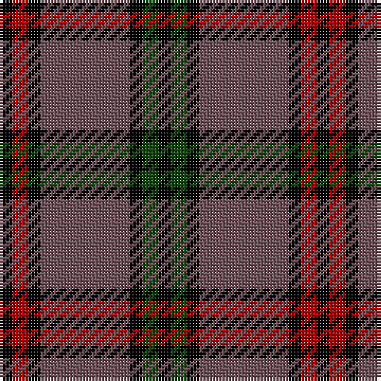

This page is one **sett** — a single exact thread-count. It belongs to the [tartan](/tartans/k4dr5k4n28k4dg5k4/)
(the same proportion at any scale), whose colour order is pattern [KGKBKRK](/stripes/kgkbkrk/).

Sourced from weddslist.  It is a [7 stripe tartan](/stripes/stripes7/).

Original link http://www.weddslist.com/cgi-bin/tartans/pg.pl?source=x

## Thread count
K/4 DR5 K4 N28 K4 DG5 K/4

## Palette
Each colour and the base-6 reference it is a variant of.

| Colour | Shade | Base |
|---|---|---|
| DG | <code style="background-color:#11450D;">#11450D</code> `oklch(34.4% 0.101 142.1)` <small>#11450D</small> | G <code style="background-color:#006100;">#006100</code> |
| DR | <code style="background-color:#AA0000;">#AA0000</code> `oklch(46.3% 0.190 29.2)` <small>#AA0000</small> | R <code style="background-color:#CC0000;">#CC0000</code> |
| K | <code style="background-color:#000000;">#000000</code> `oklch(0.0% 0.000 0.0)` <small>#000000</small> | K <code style="background-color:#000000;">#000000</code> |
| N | <code style="background-color:#6E5058;">#6E5058</code> `oklch(46.6% 0.042 1.2)` <small>#6E5058</small> | B <code style="background-color:#2A418A;">#2A418A</code> |

# Sample pattern

## Nearest tartans

The nearest existing variants by ΔTartan distance, with this tartan at the top so the swatches line up against it.

ΔTartan

Tartan

Sett

—

<a href="/ttd/edit/#slug=k4dg5k4n28k4r5k4">Montgomery</a> <a class="nn-out" href="/setts/s7/k4dg5k4n28k4r5k4/" title="open its dictionary page">↗</a>

0.00

<a href="/ttd/edit/#slug=k4dg5k4n28k4r5k4~x2">Montgomery</a> <a class="nn-out" href="/setts/s7/k4dg5k4n28k4r5k4~x2/" title="open its dictionary page">↗</a>

1.18

<a href="/ttd/edit/#slug=k4dg5k2dg5r17db2~x2">Denny Hunting</a> <a class="nn-out" href="/setts/s6/k4dg5k2dg5r17db2~x2/" title="open its dictionary page">↗</a>

1.23

<a href="/ttd/edit/#slug=k4r5k4db28k4g5k4~x2">Montgomerie of Eglinton</a> <a class="nn-out" href="/setts/s7/k4r5k4db28k4g5k4~x2/" title="open its dictionary page">↗</a>

1.27

<a href="/ttd/edit/#slug=r12db3g5db16ly2g2~x2">Dunbog Primary (School)</a> <a class="nn-out" href="/setts/s6/r12db3g5db16ly2g2~x2/" title="open its dictionary page">↗</a>

1.30

<a href="/ttd/edit/#slug=n3o3k16n2k2n16k3n2lb2~x2">Chinzei Keiai Senior High School</a> <a class="nn-out" href="/setts/s9/n3o3k16n2k2n16k3n2lb2~x2/" title="open its dictionary page">↗</a>

1.34

<a href="/ttd/edit/#slug=k21o2k8w2o16n6k2n8~x2">Ardmore (Fashion)</a> <a class="nn-out" href="/setts/s8/k21o2k8w2o16n6k2n8~x2/" title="open its dictionary page">↗</a>

1.34

<a href="/ttd/edit/#slug=lo3t7do2m2do14t2do2lo3~x2">Daks (Blue Loden)</a> <a class="nn-out" href="/setts/s8/lo3t7do2m2do14t2do2lo3~x2/" title="open its dictionary page">↗</a>

1.38

<a href="/ttd/edit/#slug=o5t13dr4r4dr27t3dr4o5">Daks, Blue Loden</a> <a class="nn-out" href="/setts/s8/o5t13dr4r4dr27t3dr4o5/" title="open its dictionary page">↗</a>

1.40

<a href="/ttd/edit/#slug=k3dy3lo6k12lo1o2dy2~x4">Strummer, Joe (Commemorative)</a> <a class="nn-out" href="/setts/s7/k3dy3lo6k12lo1o2dy2~x4/" title="open its dictionary page">↗</a>

1.42

<a href="/ttd/edit/#slug=w6dy36k48r4k5ly6">Drambuie Dress</a> <a class="nn-out" href="/setts/s6/w6dy36k48r4k5ly6/" title="open its dictionary page">↗</a>

## Neighbour map

Every grey dot is one of 14299 variants placed by the first two principal components of the ΔTartan feature space (44% of its variance). Red is this tartan; blue dots are its nearest — click one to open its page.

<svg viewBox="0 0 640 380" role="img" style="max-width:100%;height:auto;border:1px solid #e0e0e0;border-radius:4px;display:block" xmlns="http://www.w3.org/2000/svg"><image href="/nn/cloud.v1.png" width="640" height="380"/><a href="/setts/s7/k4dg5k4n28k4r5k4~x2/"><circle cx="273.2" cy="198.8" r="4" fill="#3465a4"><title>Montgomery</title></circle></a><a href="/setts/s6/k4dg5k2dg5r17db2~x2/"><circle cx="266.6" cy="215.9" r="4" fill="#3465a4"><title>Denny Hunting</title></circle></a><a href="/setts/s7/k4r5k4db28k4g5k4~x2/"><circle cx="263.8" cy="202.0" r="4" fill="#3465a4"><title>Montgomerie of Eglinton</title></circle></a><a href="/setts/s6/r12db3g5db16ly2g2~x2/"><circle cx="223.9" cy="209.5" r="4" fill="#3465a4"><title>Dunbog Primary (School)</title></circle></a><a href="/setts/s9/n3o3k16n2k2n16k3n2lb2~x2/"><circle cx="281.2" cy="198.0" r="4" fill="#3465a4"><title>Chinzei Keiai Senior High School</title></circle></a><a href="/setts/s8/k21o2k8w2o16n6k2n8~x2/"><circle cx="239.6" cy="197.5" r="4" fill="#3465a4"><title>Ardmore (Fashion)</title></circle></a><a href="/setts/s8/lo3t7do2m2do14t2do2lo3~x2/"><circle cx="267.1" cy="206.3" r="4" fill="#3465a4"><title>Daks (Blue Loden)</title></circle></a><a href="/setts/s8/o5t13dr4r4dr27t3dr4o5/"><circle cx="307.6" cy="202.2" r="4" fill="#3465a4"><title>Daks, Blue Loden</title></circle></a><a href="/setts/s7/k3dy3lo6k12lo1o2dy2~x4/"><circle cx="264.7" cy="193.5" r="4" fill="#3465a4"><title>Strummer, Joe (Commemorative)</title></circle></a><a href="/setts/s6/w6dy36k48r4k5ly6/"><circle cx="266.9" cy="173.8" r="4" fill="#3465a4"><title>Drambuie Dress</title></circle></a><circle cx="273.2" cy="198.8" r="5" fill="#c00000"/></svg>

ID: /setts/s7/k4dg5k4n28k4r5k4/
