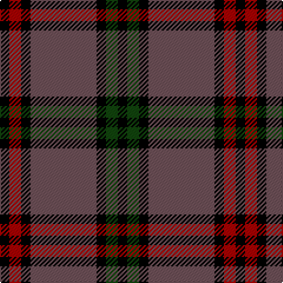

**Bands:** [KRKBKGK](/stripes/krkbkgk/) · **Stripes:** [K R K N K DG K](/stripes/stripes7/) K R K N K DG K

This was sourced from weddslist.  It is a [7 band tartan](/bands/bands7/).

Original link http://www.weddslist.com/cgi-bin/tartans/pg.pl?source=tinsel

## Register references

External register numbers recorded for this tartan.

- Scottish Register of Tartans: [1166](https://www.tartanregister.gov.uk/tartanDetails.aspx?ref=1166)
- Scottish Register of Tartans: [1510](https://www.tartanregister.gov.uk/tartanDetails.aspx?ref=1510)
- Scottish Register of Tartans: [1758](https://www.tartanregister.gov.uk/tartanDetails.aspx?ref=1758)
- Scottish Register of Tartans: [2307](https://www.tartanregister.gov.uk/tartanDetails.aspx?ref=2307)
- Scottish Register of Tartans: [2349](https://www.tartanregister.gov.uk/tartanDetails.aspx?ref=2349)
- Scottish Register of Tartans: [2540](https://www.tartanregister.gov.uk/tartanDetails.aspx?ref=2540)
- Scottish Register of Tartans: [2582](https://www.tartanregister.gov.uk/tartanDetails.aspx?ref=2582)
- Scottish Register of Tartans: [2585](https://www.tartanregister.gov.uk/tartanDetails.aspx?ref=2585)
- Scottish Register of Tartans: [2625](https://www.tartanregister.gov.uk/tartanDetails.aspx?ref=2625)
- Scottish Register of Tartans: [2730](https://www.tartanregister.gov.uk/tartanDetails.aspx?ref=2730)
- Scottish Register of Tartans: [2862](https://www.tartanregister.gov.uk/tartanDetails.aspx?ref=2862)
- Scottish Register of Tartans: [3072](https://www.tartanregister.gov.uk/tartanDetails.aspx?ref=3072)
- Scottish Register of Tartans: [3555](https://www.tartanregister.gov.uk/tartanDetails.aspx?ref=3555)
- Scottish Register of Tartans: [4925](https://www.tartanregister.gov.uk/tartanDetails.aspx?ref=4925)
- Scottish Register of Tartans: [696](https://www.tartanregister.gov.uk/tartanDetails.aspx?ref=696)
- Scottish Register of Tartans: [697](https://www.tartanregister.gov.uk/tartanDetails.aspx?ref=697)
- Scottish Register of Tartans: [982](https://www.tartanregister.gov.uk/tartanDetails.aspx?ref=982)
- Scottish Tartans Authority (ITI): 1277
- Scottish Tartans Authority (ITI): 1429
- Scottish Tartans Authority (ITI): 218
- Scottish Tartans Authority (ITI): 977
- Scottish Tartans World Register: 1042
- Scottish Tartans World Register: 127
- Scottish Tartans World Register: 1277
- Scottish Tartans World Register: 1399
- Scottish Tartans World Register: 1429
- Scottish Tartans World Register: 1593
- Scottish Tartans World Register: 218
- Scottish Tartans World Register: 2218
- Scottish Tartans World Register: 3061
- Scottish Tartans World Register: 441
- Scottish Tartans World Register: 737
- Scottish Tartans World Register: 858
- Scottish Tartans World Register: 864
- Scottish Tartans World Register: 873
- Scottish Tartans World Register: 897
- Scottish Tartans World Register: 977
- Scottish Tartans World Register: 978

## Variants

Other setts woven to the same stripe pattern.

- [Montgomery](/setts/s7/k4dg5k4n28k4r5k4/)

## Thread count
K/8 DR10 K8 N56 K8 DG10 K/8

## Palette
Each colour and its ΔE from the base-6 reference it is a variant of.

| Colour | Shade | Base | ΔE (OKLab) |
|---|---|---|---|
| DG | <code style="background-color:#11450D;">#11450D</code> `#11450D` | G <code style="background-color:#006100;">#006100</code> | 0.09 |
| DR | <code style="background-color:#AA0000;">#AA0000</code> `#AA0000` | R <code style="background-color:#CC0000;">#CC0000</code> | 0.07 |
| K | <code style="background-color:#000000;">#000000</code> `#000000` | K <code style="background-color:#000000;">#000000</code> | 0.00 |
| N | <code style="background-color:#6E5058;">#6E5058</code> `#6E5058` | B <code style="background-color:#2A418A;">#2A418A</code> | 0.15 |

# Sample pattern

## Nearest tartans

The nearest existing variants by ΔTartan distance.

1. [Montgomery](/setts/s7/k4dg5k4n28k4r5k4/) — ΔT 0.00
1. [Denny Hunting](/setts/s6/k4dg5k2dg5r17db2~x2/) — ΔT 1.18
1. [Montgomerie of Eglinton](/setts/s7/k4r5k4db28k4g5k4~x2/) — ΔT 1.23
1. [Dunbog Primary (School)](/setts/s6/r12db3g5db16ly2g2~x2/) — ΔT 1.27
1. [Chinzei Keiai Senior High School](/setts/s9/n3o3k16n2k2n16k3n2lb2~x2/) — ΔT 1.30
1. [Ardmore (Fashion)](/setts/s8/k21o2k8w2o16n6k2n8~x2/) — ΔT 1.34
1. [Daks (Blue Loden)](/setts/s8/lo3t7do2m2do14t2do2lo3~x2/) — ΔT 1.34
1. [Daks, Blue Loden](/setts/s8/o5t13dr4r4dr27t3dr4o5/) — ΔT 1.38
1. [Strummer, Joe (Commemorative)](/setts/s7/k3dy3lo6k12lo1o2dy2~x4/) — ΔT 1.40
1. [Drambuie Dress](/setts/s6/w6dy36k48r4k5ly6/) — ΔT 1.42

## Neighbour map

Every grey dot is one of 14299 variants placed by the first two principal components of the ΔTartan feature space (44% of its variance). Red is this tartan; blue dots are its nearest — click one to open its page.

<svg viewBox="0 0 640 380" role="img" style="max-width:100%;height:auto;border:1px solid #e0e0e0;border-radius:4px;display:block" xmlns="http://www.w3.org/2000/svg"><image href="/nn/cloud.v1.png" width="640" height="380"/><a href="/setts/s7/k4dg5k4n28k4r5k4/"><circle cx="273.2" cy="198.8" r="4" fill="#3465a4"><title>Montgomery</title></circle></a><a href="/setts/s6/k4dg5k2dg5r17db2~x2/"><circle cx="266.6" cy="215.9" r="4" fill="#3465a4"><title>Denny Hunting</title></circle></a><a href="/setts/s7/k4r5k4db28k4g5k4~x2/"><circle cx="263.8" cy="202.0" r="4" fill="#3465a4"><title>Montgomerie of Eglinton</title></circle></a><a href="/setts/s6/r12db3g5db16ly2g2~x2/"><circle cx="223.9" cy="209.5" r="4" fill="#3465a4"><title>Dunbog Primary (School)</title></circle></a><a href="/setts/s9/n3o3k16n2k2n16k3n2lb2~x2/"><circle cx="281.2" cy="198.0" r="4" fill="#3465a4"><title>Chinzei Keiai Senior High School</title></circle></a><a href="/setts/s8/k21o2k8w2o16n6k2n8~x2/"><circle cx="239.6" cy="197.5" r="4" fill="#3465a4"><title>Ardmore (Fashion)</title></circle></a><a href="/setts/s8/lo3t7do2m2do14t2do2lo3~x2/"><circle cx="267.1" cy="206.3" r="4" fill="#3465a4"><title>Daks (Blue Loden)</title></circle></a><a href="/setts/s8/o5t13dr4r4dr27t3dr4o5/"><circle cx="307.6" cy="202.2" r="4" fill="#3465a4"><title>Daks, Blue Loden</title></circle></a><a href="/setts/s7/k3dy3lo6k12lo1o2dy2~x4/"><circle cx="264.7" cy="193.5" r="4" fill="#3465a4"><title>Strummer, Joe (Commemorative)</title></circle></a><a href="/setts/s6/w6dy36k48r4k5ly6/"><circle cx="266.9" cy="173.8" r="4" fill="#3465a4"><title>Drambuie Dress</title></circle></a><circle cx="273.2" cy="198.8" r="5" fill="#c00000"/></svg>

ID: /setts/s7/k4dg5k4n28k4r5k4~x2/
