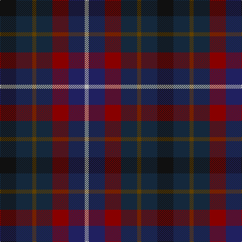

**Bands:** [KBGBRBY](/stripes/kbgbrby/) · **Stripes:** [K DT DY DT R DB LR](/stripes/stripes7/) K DT DY DT R DB LR

This was sourced from tartans-authority.  It is a [7 band tartan](/bands/bands7/).

Original link http://www.tartansauthority.com/tartan-ferret/display/6711/

## Thread count
K/32 DN32 T8 DN32 DR32 DB32 N/8

## Palette
Each colour and its ΔE from the base-6 reference it is a variant of.

| Colour | Shade | Base | ΔE (OKLab) |
|---|---|---|---|
| DB | <code style="background-color:#202060;">#202060</code> `#202060` | B <code style="background-color:#2A418A;">#2A418A</code> | 0.11 |
| DN | <code style="background-color:#14283C;">#14283C</code> `#14283C` | B <code style="background-color:#2A418A;">#2A418A</code> | 0.15 |
| DR | <code style="background-color:#880000;">#880000</code> `#880000` | R <code style="background-color:#CC0000;">#CC0000</code> | 0.15 |
| K | <code style="background-color:#101010;">#101010</code> `#101010` | K <code style="background-color:#000000;">#000000</code> | 0.17 |
| N | <code style="background-color:#B8B8B8;">#B8B8B8</code> `#B8B8B8` | Y <code style="background-color:#F2BF00;">#F2BF00</code> | 0.17 |
| T | <code style="background-color:#604000;">#604000</code> `#604000` | G <code style="background-color:#006100;">#006100</code> | 0.14 |

# Sample pattern

## Nearest tartans

The nearest existing variants by ΔTartan distance.

1. [Blackdown Hills](/setts/s7/k4dt4dy1dt4r4db4w1~x8/) — ΔT 0.99
1. [Wcwm 1310](/setts/s8/do10r3do10g14k12db12do14r4~x2/) — ΔT 1.45
1. [Price-Powell (Personal)](/setts/s12/db14p5db4p5db14k14dg14k4lo4k8dg14k14~x2/) — ΔT 1.57
1. [MacCaughan or MacEachain (Personal)](/setts/s6/dp2dg6k2db6k1r2~x4/) — ΔT 1.60
1. [Crinnion (Personal)](/setts/s5/db3k1n3dp4g3~x4/) — ΔT 1.61
1. [New York City American District Tartan Tartan Number: 3812. Earliest known date: 2002 Created to celebrate Tartan Day 6th April 2002 in New York City on the occasion of the greatest parade of Pipes and Drums ever seen. Colourings are for the streets and buildings of New York: green is Central Park; blue the rivers (Hudson, Harlem & East) that surround Manhattan; the two black stripes are to honour the memory of the twin towers of the World Trade centre destroyed in "911" (The American way of signifying September 11th). See products available Copyright © Blair Urquhart, Comrie, 2015](/setts/s12/db3k1db3n3g4r1g4n3db3k1db3db2~x8/) — ΔT 1.63
1. [Longford, County](/setts/s10/db5k3db18dg6k6dg6dy12r5dy12r3~x2/) — ΔT 1.72
1. [Queen of the South F.C. (Sports)](/setts/s8/lb6r16dt20db18t5db18n6db4/) — ΔT 1.73
1. [Haughfoot (Commemorative)](/setts/s6/r4k15t4dt15dg24y4~x2/) — ΔT 1.79
1. [Redgate (Connecticut)](/setts/s13/n10dr3n10k7do5w2do5w2do5k7dg10dr3dg7~x2/) — ΔT 1.81

## Neighbour map

Every grey dot is one of 14313 variants placed by the first two principal components of the ΔTartan feature space (44% of its variance). Red is this tartan; blue dots are its nearest — click one to open its page.

<svg viewBox="0 0 640 380" role="img" style="max-width:100%;height:auto;border:1px solid #e0e0e0;border-radius:4px;display:block" xmlns="http://www.w3.org/2000/svg"><image href="/nn/cloud.v1.png" width="640" height="380"/><a href="/setts/s7/k4dt4dy1dt4r4db4w1~x8/"><circle cx="89.7" cy="267.4" r="4" fill="#3465a4"><title>Blackdown Hills</title></circle></a><a href="/setts/s8/do10r3do10g14k12db12do14r4~x2/"><circle cx="174.5" cy="293.4" r="4" fill="#3465a4"><title>Wcwm 1310</title></circle></a><a href="/setts/s12/db14p5db4p5db14k14dg14k4lo4k8dg14k14~x2/"><circle cx="135.5" cy="275.0" r="4" fill="#3465a4"><title>Price-Powell (Personal)</title></circle></a><a href="/setts/s6/dp2dg6k2db6k1r2~x4/"><circle cx="165.1" cy="263.6" r="4" fill="#3465a4"><title>MacCaughan or MacEachain (Personal)</title></circle></a><a href="/setts/s5/db3k1n3dp4g3~x4/"><circle cx="86.3" cy="315.4" r="4" fill="#3465a4"><title>Crinnion (Personal)</title></circle></a><a href="/setts/s12/db3k1db3n3g4r1g4n3db3k1db3db2~x8/"><circle cx="115.3" cy="266.4" r="4" fill="#3465a4"><title>New York City American District Tartan Tartan Number: 3812. Earliest known date: 2002 Created to celebrate Tartan Day 6th April 2002 in New York City on the occasion of the greatest parade of Pipes and Drums ever seen. Colourings are for the streets and buildings of New York: green is Central Park; blue the rivers (Hudson, Harlem &amp; East) that surround Manhattan; the two black stripes are to honour the memory of the twin towers of the World Trade centre destroyed in &quot;911&quot; (The American way of signifying September 11th). See products available Copyright © Blair Urquhart, Comrie, 2015</title></circle></a><a href="/setts/s10/db5k3db18dg6k6dg6dy12r5dy12r3~x2/"><circle cx="154.6" cy="246.7" r="4" fill="#3465a4"><title>Longford, County</title></circle></a><a href="/setts/s8/lb6r16dt20db18t5db18n6db4/"><circle cx="159.6" cy="245.1" r="4" fill="#3465a4"><title>Queen of the South F.C. (Sports)</title></circle></a><a href="/setts/s6/r4k15t4dt15dg24y4~x2/"><circle cx="157.3" cy="244.6" r="4" fill="#3465a4"><title>Haughfoot (Commemorative)</title></circle></a><a href="/setts/s13/n10dr3n10k7do5w2do5w2do5k7dg10dr3dg7~x2/"><circle cx="69.3" cy="238.3" r="4" fill="#3465a4"><title>Redgate (Connecticut)</title></circle></a><circle cx="118.3" cy="282.6" r="5" fill="#c00000"/></svg>

ID: /setts/s7/k4dt4dy1dt4r4db4lr1~x8/
