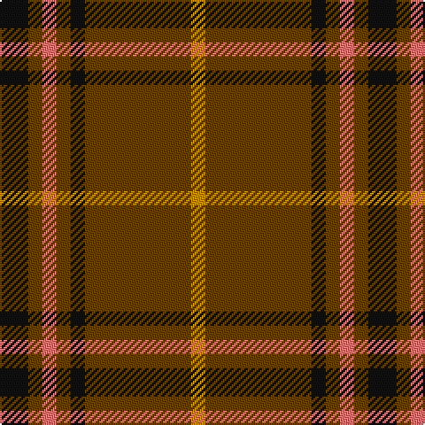

**Bands:** [KGRGKGY](/stripes/kgrgkgy/) · **Stripes:** [K DY R DY K DY LO](/stripes/stripes7/) K DY R DY K DY LO

This was sourced from tartans-authority.  It is a [7 band tartan](/bands/bands7/).

Original link http://www.tartansauthority.com/tartan-ferret/display/2167/

## Also known as

This cloth is also recorded under:

- Welsh National #2

## Thread count
K/16 T8 LR8 T8 K8 T60 DY/8

## Palette
Each colour and its ΔE from the base-6 reference it is a variant of.

| Colour | Shade | Base | ΔE (OKLab) |
|---|---|---|---|
| DY | <code style="background-color:#BC8C00;">#BC8C00</code> `#BC8C00` | Y <code style="background-color:#F2BF00;">#F2BF00</code> | 0.16 |
| K | <code style="background-color:#101010;">#101010</code> `#101010` | K <code style="background-color:#000000;">#000000</code> | 0.17 |
| LR | <code style="background-color:#E87878;">#E87878</code> `#E87878` | R <code style="background-color:#CC0000;">#CC0000</code> | 0.19 |
| T | <code style="background-color:#604000;">#604000</code> `#604000` | G <code style="background-color:#006100;">#006100</code> | 0.14 |

# Sample pattern

## Nearest tartans

The nearest existing variants by ΔTartan distance.

1. [Kirk (Name)](/setts/s7/r4g21r4k7r34lo3r4~x2/) — ΔT 1.34
1. [Welsh National #2](/setts/s12/k4dy2r2dy2k2dy15lo2~x4/) — ΔT 1.53
1. [Waverley Care Aids Trust](/setts/s10/r8g2r2k1r1g2~x10/) — ΔT 1.58
1. [Glen Trool](/setts/s5/dg37o9dg3r9o3~x2/) — ΔT 1.59
1. [Land's End Camel](/setts/s9/lo24do2lo3dy6lo3do2dg15lo20do4~x2/) — ΔT 1.60
1. [Scott Autumn (Fashion)](/setts/s7/dg16ly3dg14r16dg2r2dg3~x2/) — ΔT 1.63
1. [Ulster](/setts/s10/o28k2o28k2o2k2dr29k2r2k2~x2/) — ΔT 1.71
1. [Land's End (Unnamed Camel)](/setts/s9/o24dr2o3o6o3dr2dg15o20dr4~x2/) — ΔT 1.71
1. [Comyn](/setts/s8/k1r9dg2r2dg4lr1dg4r1~x2/) — ΔT 1.71
1. [Tulloch Homes](/setts/s7/g6dg14r9dt7r9dg54ly6/) — ΔT 1.74

## Neighbour map

Every grey dot is one of 14299 variants placed by the first two principal components of the ΔTartan feature space (44% of its variance). Red is this tartan; blue dots are its nearest — click one to open its page.

<svg viewBox="0 0 640 380" role="img" style="max-width:100%;height:auto;border:1px solid #e0e0e0;border-radius:4px;display:block" xmlns="http://www.w3.org/2000/svg"><image href="/nn/cloud.v1.png" width="640" height="380"/><a href="/setts/s7/r4g21r4k7r34lo3r4~x2/"><circle cx="376.2" cy="194.0" r="4" fill="#3465a4"><title>Kirk (Name)</title></circle></a><a href="/setts/s12/k4dy2r2dy2k2dy15lo2~x4/"><circle cx="456.0" cy="197.7" r="4" fill="#3465a4"><title>Welsh National #2</title></circle></a><a href="/setts/s10/r8g2r2k1r1g2~x10/"><circle cx="416.5" cy="229.5" r="4" fill="#3465a4"><title>Waverley Care Aids Trust</title></circle></a><a href="/setts/s5/dg37o9dg3r9o3~x2/"><circle cx="441.6" cy="238.4" r="4" fill="#3465a4"><title>Glen Trool</title></circle></a><a href="/setts/s9/lo24do2lo3dy6lo3do2dg15lo20do4~x2/"><circle cx="365.1" cy="189.1" r="4" fill="#3465a4"><title>Land's End Camel</title></circle></a><a href="/setts/s7/dg16ly3dg14r16dg2r2dg3~x2/"><circle cx="406.4" cy="262.3" r="4" fill="#3465a4"><title>Scott Autumn (Fashion)</title></circle></a><a href="/setts/s10/o28k2o28k2o2k2dr29k2r2k2~x2/"><circle cx="369.3" cy="156.7" r="4" fill="#3465a4"><title>Ulster</title></circle></a><a href="/setts/s9/o24dr2o3o6o3dr2dg15o20dr4~x2/"><circle cx="410.3" cy="212.4" r="4" fill="#3465a4"><title>Land's End (Unnamed Camel)</title></circle></a><a href="/setts/s8/k1r9dg2r2dg4lr1dg4r1~x2/"><circle cx="305.4" cy="206.2" r="4" fill="#3465a4"><title>Comyn</title></circle></a><a href="/setts/s7/g6dg14r9dt7r9dg54ly6/"><circle cx="352.6" cy="193.5" r="4" fill="#3465a4"><title>Tulloch Homes</title></circle></a><circle cx="397.9" cy="214.2" r="5" fill="#c00000"/></svg>

ID: /setts/s7/k4dy2r2dy2k2dy15lo2~x4/
