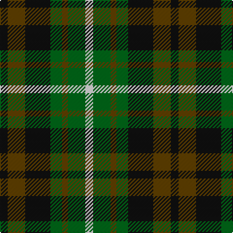

This page is one **sett** — a single exact thread-count. It belongs to the [tartan](/tartans/k4dy9k13g6dy3g9w4/)
(the same proportion at any scale), whose colour order is pattern [KGKGGGW](/stripes/kgkgggw/).

Sourced from house-of-tartan.  It is a [7 stripe tartan](/stripes/stripes7/).

Original link http://www.house-of-tartan.scotland.net/house/TartanViewjs.asp?colr=Def&tnam=1198

## Thread count
K/8 T18 K26 G12 T6 G18 LN/8

## Palette

Palette: <strong>Tartan Register</strong>
<table><thead><tr><th>Colour</th><th>Threads</th><th>Shade</th><th>Base</th><th>OKLCh</th></tr></thead><tbody><tr><td>K/</td><td style="text-align:right;font-variant-numeric:tabular-nums">8</td><td><code style="background-color:#101010;">#101010</code> <small style="color:#888">#101010</small></td><td>K <code style="background-color:#000000;">#000000</code></td><td><small style="color:#888">oklch(17.3% 0.000 89.9)</small></td></tr><tr><td>T</td><td style="text-align:right;font-variant-numeric:tabular-nums">18</td><td><code style="background-color:#604000;">#604000</code> <small style="color:#888">#604000</small></td><td>G <code style="background-color:#006100;">#006100</code></td><td><small style="color:#888">oklch(39.8% 0.083 76.8)</small></td></tr><tr><td>K</td><td style="text-align:right;font-variant-numeric:tabular-nums">26</td><td><code style="background-color:#101010;">#101010</code> <small style="color:#888">#101010</small></td><td>K <code style="background-color:#000000;">#000000</code></td><td><small style="color:#888">oklch(17.3% 0.000 89.9)</small></td></tr><tr><td>G</td><td style="text-align:right;font-variant-numeric:tabular-nums">12</td><td><code style="background-color:#006818;">#006818</code> <small style="color:#888">#006818</small></td><td>G <code style="background-color:#006100;">#006100</code></td><td><small style="color:#888">oklch(45.0% 0.142 145.0)</small></td></tr><tr><td>T</td><td style="text-align:right;font-variant-numeric:tabular-nums">6</td><td><code style="background-color:#604000;">#604000</code> <small style="color:#888">#604000</small></td><td>G <code style="background-color:#006100;">#006100</code></td><td><small style="color:#888">oklch(39.8% 0.083 76.8)</small></td></tr><tr><td>G</td><td style="text-align:right;font-variant-numeric:tabular-nums">18</td><td><code style="background-color:#006818;">#006818</code> <small style="color:#888">#006818</small></td><td>G <code style="background-color:#006100;">#006100</code></td><td><small style="color:#888">oklch(45.0% 0.142 145.0)</small></td></tr><tr><td>LN/</td><td style="text-align:right;font-variant-numeric:tabular-nums">8</td><td><code style="background-color:#E0E0E0;">#E0E0E0</code> <small style="color:#888">#E0E0E0</small></td><td>W <code style="background-color:#F7F7F7;">#F7F7F7</code></td><td><small style="color:#888">oklch(90.7% 0.000 89.9)</small></td></tr></tbody></table>

# Sample pattern

## Nearest tartans

The nearest existing variants by ΔTartan distance, with this tartan at the top so the swatches line up against it.

ΔTartan

Tartan

Sett

—

<a href="/ttd/edit/#slug=k4dy9k13g6dy3g9w4~x2">Ramsay Hunting Family Tartan Tartan Number: 1198. Earliest known date: pre 2003 This sample comes from the MacGregor-Hastie collection which forms the basis of the cloth archive of the Scottish Tartans Society. Some of the samples, including this one, were unmarked. One can assume that the sample dates between 1930 and 1950. See products available Copyright © Blair Urquhart, Comrie, 2015</a> <a class="nn-out" href="/setts/s7/k4dy9k13g6dy3g9w4~x2/" title="open its dictionary page">↗</a>

0.91

<a href="/ttd/edit/#slug=dg12k14y11r3y3r3y11k14dg12y3~x2">Wilson's No.112 (Light Blue)</a> <a class="nn-out" href="/setts/s10/dg12k14y11r3y3r3y11k14dg12y3~x2/" title="open its dictionary page">↗</a>

1.04

<a href="/ttd/edit/#slug=y3dg6k6y4r1y1~x2">Waterloo</a> <a class="nn-out" href="/setts/s6/y3dg6k6y4r1y1~x2/" title="open its dictionary page">↗</a>

1.06

<a href="/ttd/edit/#slug=k4lo9k13g6lo3g9w4~x2">Ramsay (Orange)</a> <a class="nn-out" href="/setts/s7/k4lo9k13g6lo3g9w4~x2/" title="open its dictionary page">↗</a>

1.08

<a href="/ttd/edit/#slug=lo4g10k3g3k3g3k9dr11k3~x4">Martin</a> <a class="nn-out" href="/setts/s9/lo4g10k3g3k3g3k9dr11k3~x4/" title="open its dictionary page">↗</a>

1.13

<a href="/ttd/edit/#slug=g24k4g24k24t7r24t7~x2">Unidentified, Pinafore</a> <a class="nn-out" href="/setts/s7/g24k4g24k24t7r24t7~x2/" title="open its dictionary page">↗</a>

1.14

<a href="/ttd/edit/#slug=g12k14t11r3t3r3t11k14g12t3~x2">Wellington (Wilson) #2</a> <a class="nn-out" href="/setts/s10/g12k14t11r3t3r3t11k14g12t3~x2/" title="open its dictionary page">↗</a>

1.19

<a href="/setts/s8/dp11t2k10g10ly3~x2/">Wilson's No.217</a>

1.23

<a href="/ttd/edit/#slug=k9g9w2g9k9db9k3~x2">Graham of Montrose - 1850 (Clan)</a> <a class="nn-out" href="/setts/s7/k9g9w2g9k9db9k3~x2/" title="open its dictionary page">↗</a>

1.24

<a href="/ttd/edit/#slug=k11g12w2g12k12dp12r3~x2">Cunningham / Wilson's No 120</a> <a class="nn-out" href="/setts/s7/k11g12w2g12k12dp12r3~x2/" title="open its dictionary page">↗</a>

1.26

<a href="/ttd/edit/#slug=db7r3db9r2k10g9r3g2r2g7~x2">Cameron</a> <a class="nn-out" href="/setts/s10/db7r3db9r2k10g9r3g2r2g7~x2/" title="open its dictionary page">↗</a>

## Neighbour map

Every grey dot is one of 14299 variants placed by the first two principal components of the ΔTartan feature space (44% of its variance). Red is this tartan; blue dots are its nearest — click one to open its page.

<svg viewBox="0 0 640 380" role="img" style="max-width:100%;height:auto;border:1px solid #e0e0e0;border-radius:4px;display:block" xmlns="http://www.w3.org/2000/svg"><image href="/nn/cloud.v1.png" width="640" height="380"/><a href="/setts/s10/dg12k14y11r3y3r3y11k14dg12y3~x2/"><circle cx="113.7" cy="248.3" r="4" fill="#3465a4"><title>Wilson's No.112 (Light Blue)</title></circle></a><a href="/setts/s6/y3dg6k6y4r1y1~x2/"><circle cx="157.5" cy="254.1" r="4" fill="#3465a4"><title>Waterloo</title></circle></a><a href="/setts/s7/k4lo9k13g6lo3g9w4~x2/"><circle cx="95.1" cy="254.7" r="4" fill="#3465a4"><title>Ramsay (Orange)</title></circle></a><a href="/setts/s9/lo4g10k3g3k3g3k9dr11k3~x4/"><circle cx="143.7" cy="263.4" r="4" fill="#3465a4"><title>Martin</title></circle></a><a href="/setts/s7/g24k4g24k24t7r24t7~x2/"><circle cx="137.1" cy="241.7" r="4" fill="#3465a4"><title>Unidentified, Pinafore</title></circle></a><a href="/setts/s10/g12k14t11r3t3r3t11k14g12t3~x2/"><circle cx="108.0" cy="246.7" r="4" fill="#3465a4"><title>Wellington (Wilson) #2</title></circle></a><a href="/setts/s8/dp11t2k10g10ly3~x2/"><circle cx="106.5" cy="240.9" r="4" fill="#3465a4"><title>Wilson's No.217</title></circle></a><a href="/setts/s7/k9g9w2g9k9db9k3~x2/"><circle cx="148.3" cy="288.8" r="4" fill="#3465a4"><title>Graham of Montrose - 1850 (Clan)</title></circle></a><a href="/setts/s7/k11g12w2g12k12dp12r3~x2/"><circle cx="131.2" cy="255.0" r="4" fill="#3465a4"><title>Cunningham / Wilson's No 120</title></circle></a><a href="/setts/s10/db7r3db9r2k10g9r3g2r2g7~x2/"><circle cx="95.6" cy="230.6" r="4" fill="#3465a4"><title>Cameron</title></circle></a><circle cx="117.2" cy="273.0" r="5" fill="#c00000"/></svg>

ID: /setts/s7/k4dy9k13g6dy3g9w4~x2/
