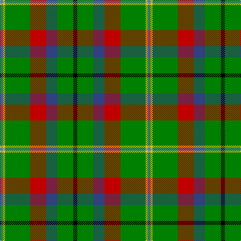

In pattern [BYGRBGK](/patterns/bygrbgk/).

This was sourced from weddslist.  It is a [7 stripes tartan](/stripes/stripes7/).

Original link http://www.weddslist.com/cgi-bin/tartans/pg.pl?source=sts

## Thread count
Ba/6 Y4 G50 R32 B22 G32 K/8

## Palette
Each colour and its ΔE from the base-6 reference it is a variant of.

| Colour | Shade | Base | ΔE (OKLab) |
|---|---|---|---|
| B | <code style="background-color:#304080;">#304080</code> `#304080` | B <code style="background-color:#2A418A;">#2A418A</code> | 0.02 |
| Ba | <code style="background-color:#5480B0;">#5480B0</code> `#5480B0` | B <code style="background-color:#2A418A;">#2A418A</code> | 0.19 |
| G | <code style="background-color:#008000;">#008000</code> `#008000` | G <code style="background-color:#006100;">#006100</code> | 0.10 |
| K | <code style="background-color:#000000;">#000000</code> `#000000` | K <code style="background-color:#000000;">#000000</code> | 0.00 |
| R | <code style="background-color:#C00000;">#C00000</code> `#C00000` | R <code style="background-color:#CC0000;">#CC0000</code> | 0.03 |
| Y | <code style="background-color:#F0C000;">#F0C000</code> `#F0C000` | Y <code style="background-color:#F2BF00;">#F2BF00</code> | 0.00 |

# Sample pattern

## Nearest tartans

The nearest existing variants by ΔTartan distance.

1. [St Andrews Bay](/setts/s7/y30w4y20g20k20ya3k6x2~g006818-k101010-we0e0e0-ya08858-yad87c00/) — ΔT 1.18
1. [Driver (Name)](/setts/s6/g11w11k3y3ga36ya7x2~g006818-ga003820-k101010-we0e0e0-ye8c000-yad87c00/) — ΔT 1.23
1. [Rotary](/setts/s7/g25r4b25r13g25y2ba6x2~b304080-ba5480b0-g008000-rc00000-yf0c000/) — ΔT 1.24
1. [Taylor](/setts/s8/g8k2g13r4g12b22g5y3x2~b304080-g008000-k000000-rd03030-yf0c000/) — ΔT 1.39
1. [Driver, RC](/setts/s6/g11w11k3y3ga36r7x2~g008000-ga004f00-k101010-rcd3700-wffffff-yeeee00/) — ΔT 1.39
1. [Asheville Firefighters, The](/setts/s6/k17g48y4r10b12g4~b202060-g006818-k101010-rc80000-ye8c000/) — ΔT 1.44
1. [Newfoundland](/setts/s7/r6g4b14w4b7g30y4x2~b441800-g006818-rc80000-we0e0e0-yd09800/) — ΔT 1.44
1. [Royal British Legion, The](/setts/s7/r6b2g20k3ba8ga2b4x2~b8080d0-ba304080-g008000-ga30a010-k000000-rc00000/) — ΔT 1.45
1. [Brown, George](/setts/s9/w3r3k4r6g22r4k18g24y3x2~g006818-k101010-rc80000-wfcfcfc-ye8c000/) — ΔT 1.45
1. [Aztec, New Mexico](/setts/s8/r3k8g17y2g17k8b8k2x2~b3850c8-g146400-k101010-rff0000-yffe600/) — ΔT 1.45

## Neighbour map

Every grey dot is one of 15726 variants placed by the first two principal components of the ΔTartan feature space (44% of its variance). Red is this tartan; blue dots are its nearest — click one to open its page.

<svg viewBox="0 0 640 380" role="img" style="max-width:100%;height:auto;border:1px solid #e0e0e0;border-radius:4px;display:block" xmlns="http://www.w3.org/2000/svg"><image href="/nn/cloud.v1.png" width="640" height="380"/><a href="/setts/s7/y30w4y20g20k20ya3k6x2~g006818-k101010-we0e0e0-ya08858-yad87c00/"><circle cx="197.2" cy="198.3" r="4" fill="#3465a4"><title>St Andrews Bay</title></circle></a><a href="/setts/s6/g11w11k3y3ga36ya7x2~g006818-ga003820-k101010-we0e0e0-ye8c000-yad87c00/"><circle cx="199.2" cy="155.3" r="4" fill="#3465a4"><title>Driver (Name)</title></circle></a><a href="/setts/s7/g25r4b25r13g25y2ba6x2~b304080-ba5480b0-g008000-rc00000-yf0c000/"><circle cx="240.8" cy="201.6" r="4" fill="#3465a4"><title>Rotary</title></circle></a><a href="/setts/s8/g8k2g13r4g12b22g5y3x2~b304080-g008000-k000000-rd03030-yf0c000/"><circle cx="263.5" cy="197.8" r="4" fill="#3465a4"><title>Taylor</title></circle></a><a href="/setts/s6/g11w11k3y3ga36r7x2~g008000-ga004f00-k101010-rcd3700-wffffff-yeeee00/"><circle cx="191.7" cy="151.4" r="4" fill="#3465a4"><title>Driver, RC</title></circle></a><a href="/setts/s6/k17g48y4r10b12g4~b202060-g006818-k101010-rc80000-ye8c000/"><circle cx="276.3" cy="188.1" r="4" fill="#3465a4"><title>Asheville Firefighters, The</title></circle></a><a href="/setts/s7/r6g4b14w4b7g30y4x2~b441800-g006818-rc80000-we0e0e0-yd09800/"><circle cx="231.0" cy="195.8" r="4" fill="#3465a4"><title>Newfoundland</title></circle></a><a href="/setts/s7/r6b2g20k3ba8ga2b4x2~b8080d0-ba304080-g008000-ga30a010-k000000-rc00000/"><circle cx="165.7" cy="161.7" r="4" fill="#3465a4"><title>Royal British Legion, The</title></circle></a><a href="/setts/s9/w3r3k4r6g22r4k18g24y3x2~g006818-k101010-rc80000-wfcfcfc-ye8c000/"><circle cx="228.0" cy="182.2" r="4" fill="#3465a4"><title>Brown, George</title></circle></a><a href="/setts/s8/r3k8g17y2g17k8b8k2x2~b3850c8-g146400-k101010-rff0000-yffe600/"><circle cx="220.0" cy="206.6" r="4" fill="#3465a4"><title>Aztec, New Mexico</title></circle></a><circle cx="220.9" cy="174.5" r="5" fill="#c00000"/></svg>

ID: /setts/s7/k4g16b11r16g25y2ba3x2~b304080-ba5480b0-g008000-k000000-rc00000-yf0c000/
