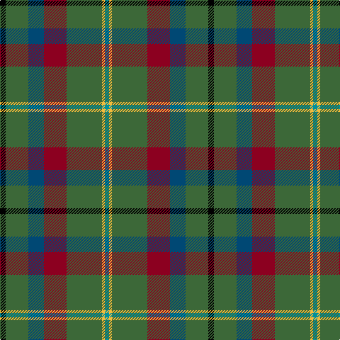

In pattern [GYGRBGK](/stripes/gygrbgk/).

This was sourced from house-of-tartan.  It is a [7 stripe tartan](/stripes/stripes7/).

Original link http://www.house-of-tartan.scotland.net/house/TartanViewjs.asp?colr=Def&tnam=2270

## Thread count
K/8 G32 DB22 DR32 G50 Y4 B/6

## Palette
Each colour and its ΔE from the base-6 reference it is a variant of.

| Colour | Shade | Base | ΔE (OKLab) |
|---|---|---|---|
| B | <code style="background-color:#00909C;">#00909C</code> `#00909C` | G <code style="background-color:#006100;">#006100</code> | 0.22 |
| DB | <code style="background-color:#004874;">#004874</code> `#004874` | B <code style="background-color:#2A418A;">#2A418A</code> | 0.05 |
| DR | <code style="background-color:#8C0020;">#8C0020</code> `#8C0020` | R <code style="background-color:#CC0000;">#CC0000</code> | 0.14 |
| G | <code style="background-color:#3C6838;">#3C6838</code> `#3C6838` | G <code style="background-color:#006100;">#006100</code> | 0.07 |
| K | <code style="background-color:#000000;">#000000</code> `#000000` | K <code style="background-color:#000000;">#000000</code> | 0.00 |
| Y | <code style="background-color:#F4BC3C;">#F4BC3C</code> `#F4BC3C` | Y <code style="background-color:#F2BF00;">#F2BF00</code> | 0.02 |

# Sample pattern

## Nearest tartans

The nearest existing variants by ΔTartan distance.

1. [Connelly, James (Personal)](/setts/s8/dg12g6r1dg6g4dp8ly2w2~x4/) — ΔT 1.21
1. [Mayo, County (District)](/setts/s7/k4dg16db11r16dg25lo2t3~x2/) — ΔT 1.25
1. [Rotary](/setts/s7/g25r4db25r13g25ly2t6~x2/) — ΔT 1.28
1. [Wynberg Boys' High School](/setts/s9/w4r13g54dg22k4y20g48r13w4/) — ΔT 1.31
1. [Glencross, Tynron (Name)](/setts/s6/r3y13db13ly2dg34w3~x2/) — ΔT 1.33
1. [Mica, Green (Fashion)](/setts/s8/dy6o2dy12k4dt14k1dy3ly2~x2/) — ΔT 1.34
1. [Lossiemouth/Hersbruck](/setts/s6/g26db3g12k10dp15w2~x2/) — ΔT 1.40
1. [Bahamas](/setts/s8/n8ly2n22dg6r2lb10dg12n3~x2/) — ΔT 1.42
1. [Taylor Family Tartan Tartan Number: 809. Earliest known date: 1955 Some similarity to the Cameron recorded in the Vestiarium Scoticum, which may be connected with the name of the designer, Lt Col Iain Cameron Taylor, or to the Clan Cameron warrior Taillear dubh na Tuaighe (Black Taylor of the Axe) who lived in the seventeenth century. The pink stripe is described as 'coral'. The tartan is recognised by the Cameron of Lochiel. See products available Copyright © Blair Urquhart, Comrie, 2015](/setts/s8/g8k2g13r4g12dp22g5ly3~x2/) — ΔT 1.44
1. [Allman-Jones (Personal)](/setts/s7/r3w2y7n25k8y15dg2~x2/) — ΔT 1.45

## Neighbour map

Every grey dot is one of 14299 variants placed by the first two principal components of the ΔTartan feature space (44% of its variance). Red is this tartan; blue dots are its nearest — click one to open its page.

<svg viewBox="0 0 640 380" role="img" style="max-width:100%;height:auto;border:1px solid #e0e0e0;border-radius:4px;display:block" xmlns="http://www.w3.org/2000/svg"><image href="/nn/cloud.v1.png" width="640" height="380"/><a href="/setts/s8/dg12g6r1dg6g4dp8ly2w2~x4/"><circle cx="186.7" cy="193.9" r="4" fill="#3465a4"><title>Connelly, James (Personal)</title></circle></a><a href="/setts/s7/k4dg16db11r16dg25lo2t3~x2/"><circle cx="285.2" cy="211.5" r="4" fill="#3465a4"><title>Mayo, County (District)</title></circle></a><a href="/setts/s7/g25r4db25r13g25ly2t6~x2/"><circle cx="242.9" cy="204.8" r="4" fill="#3465a4"><title>Rotary</title></circle></a><a href="/setts/s9/w4r13g54dg22k4y20g48r13w4/"><circle cx="267.3" cy="162.0" r="4" fill="#3465a4"><title>Wynberg Boys' High School</title></circle></a><a href="/setts/s6/r3y13db13ly2dg34w3~x2/"><circle cx="259.6" cy="164.7" r="4" fill="#3465a4"><title>Glencross, Tynron (Name)</title></circle></a><a href="/setts/s8/dy6o2dy12k4dt14k1dy3ly2~x2/"><circle cx="274.6" cy="194.8" r="4" fill="#3465a4"><title>Mica, Green (Fashion)</title></circle></a><a href="/setts/s6/g26db3g12k10dp15w2~x2/"><circle cx="275.6" cy="207.4" r="4" fill="#3465a4"><title>Lossiemouth/Hersbruck</title></circle></a><a href="/setts/s8/n8ly2n22dg6r2lb10dg12n3~x2/"><circle cx="249.2" cy="195.7" r="4" fill="#3465a4"><title>Bahamas</title></circle></a><a href="/setts/s8/g8k2g13r4g12dp22g5ly3~x2/"><circle cx="274.7" cy="193.7" r="4" fill="#3465a4"><title>Taylor Family Tartan Tartan Number: 809. Earliest known date: 1955 Some similarity to the Cameron recorded in the Vestiarium Scoticum, which may be connected with the name of the designer, Lt Col Iain Cameron Taylor, or to the Clan Cameron warrior Taillear dubh na Tuaighe (Black Taylor of the Axe) who lived in the seventeenth century. The pink stripe is described as 'coral'. The tartan is recognised by the Cameron of Lochiel. See products available Copyright © Blair Urquhart, Comrie, 2015</title></circle></a><a href="/setts/s7/r3w2y7n25k8y15dg2~x2/"><circle cx="214.2" cy="174.1" r="4" fill="#3465a4"><title>Allman-Jones (Personal)</title></circle></a><circle cx="257.4" cy="193.5" r="5" fill="#c00000"/></svg>

ID: /setts/s7/k4g16db11r16g25ly2g3~x2/
